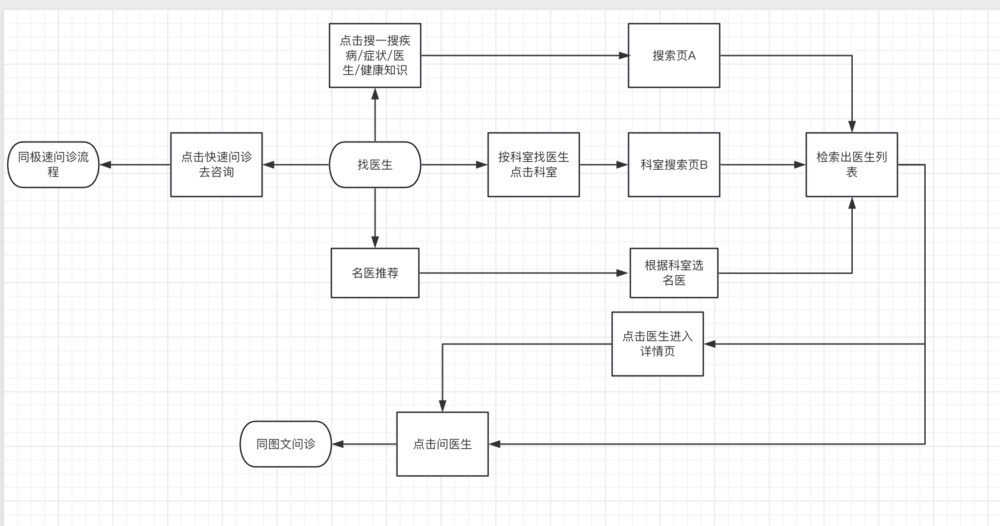

# 问医生模块

## 问医生-需求分析



## 问医生-路由搭建

步骤：

1. 页面结构
2. 配置路由
3. 首页跳转

页面结构`ConsultDoctor.vue`

```vue
<script setup lang="ts"></script>

<template>
  <div class="consult-doctor-page">
    <cp-nav-bar
      title="找医生"
      right-text="问诊记录"
      @click-right="$router.push('/user/consult')"
    ></cp-nav-bar>

    <div class="search">
      <cp-icon name="home-search" /> 搜一搜：医生/疾病名称
    </div>
    <div class="quick-inquary-banner">
      <div class="left-content">
        <van-icon name="chat-o" size="33" />
        <div>
          <p class="solgan">快速问医 无需等待</p>
          <p class="tips">2w+名医在线问诊</p>
        </div>
      </div>
      <span class="inquary-btn" @click="
          consultStore.setType(ConsultType.Fast) &&
            $router.push('/consult/fast')
        "
        >去咨询</span
      >
    </div>

    <div class="department-content">
      <div class="department-header">
        <p class="title-text">按科室找医生</p>
        <p class="all-link">
          全部科室
          <van-icon name="arrow" />
        </p>
      </div>
      <div class="department-list">
        <div class="department-item" v-for="item in 12" :key="item">
          <span class="department-name">内科</span>
        </div>
      </div>
    </div>

    <div class="famous-doctor-list">
      <div>
        <p class="title-text">名医推荐</p>
        <p class="sub-title">获取更多诊疗建议</p>
      </div>

      <van-tabs shrink sticky>
        <van-tab title="心血管内科"> 心血管内科医生列表 </van-tab>
        <van-tab title="普通内科"> 普通内科医生列表 </van-tab>
      </van-tabs>
    </div>
  </div>
</template>

<style scoped lang="scss">
.consult-doctor-page {
  padding: 46px 15px 0;
  .search {
    margin-top: 10px;
    // border: 1px solid rgba(237, 237, 237, 0.9);
    height: 40px;
    border-radius: 20px;
    box-shadow: 0px 15px 22px -7px rgba(224, 236, 250, 0.8);
    background-color: #fff;
    display: flex;
    align-items: center;
    padding: 0 20px;
    color: var(--cp-dark);
    font-size: 13px;
    .cp-icon {
      font-size: 16px;
      margin-right: 5px;
    }
  }
  .quick-inquary-banner {
    display: flex;
    align-items: center;
    margin: 15px 0;
    justify-content: space-between;
    height: 75px;
    background: #fafafa;
    border-radius: 18px;
    padding: 0 15px;
    .left-content {
      display: flex;
      align-items: center;
      .van-icon {
        margin-right: 10px;
      }
      .solgan {
        font-size: 16px;
        font-weight: 500;
        color: var(--cp-primary);
      }
      .tips {
        font-size: 12px;
        color: #848484;
      }
    }
    .inquary-btn {
      width: 70px;
      height: 30px;
      line-height: 30px;
      text-align: center;
      background: rgba(44, 181, 165, 0.1);
      border-radius: 25px;
      font-size: 14px;
      color: #2cb5a5;
    }
  }
  .department-content {
    .department-header {
      font-size: 16px;
      font-weight: 500;
      color: #121826;
      display: flex;
      justify-content: space-between;
      align-items: center;
      margin-bottom: 10px;
      .all-link {
        font-size: 13px;
        color: #c3c3c5;
        display: flex;
        align-items: center;
      }
    }
    .department-list {
      padding-top: 20px;
      background: #fafafa;
      border-radius: 20px;
      display: flex;
      flex-wrap: wrap;
      justify-content: space-between;
      .department-item {
        display: flex;
        flex-direction: column;
        align-items: center;
        width: 25%;
        margin-bottom: 20px;
        .department-icon {
          display: inline-block;
          width: 25px;
          height: 25px;
        }
        .department-name {
          font-size: 12px;
          margin-top: 6px;
          font-family: PingFang SC, PingFang SC-Medium;
          font-weight: 500;
          color: #121826;
        }
      }
    }
  }
  .famous-doctor-list {
    margin-top: 15px;
    position: relative;
    .title-text {
      font-size: 16px;
      font-weight: 500;
      color: #121826;
    }
    .sub-title {
      font-size: 12px;
      color: #c3c3c5;
    }
  }
}
</style>

```

配置路由`router/index.ts`

```ts
{
    path: '/consult/doctor',
    component: () => import('@/views/Consult/ConsultDoctor.vue'),
    meta: { title: '找医生' }
}
```

首页跳转`home/index.vue`

```vue
<router-link
    to="/consult/doctor"
    class="nav"
    @click="store.setType(ConsultType.Doctor)"
>
    <cp-icon name="home-doctor"></cp-icon>
    <p class="title">问医生</p>
    <p class="desc">按科室查问医生</p>
</router-link>

```

## 问医生-渲染科室

除了页面中间选择科室区域，页面底部tab栏也用到了科室

步骤：

1. 中间区域选择科室，抽离组件
2. 科室类型新增字段
3. 发送请求，状态提升在父组件申明数据（`DepartmentContent`与`Tabs`都会用到科室数据）
4. 渲染数据，跳转医生列表页
5. 抽屉内容科室处理

中间区域选择科室，抽离组件
`DepartmentContent.vue`

```vue
<script setup lang="ts">

</script>

<template>
  <div class="department-content">
    <div class="department-header">
      <p class="title-text">按科室找医生</p>
      <p class="all-link">
        全部科室
        <van-icon name="arrow" />
      </p>
    </div>
    <div class="department-list">
      <div class="department-item" v-for="item in 12" :key="item">
        <span class="department-name">内科</span>
      </div>
    </div>
  </div>
</template>

<style scoped lang="scss">
.department-content {
  .department-header {
    font-size: 16px;
    font-weight: 500;
    color: #121826;
    display: flex;
    justify-content: space-between;
    align-items: center;
    margin-bottom: 10px;
    .all-link {
      font-size: 13px;
      color: #c3c3c5;
      display: flex;
      align-items: center;
    }
  }
  .department-list {
    padding-top: 20px;
    background: #fafafa;
    border-radius: 20px;
    display: flex;
    flex-wrap: wrap;
    justify-content: space-between;
    .department-item {
      display: flex;
      flex-direction: column;
      align-items: center;
      width: 25%;
      margin-bottom: 20px;
      .department-icon {
        display: inline-block;
        width: 25px;
        height: 25px;
      }
      .department-name {
        font-size: 12px;
        margin-top: 6px;
        font-family: PingFang SC, PingFang SC-Medium;
        font-weight: 500;
        color: #121826;
      }
    }
  }
}
</style>

```

科室类型新增字段
`consult.d.ts`

```ts
// 二级科室
type SubDep = {
  id: string
  name: string
  avatar?: string
}
```

发送请求，状态提升在父组件申明数据（`DepartmentContent`与`Tabs`都会用到科室数据）

```vue
// ConsultDoctor 发请求，状态提升
<script setup lang="ts">
import { ref, onMounted, computed } from 'vue'
import DepartmentContent from './components/DepartmentContent.vue'
import type { TopDep } from '@/types/consult'

import { getAllDep } from '@/services/consult'

const depts = ref<TopDep[]>([])
const loadDepts = async () => {
  const { data } = await getAllDep()
  depts.value = data
}
onMounted(() => {
  loadDepts()
})
const allDepts = computed(() =>
  depts.value.map((item) => item?.child || []).flat()
)
    
const consultStore = useConsultStore()
</script>


<!-- 科室搜索  -->
<department-content :depts="depts"></department-content>

<van-tabs shrink sticky>
    <van-tab :title="item.name" v-for="item in allDepts" :key="item.id">
        {{ item.name }} 医生列表
    </van-tab>
</van-tabs>
```

渲染数据，跳转医生列表页

`DepartmentContent.vue`

```vue
<script setup lang="ts">
import type { TopDep } from '@/types/consult'
import { computed } from 'vue'

const props = defineProps<{
  depts: TopDep[]
}>()

const showDepts = computed(() => props.depts[0]?.child || [])

const consultStore = useConsultStore()
const router = useRouter()
const goFindDoctorByDepId = (item: SubDep) => {
  consultStore.setDep(item.id)
  router.push(`/doctorList/${item?.id}?department=${item?.name}`)
}
    
const show = ref(false)
</script>

<template>
  <div class="department-content">
    <div class="department-header">
      <p class="title-text">按科室找医生</p>
      <p class="all-link" @click="show = true">
        全部科室
        <van-icon name="arrow" />
      </p>
    </div>
    <div class="department-list">
      <div class="department-item" v-for="item in showDepts" :key="item.id"  @click="goFindDoctorByDepId(item)">
        <span
          class="department-name"
          >{{ item.name }}</span
        >
      </div>
    </div>
  </div>
</template>

<style scoped lang="scss">
.department-content {
  .department-header {
    font-size: 16px;
    font-weight: 500;
    color: #121826;
    display: flex;
    justify-content: space-between;
    align-items: center;
    margin-bottom: 10px;
    .all-link {
      font-size: 13px;
      color: #c3c3c5;
      display: flex;
      align-items: center;
    }
  }
  .department-list {
    padding-top: 20px;
    background: #fafafa;
    border-radius: 20px;
    display: flex;
    flex-wrap: wrap;
    justify-content: space-between;
    .department-item {
      display: flex;
      flex-direction: column;
      align-items: center;
      width: 25%;
      margin-bottom: 20px;
      .department-icon {
        --icon-size: 70px;
        display: inline-block;
        width: var(--icon-size);
        height: var(--icon-size);
      }
      .department-name {
        font-size: 12px;
        margin-top: 6px;
        font-family: PingFang SC, PingFang SC-Medium;
        font-weight: 500;
        color: #121826;
      }
    }
  }
}
</style>

```

抽屉内容结构

```vue
<van-action-sheet v-model:show="show" title="全部科室">
    <div class="content">
      <div>
        <p class="department-header">内科</p>
        <div class="mb-20">
          <span class="department-text">心血管内科</span
          ><span class="department-text">普通内科</span
          ><span class="department-text">神经内科</span
          ><span class="department-text">消化内科</span
          ><span class="department-text">内分泌科</span
          ><span class="department-text">免疫科</span
          ><span class="department-text">高压氧科</span
          ><span class="department-text">血液科</span
          ><span class="department-text">肾病内科</span
          ><span class="department-text">呼吸科</span
          ><span class="department-text">感染内科</span
          ><span class="department-text">过敏反应科</span>
        </div>
      </div>
    </div>
</van-action-sheet>
```

```scss
.content {
  padding: 16px;
  height: 400px;
  .department-header {
    display: flex;
    justify-content: space-between;
    align-items: center;
    margin-bottom: 10px;
    font-size: 16px;
    font-weight: 500;
    color: #121826;
  }
  .mb-20 {
    margin-bottom: 20px;
    .department-text {
      display: inline-block;
      height: 33px;
      padding: 0 20px;
      background: #fafafa;
      border-radius: 27px;
      font-size: 13px;
      color: #3c3e42;
      line-height: 33px;
      text-align: center;
      margin-right: 9px;
      margin-bottom: 9px;
    }
  }
}
```

渲染抽屉内容

```vue
<van-action-sheet v-model:show="show" title="全部科室">
    <div class="content">
      <div v-for="item in depts" :key="item.id">
        <div v-if="item.child.length > 0">
          <p class="department-header">{{ item.name }}</p>
          <div class="mb-20">
            <span
              @click="goFindDoctorByDepId(sub)"
              class="department-text"
              v-for="sub in item.child"
              :key="sub.id"
              >{{ sub.name }}</span
            >
          </div>
        </div>
      </div>
    </div>
</van-action-sheet>
```

## 医生列表-路由搭建及组件拆分

步骤：

1. 搭建页面结构
2. 路由配置
3. 医生卡片组件
4. 医生列表组件

搭建页面结构
`ConsultDoctorList`

```vue
<script setup lang="ts">
import { ref } from 'vue'
import { useRoute } from 'vue-router'

const route = useRoute()
const department = route.query.department as string
// const depId = route.params.depId as string

const menuRef = ref(null)
const itemRef = ref()
const value = ref(0)
const switch1 = ref(false)
const switch2 = ref(false)
const options = [
  { text: '全部商品', value: 0 },
  { text: '新款商品', value: 1 },
  { text: '活动商品', value: 2 }
]
const onConfirm = () => {
  itemRef.value?.toggle()
  // 或者
  // menuRef.value.close();
}
</script>

<template>
  <div class="doctor-list-page">
    <cp-nav-bar :title="department"></cp-nav-bar>
    <div class="search">
      <cp-icon name="home-search" /> 搜一搜：医生/疾病名称
    </div>
    <van-dropdown-menu ref="menuRef">
      <van-dropdown-item v-model="value" :options="options" />
      <van-dropdown-item title="筛选" ref="itemRef">
        <van-cell center title="包邮">
          <template #right-icon>
            <van-switch v-model="switch1" />
          </template>
        </van-cell>
        <van-cell center title="团购">
          <template #right-icon>
            <van-switch v-model="switch2" />
          </template>
        </van-cell>
        <div style="padding: 5px 16px">
          <van-button type="primary" block round @click="onConfirm">
            确认
          </van-button>
        </div>
      </van-dropdown-item>
    </van-dropdown-menu>

    <div class="doctor-list">
      <div class="doctor-card" v-for="item in 10" :key="item">
        
        <div class="detail">
          <p>
            <span class="doctor-name">张医生</span
            ><span class="doctor-other-info">消化内科 | 主治医师</span>
          </p>
          <p class="hospital-info">
            <span class="hospital-grade">三级甲等</span
            ><span class="hospital-name">中国医学科学院北京协和医院</span>
          </p>
          <p class="skill-list">高血压，心脏病</p>
          <p class="record-list">
            <van-icon name="star" color="#fea116" />
            <span class="score">5.0</span><span> / 接诊数 </span
            ><span class="count">0</span>
          </p>
          <p class="bottom-content">
            <span class="price">¥49</span><span class="btn">问医生</span>
          </p>
        </div>
      </div>
    </div>
  </div>
</template>

<style scoped lang="scss">
.doctor-list-page {
  padding-top: 46px;
  .search {
    box-sizing: border-box;
    margin-top: 10px;
    // border: 1px solid rgba(237, 237, 237, 0.9);
    height: 40px;
    border-radius: 20px;
    box-shadow: 0px 15px 22px -7px rgba(224, 236, 250, 0.8);
    background-color: #fff;
    display: flex;
    align-items: center;
    padding: 0 20px;
    color: var(--cp-dark);
    font-size: 13px;
    .cp-icon {
      font-size: 16px;
      margin-right: 5px;
    }
  }
  .van-dropdown-menu {
    position: sticky;
    top: 40px;
    z-index: 10;
    background-color: #fff;
  }

  .doctor-list {
    padding: 15px;
    .doctor-card {
      display: flex;
      flex-direction: row;
      padding: 20px 0;
      position: relative;
      .avator {
        width: 45px;
        height: 45px;
        border-radius: 50%;
        margin-right: 10px;
        vertical-align: middle;
        border-style: none;
      }
      .detail {
        flex: 1 1;
        .doctor-name {
          font-size: 18px;
          font-weight: 500;
          color: #3c3e42;
          margin-right: 7.5px;
        }
        .doctor-other-info {
          font-size: 12px;
          color: #6f6f6f;
        }
        .hospital-info {
          margin-bottom: 5px;
          display: flex;
          align-items: center;
          .hospital-grade {
            display: inline-block;
            width: 26px;
            height: 14px;
            background: #677fff;
            border-radius: 2px;
            font-size: 9px;
            color: #ffffff;
            line-height: 14px;
            text-align: center;
            margin-right: 3px;
          }
          .hospital-name {
            font-size: 12px;
            color: #3c3e42;
          }
        }
        .skill-list {
          font-size: 12px;
          color: #6f6f6f;
          margin-bottom: 10px;
        }
        .record-list {
          display: flex;
          align-items: center;
          font-size: 12px;
          color: #979797;
          .score,
          .count {
            font-size: 12px;
            font-family: Avenir, Avenir-Book;
            color: #fea116;
          }
        }
        .bottom-content {
          margin-top: 11px;
          padding-right: 11px;
          display: flex;
          justify-content: space-between;
          .price {
            font-size: 18px;
            font-family: DIN Alternate, DIN Alternate-Bold;
            font-weight: 700;
            color: #2cb5a5;
          }
          .btn {
            display: inline-block;
            width: 70px;
            height: 29px;
            background: rgba(44, 181, 165, 0.1);
            border-radius: 27px;
            font-size: 14px;
            font-family: PingFang SC, PingFang SC-Regular;
            color: #2cb5a5;
            line-height: 29px;
            text-align: center;
          }
        }
      }
      :after {
        content: '';
        position: absolute;
        left: 0;
        bottom: 0;
        border-top: 1px solid rgba(237, 237, 237, 0.9);
        width: 200%;
        transform: scale(0.5);
        transform-origin: left top;
      }
    }
  }
}
</style>

```

路由配置
`router/index.ts`

```ts
{
    path: '/doctorList/:depId',
    component: () => import('@/views/Consult/ConsultDoctorList.vue'),
    meta: { title: '医生搜索' }
},
```

医生卡片组件`DoctorCard.vue`

```vue
<script setup lang="ts"></script>

<template>
  <div class="doctor-card">
    
    <div class="detail">
      <p>
        <span class="doctor-name">张医生</span
        ><span class="doctor-other-info">消化内科 | 主治医师</span>
      </p>
      <p class="hospital-info">
        <span class="hospital-grade">三级甲等</span
        ><span class="hospital-name">中国医学科学院北京协和医院</span>
      </p>
      <p class="skill-list">高血压，心脏病</p>
      <p class="record-list">
        <van-icon name="star" color="#fea116" />
        <span class="score">5.0</span><span> / 接诊数 </span
        ><span class="count">0</span>
      </p>
      <p class="bottom-content">
        <span class="price">¥49</span><span class="btn">问医生</span>
      </p>
    </div>
  </div>
</template>

<style scoped lang="scss">
.doctor-card {
  display: flex;
  flex-direction: row;
  padding: 20px 0;
  position: relative;
  .avator {
    width: 45px;
    height: 45px;
    border-radius: 50%;
    margin-right: 10px;
    vertical-align: middle;
    border-style: none;
  }
  .detail {
    flex: 1 1;
    .doctor-name {
      font-size: 18px;
      font-weight: 500;
      color: #3c3e42;
      margin-right: 7.5px;
    }
    .doctor-other-info {
      font-size: 12px;
      color: #6f6f6f;
    }
    .hospital-info {
      margin-bottom: 5px;
      display: flex;
      align-items: center;
      .hospital-grade {
        display: inline-block;
        width: 26px;
        height: 14px;
        background: #677fff;
        border-radius: 2px;
        font-size: 9px;
        color: #ffffff;
        line-height: 14px;
        text-align: center;
        margin-right: 3px;
      }
      .hospital-name {
        font-size: 12px;
        color: #3c3e42;
      }
    }
    .skill-list {
      font-size: 12px;
      color: #6f6f6f;
      margin-bottom: 10px;
    }
    .record-list {
      display: flex;
      align-items: center;
      font-size: 12px;
      color: #979797;
      .score,
      .count {
        font-size: 12px;
        font-family: Avenir, Avenir-Book;
        color: #fea116;
      }
    }
    .bottom-content {
      margin-top: 11px;
      padding-right: 11px;
      display: flex;
      justify-content: space-between;
      .price {
        font-size: 18px;
        font-family: DIN Alternate, DIN Alternate-Bold;
        font-weight: 700;
        color: #2cb5a5;
      }
      .btn {
        display: inline-block;
        width: 70px;
        height: 29px;
        background: rgba(44, 181, 165, 0.1);
        border-radius: 27px;
        font-size: 14px;
        font-family: PingFang SC, PingFang SC-Regular;
        color: #2cb5a5;
        line-height: 29px;
        text-align: center;
      }
    }
  }
  :after {
    content: '';
    position: absolute;
    left: 0;
    bottom: 0;
    border-top: 1px solid rgba(237, 237, 237, 0.9);
    width: 200%;
    transform: scale(0.5);
    transform-origin: left top;
  }
}
</style>

```

医生列表组件`DoctorList`

```vue
<script setup lang="ts">
import DoctorCard from './DoctorCard.vue'
defineProps<{
  depId: string
}>()
</script>

<template>
  <div class="doctor-list">
    <doctor-card v-for="item in 10" :key="item"></doctor-card>
  </div>
</template>

<style scoped lang="scss">
.doctor-list {
  padding: 15px;
}
</style>

```

## 医生列表-渲染列表

步骤：

1. van-list组件使用
2. 类型定义
3. 接口封装
4. 发送请求
5. 渲染数据

类型定义`consult.d.ts`

```ts
// consult.d.ts
/**
 * default_ascend 综合排序
 * score_ascend 评分
 * consultationNum_ascend 咨询量
 * serviceFee_ascend 价格
 */
export type DoctorOrderType =
  | 'default_ascend'
  | 'score_ascend'
  | 'consultationNum_ascend'
  | 'serviceFee_ascend'

export type DoctorParams = PageParams & {
  provinceId: string
  depId: string
  order: DoctorOrderType
}
```

接口封装`service/consult.ts`

```ts
export const getFindDoctorPage = (params: DoctorParams) => {
  return request<DoctorPage>('/patient/search/doc', 'GET', params)
}
```

发送请求`DoctorList.vue`

```vue
// DoctorList.vue
<script setup lang="ts">
import { ref } from 'vue'
import DoctorCard from './DoctorCard.vue'
import type { DoctorList, DoctorParams } from '@/types/consult'
import { getFindDoctorPage } from '@/services/consult'
const props = defineProps<{
  depId: string
}>()
const list = ref<DoctorList>([])
const loading = ref(false)
const finished = ref(false)

const params = ref<DoctorParams>({
  current: 1,
  pageSize: 10,
  provinceId: '100000',
  depId: props.depId,
  order: 'default_ascend'
})

const onLoad = async () => {
  const { data } = await getFindDoctorPage(params.value)
  list.value.push(...data.rows)
  loading.value = false
  if (params.value.current >= data.pageTotal) {
    finished.value = true
  } else {
   finished.value = false
    params.value.current++
  }
}
</script>

<template>
  <div class="doctor-list">
    <van-list
      v-model:loading="loading"
      :finished="finished"
      finished-text="没有更多了"
      @load="onLoad"
    >
      <doctor-card v-for="item in list" :key="item.id"></doctor-card>
    </van-list>
  </div>
</template>

<style scoped lang="scss">
.doctor-list {
  padding: 15px;
}
</style>

```

渲染数据`DoctorCard.vue`

```vue
<script setup lang="ts">
import type { Doctor } from '@/types/consult'

defineProps<{
  item: Doctor
}>()
</script>

<template>
  <div class="doctor-card">
    
    <div class="detail">
      <p>
        <span class="doctor-name">{{ item.name }}</span
        ><span class="doctor-other-info"
          >{{ item.depName }} | {{ item.positionalTitles }}</span
        >
      </p>
      <p class="hospital-info">
        <span class="hospital-grade">{{ item.gradeName }}</span
        ><span class="hospital-name">{{ item.hospitalName }}</span>
      </p>
      <p class="skill-list">{{ item.major }}</p>
      <p class="record-list">
        <van-icon name="star" color="#fea116" />
        <span class="score">{{ item.score }}</span
        ><span> / 接诊数 </span
        ><span class="count">{{ item.consultationNum }}</span>
      </p>
      <p class="bottom-content">
        <span class="price">¥{{ item.serviceFee }}</span
        ><span class="btn">问医生</span>
      </p>
    </div>
  </div>
</template>
```

## 医生列表-排序筛选

步骤：

1. 定义下拉菜单选项，双向数据绑定的值
2. 父传子排序字段
3. 监听排序字段，发送请求

定义下拉菜单选项，双向数据绑定的值
`ConsultDoctorList.vue`

```ts
const order = ref<DoctorOrderType>('default_ascend')
const options = [
  { text: '综合排序', value: 'default_ascend' },
  { text: '评分', value: 'score_ascend' },
  { text: '咨询量', value: 'consultationNum_ascend' },
  { text: '价格', value: 'serviceFee_ascend' }
]
```

```vue
<van-dropdown-item v-model="order" :options="options" />
```

父传子排序字段

```vue
<doctor-list :dep-id="depId" :order="order"></doctor-list>
```

监听排序字段，发送请求
`DoctorList.vue`

```vue
const props = defineProps<{
  depId: string
  order?: DoctorOrderType
}>()

const params = ref<DoctorParams>({
  current: 1,
  pageSize: 10,
  depId: props.depId,
  order: props.order || 'default_ascend',
})


watch(
  () => props.order,
  (val) => {
    // console.log(val)
    list.value = []
    params.value.order = val || 'default_ascend'
    params.value.current = 1
    onLoad()
  }
)
```

## 医生列表-区域选择

步骤：

1. 下拉菜单区域结构布局
2. 定义区域类型
3. 接口封装
4. 发送请求，组装数据字段
5. 渲染区域数据
6. 完成区域检索功能

下拉菜单区域结构布局
`ConsultDoctorList.vue`

```vue
const active = ref(0)


<van-dropdown-item title="区域">
    <div class="wrapper">
        <van-sidebar v-model="active">
        <van-sidebar-item title="1" />
        <van-sidebar-item title="2" />
        <van-sidebar-item title="3" />
        <van-sidebar-item title="4" />
        </van-sidebar>
        <div class="sub"><span>1</span><span>2</span><span>3</span></div>
    </div>
</van-dropdown-item>
```

定义区域类型
`consult.d.ts`

```ts
export type Area = {
  id: string
  parentId: string
  name: string
  citys?: City[]
}

export type City = {
  id: string
  parentId: string
  name: string
}
```

接口封装
`service/consult.ts`

```ts
export const getAllBasicArea = () => {
  return request<Area[]>('basicArea/all')
}
```

发送请求，组装数据字段

```ts
const active = ref(0)
const areas = ref<Area[]>([])
onMounted(async () => {
  const { data } = await getAllBasicArea()
  areas.value = [
    {
      id: '100000',
      parentId: '',
      name: '全部'
    },
    ...data
  ]
})
const citys = computed(() => {
  const parent = areas.value[active.value]
  const result = parent?.citys || []
  return [
    {
      id: parent.id,
      parentId: parent.parentId,
      name: '全部'
    },
    ...result
  ]
})
const selectCity = (id: string) => {
  console.log(id)
}
```

渲染区域数据

```vue
<div class="wrapper">
    <van-sidebar v-model="active">
    <van-sidebar-item
        :title="item.name"
        v-for="item in areas"
        :key="item.id"
    />
    </van-sidebar>
    <div class="sub">
    <span
        v-for="city in citys"
        :key="city.id"
        @click="selectCity(city.id)"
    >
        {{ city.name }}
    </span>
    </div>
</div>
```

完成区域检索功能

`ConsultDoctorList.vue`

```diff
<script setup lang="ts">
const provinceId = ref('100000')
const selectCity = (id: string) => {
  provinceId.value = id
}
</script>

<template>
  ...
          <div class="sub">
            <span v-for="city in citys" :key="city.id" @click="selectCity(city.id)">
              <span>{{ city.name }}</span>
              <van-icon name="success" v-if="city.id === provinceId" />
            </span>
          </div>
    
     ...
        <doctor-list :dep-id="depId" :order="order" :province-id="provinceId"></doctor-list>
     ...
  ...
</template>

<style scoped lang="scss">
...
.wrapper {  
+  height: 400px; 
  overflow: hidden;
  display: flex;
  .sub {
    flex: 1;
    height: 100%;
    overflow-y: auto;
    > span {
+      display: flex;
+      justify-content: space-between;
      padding: 14px 30px;
      color: var(--cp-dark);
    }
  }
}
...
</style>

```

`DoctorList.vue`

```vue
// DoctorList
const props = defineProps<{
  depId: string
  order?: DoctorOrderType
  provinceId?: string
}>()

const params = ref<DoctorParams>({
  current: 1,
  pageSize: 10,
  depId: props.depId,
  order: props.order || 'default_ascend',
  provinceId: props.provinceId || '100000' // +
})


watch([() => props.order, () => props.provinceId], ([order, provinceId]) => {
  list.value = []
  params.value.order = order || 'default_ascend'
  params.value.provinceId = provinceId || '100000'
  params.value.current = 1
  onLoad()
})
```

## 医生列表-条件筛选

步骤：

1. 定义枚举类型
2. 选项定义
3. 定义表单数据
4. 表单双向数据绑定
5. 重置方法
6. 接口类型定义
7. 条件筛选确认后重新发送请求

定义枚举类型
`eunms/index.ts`

```ts
export enum PositionalTitles {
  /** 主任医师 */
  ChiefPhysician,
  /** 副主任医师 */
  AssociateChiefPhysician,
  /** 主治医师 */
  AttendingPhysician,
  /** 医师 */
  Physician
}

export enum PriceRange {
  /** 价格区间 0-19 */
  ZeroToNineteen = '0_19',
  /** 价格区间 20-49 */
  TwentyToFortyNine = '20_49',
  /** 价格区间 50-79 */
  FiftyToSeventyNine = '50_79',
  /** 价格区间 80以上 */
  MoreThanEighty = '80'
}
```

选项定义
`constants.ts`

```ts
// constants.ts
// 医院等级
export const gradeOptions = [
  { label: '三级甲等', value: 9 },
  // { label: '特等', value: 10 }
]

// 医师职称
export const positionalTitlesOptions = [
  { label: '主任医师', value: PositionalTitles.ChiefPhysician },
  { label: '副主任医师', value: PositionalTitles.AssociateChiefPhysician },
  { label: '主治医师', value: PositionalTitles.AttendingPhysician },
  { label: '医师', value: PositionalTitles.Physician }
]

// 价格区间
export const priceRangeOptions = [
  { label: '0-19', value: PriceRange.ZeroToNineteen },
  { label: '20-49', value: PriceRange.TwentyToFortyNine },
  { label: '50-79', value: PriceRange.FiftyToSeventyNine },
  { label: '80以上', value: PriceRange.MoreThanEighty }
]
```

定义表单数据
`ConsultDoctorList.vue`

```ts
// ConsultDoctorList.vue

type FindDoctorForm = {
  grade?: string
  positionalTitles?: PositionalTitles
  priceRange?: PriceRange
}

const initForm: FindDoctorForm = {
  grade: undefined,
  positionalTitles: undefined,
  priceRange: undefined
}

const form = ref<FindDoctorForm>({ ...initForm })
```

表单双向数据绑定

```vue
import {
  gradeOptions,
  positionalTitlesOptions,
  priceRangeOptions
} from '@/services/constants'


<div class="find-doctor-form">
    <div class="item">
    <p>医院等级</p>
    <cp-radio-btn
        :options="gradeOptions"
        v-model="form.grade"
    ></cp-radio-btn>
    </div>
    <div class="item">
    <p>医生职称</p>
    <cp-radio-btn
        :options="positionalTitlesOptions"
        v-model="form.positionalTitles"
    ></cp-radio-btn>
    </div>
    <div class="item">
    <p>价格区间</p>
    <cp-radio-btn
        :options="priceRangeOptions"
        v-model="form.priceRange"
    ></cp-radio-btn>
    </div>
    <van-button round @click="onReset" class="reset-btn">重置</van-button>
    <van-button
        round
        type="primary"
        @click="onConfirm"
        class="confirm-btn"
        >确认</van-button
    >
</div>
```

```scss
  .find-doctor-form {
    padding-left: 15px;
    padding-bottom: 15px;
    .item {
      padding: 15px 0;
      p {
        font-size: 14px;
        font-family: PingFang SC, PingFang SC-Regular;
        font-weight: 400;
        color: #848484;
        margin-bottom: 10px;
      }
    }
    .reset-btn {
      width: 125px;
      margin-right: 15px;
    }
    .confirm-btn {
      width: 205px;
    }
  }
```

重置方法

```ts
const onReset = () => {
  // console.log('onReset')
  form.value = { ...initForm }
}
```

接口类型定义`consult.d.ts`

```diff
export type DoctorParams = PageParams & {
  /** 省份id */
  provinceId: string
  /** 科室id */
  depId: string
  /** 排序 */
  order: DoctorOrderType
+  /** 医院等级 */
+  grade?: string 
+  /** 职称 */
+  positionalTitles?: PositionalTitles 
+  /** 价格范围 */
+  priceRange?: PriceRange
}
```

条件筛选确认后重新发送请求

实现确认方法

```ts
const grade = ref<string>()
const positionalTitles = ref<PositionalTitles>()
const priceRange = ref<PriceRange>()
const onConfirm = () => {
  grade.value = form.value.grade
  positionalTitles.value = form.value.positionalTitles
  priceRange.value = form.value.priceRange
  itemRef.value?.toggle()
  // 或者
  // menuRef.value.close()
}
```

父传子

```vue
<doctor-list
  :dep-id="depId"
  :order="order"
  :province-id="provinceId"
  :grade="grade"
  :positional-titles="positionalTitles"
  :price-range="priceRange"
></doctor-list>
```

`DoctorList.vue`

```vue
import type { PositionalTitles, PriceRange } from '@/enums'

const props = defineProps<{
  depId: string
  order?: DoctorOrderType
  provinceId?: string
  grade?: string
  positionalTitles?: PositionalTitles
  priceRange?: PriceRange
}>()


watch(
  [
    () => props.order,
    () => props.provinceId,
    () => props.grade,
    () => props.positionalTitles,
    () => props.priceRange
  ],
  ([order, provinceId, grade, positionalTitles, priceRange]) => {
    // console.log(val)
    list.value = []
    params.value.order = order || 'default_ascend'
    params.value.provinceId = provinceId || '100000'
    params.value.grade = grade
    params.value.positionalTitles = positionalTitles
    params.value.priceRange = priceRange
    params.value.current = 1
    onLoad()
  }
)
```

## 医生列表-走通问医生流程

步骤：

1. 类型定义，新增医生Id字段
2. pinia存医生Id字段
3. 设置医生Id
4. 计算就诊信息和抵扣信息接口新增医生Id，问医生主线必须追加医生Id
5. 发送计算就诊信息和抵扣信息请求，字段判断处理
6. 生成订单id接口，参数处理
7. 支付抽屉组件回调地址处理

类型定义，新增医生Id字段
`consult.d.ts`

```ts
export type Consult = {
    ...
    /** 医生Id */
    docId: string
}
```

pinia存医生Id字段

```ts
const setDocId = (val: string) => (consult.value.docId = val)

return {
    ...
    setDocId
    ...
}
```

设置医生Id
`DoctorCard.vue`

```ts
const props = defineProps<{
  item: Doctor
  grade?: string
}>()

const consultStore = useConsultStore()
const router = useRouter()

const askDoctor = () => {
  consultStore.setDocId(props.item.id)
  // 父传子grade
  if (props.grade === '9') {
    consultStore.setIllnessType(1)
  } else {
    consultStore.setIllnessType(0)
  }
  router.push(`/consult/illness`)
}
```

计算就诊信息和抵扣信息接口新增医生Id，问医生主线必须追加医生Id

```ts
export type ConsultOrderPreParams = Pick<
  PartialConsult,
  'type' | 'illnessType' | 'docId'
>
```

发送计算就诊信息和抵扣信息请求，字段判断处理
`ConsultPay`

```ts
/**
 * ConsultPay页面，只有问医生和极速问诊才有该流程
 */
const loadData = async () => {
  // 问医生和极速问诊都需要type和illnessType
  const params: ConsultOrderPreParams = {
    type: store.consult.type,
    illnessType: store.consult.illnessType
  }
  // 问医生需要带上docId
  if (store.consult.docId) {
    params.docId = store.consult.docId
  }
  const res = await getConsultOrderPre(params)
  payInfo.value = res.data
  // 记录优惠券ID
  store.setCoupon(res.data.couponId)
}

onMounted(() => {
  // 生成订单需要的信息不完整的时候需要提示
  const validKeys: Key[] = [
    'type',
    'illnessType',
    'depId',
    'illnessDesc',
    'illnessTime',
    'consultFlag',
    'patientId'
  ]
  if (store.consult.type === ConsultType.Doctor) {
    // 问医生，必填字段加一个docId
    validKeys.push('docId')
  }
  const valid = validKeys.every((key) => store.consult[key] !== undefined)
  if (!valid) {
    return showDialog({
      title: '温馨提示',
      message:
        '问诊信息不完整请重新填写，如有未支付的问诊订单可在问诊记录中继续支付！',
      closeOnPopstate: false
    }).then(() => {
      router.push('/')
    })
  }
  loadData()
  loadPatient()
})
```

生成订单id接口，参数处理

```ts
const submit = async () => {
  if (!agree.value) return showToast('请勾选我同意支付协议')
  loading.value = true
  const type = store.consult.type
  const params = getCreateOrderParams(store.consult, type)
  // console.log(params)
  // 发送生成订单的请求
  const res = await createConsultOrder(params)
  loading.value = false
  store.clear()
  orderId.value = res.data.id

  show.value = true
}
```

支付抽屉组件回调地址处理`CpPaySheet.vue`，需要配置host，如果没有配置可以先用localhost处理

```ts
// payCallback: 'http://localhost' + props.payCallback
```

## 医生详情-路由搭建

步骤：

1. 页面结构处理
2. 路由配置
3. 跳转页面

页面结构处理
`ConsultDoctorDetail.vue`

```vue
<script setup lang="ts"></script>

<template>
  <div class="doctor-detail-page">
    <cp-nav-bar></cp-nav-bar>
    <div class="basic-info-bg">
      <div class="basic-info-content">
        <p class="avator-line">
          <span class="follow-btn">+ 关注</span>
        </p>
        <p class="doctor-line">
          <span class="doctor-name">张医生</span
          ><span class="dep-info">心血管内科 | </span
          ><span class="dep-info">副主任医师</span>
        </p>
        <p class="hospital-line">
          <span class="grade-name">三级甲等</span
          ><span class="hospital-name">中国医学科学院阜外医院</span>
        </p>
        <p class="record-list">
          <span class="score">4.8</span
          ><span> / 接诊数 </span><span class="score">2306</span>
        </p>
      </div>
    </div>
    <div class="intro-content">
      <p class="intro-title">个人简介</p>
      <p class="intro-pre-title">擅长领域</p>
      <div class="adm-ellipsis intro-desc">
        专于冠心病诊断和介入治疗工作。主要从事左主干病变、分叉病变、慢性闭塞病变等复杂冠脉病变的介入治疗。
      </div>
    </div>

    <div class="banner-content">
      <div class="banner-box">
        <van-icon name="chat-o" class="banner-icon" size="33px" color="#fff" />
        <div>
          <p>
            <span class="inquire-type">图文问诊</span
            ><span class="price">¥100/次</span>
          </p>
          <p class="tips">最长24小时图文多次沟通</p>
        </div>
        <span class="consult-btn">去咨询</span>
      </div>
    </div>

    <div class="evaluate-content">
      <div class="evaluate-header">
        <p>
          <span class="evaluate-title">患者评价</span>
          <!-- <span class="evaluate-total">(0)</span> -->
        </p>
        <p>
          <span class="rate-title">评分</span><span class="rate-text">4.8</span>
        </p>
      </div>
      <!-- <div class="no-evaluate">暂无</div> -->
    </div>

    <div class="article-list">
      <p class="intro-title">他的文章</p>
    </div>

    <div class="bottom-content">
      <van-button type="primary" round size="large">咨询医生</van-button>
    </div>
  </div>
</template>

<style scoped lang="scss">
.doctor-detail-page {
  .van-nav-bar {
    background: #dff4f1;
  }
  padding-top: 46px;
  .basic-info-bg {
    background: linear-gradient(180deg, #dff4f1 0%, rgba(44, 181, 165, 0) 100%);
    padding: 15px;
    .basic-info-content {
      position: relative;
      background: #ffffff;
      border-radius: 10px;
      box-shadow: 0 0 11px 0 rgba(229, 229, 229, 0.5);
      padding: 13px;
      .avator-line {
        position: relative;
        text-align: end;
        margin-bottom: 16px;
        .doctor-avator {
          width: 55px;
          height: 55px;
          border-radius: 50%;
          position: absolute;
          left: 0;
          top: -23px;
        }
        .follow-btn {
          display: inline-block;
          border: 1px solid #2cb5a5;
          border-radius: 14px;
          padding: 5px 15px;
          font-size: 11px;
          font-family: PingFang SC, PingFang SC-Regular;
          font-weight: 400;
          color: #2cb5a5;
        }
      }
      .doctor-line {
        .doctor-name {
          font-size: 21px;
          font-weight: 500;
          color: #121826;
          margin-right: 5px;
        }
        .dep-info {
          font-size: 13px;
          font-family: PingFang SC, PingFang SC-Regular;
          font-weight: 400;
          color: #6f6f6f;
        }
      }
      .hospital-line {
        display: flex;
        align-items: center;
        margin: 5px 0;
        .grade-name {
          display: inline-block;
          background: #677fff;
          border-radius: 2px;
          padding: 1px 4px;
          font-size: 9px;
          font-family: PingFang SC, PingFang SC-Regular;
          font-weight: 400;
          color: #ffffff;
          margin-right: 3px;
        }
        .hospital-name {
          font-size: 13px;
          font-family: PingFang SC, PingFang SC-Regular;
          font-weight: 400;
          color: #121826;
        }
      }
      .record-list {
        font-size: 12px;
        color: #979797;
        display: flex;
        align-items: center;
        .score {
          color: #03bc8e;
          font-size: 16px;
          font-weight: 600;
          margin-right: 4px;
          margin-left: 4px;
        }
      }
    }
  }
  .intro-content {
    padding: 15px;
    .intro-title {
      font-size: 16px;
      font-family: PingFang SC, PingFang SC-Medium;
      font-weight: 500;
      color: #121826;
      margin-bottom: 10px;
    }
    .intro-pre-title {
      font-size: 14px;
      font-family: PingFang SC, PingFang SC-Regular;
      font-weight: 400;
      color: #000000;
      margin: 5px 0;
    }
    .intro-desc {
      font-size: 12px;
      font-family: PingFang SC, PingFang SC-Regular;
      font-weight: 400;
      color: #3c3e42;
    }
  }
  .banner-content {
    padding: 15px;
    .banner-box {
      padding: 12px 15px;
      background: linear-gradient(281deg, #16c2a3 0%, #1cabca 100%);
      border-radius: 20px;
      display: flex;
      position: relative;
      align-items: center;
      .banner-icon {
        margin-right: 11px;
      }
      .inquire-type {
        font-size: 16px;
        font-family: PingFang SC, PingFang SC-Medium;
        font-weight: 500;
        text-align: LEFT;
        color: #ffffff;
        margin-right: 10px;
      }
      .price {
        font-size: 12px;
        font-family: PingFang SC, PingFang SC-Medium;
        font-weight: 500;
        color: #fafafa;
      }
      .tips {
        opacity: 0.7;
        font-size: 12px;
        font-family: PingFang SC, PingFang SC-Regular;
        font-weight: 400;
        color: #ffffff;
      }
      .consult-btn {
        position: absolute;
        right: 15px;
        top: 22px;
        padding: 5px 14px;
        background: #ffffff;
        border-radius: 27px;
        font-size: 14px;
        font-family: PingFang SC, PingFang SC-Regular;
        font-weight: 400;
        color: #16c2a3;
      }
    }
  }
  .evaluate-content {
    padding: 0 15px;
    margin-top: 5px;
    .evaluate-header {
      display: flex;
      justify-content: space-between;
      .evaluate-title {
        font-size: 16px;
        font-weight: 500;
        color: #000000;
        margin-right: 6px;
      }
      .evaluate-total {
        font-size: 12px;
        font-family: PingFang SC, PingFang SC-Regular;
        font-weight: 400;
        color: #3c3e42;
      }
      .rate-title {
        font-size: 13px;
        font-family: PingFang SC, PingFang SC-Regular;
        font-weight: 400;
        color: #3c3e42;
        margin-right: 3px;
      }
      .rate-text {
        font-size: 20px;
        font-family: DIN, DIN-Medium;
        font-weight: 500;
        color: #16c2a3;
      }
    }
    .no-evaluate {
      margin-bottom: 11px;
    }
  }

  .article-list {
    margin-top: 11px;
    padding: 0 15px;
    .intro-title {
      font-size: 16px;
      font-family: PingFang SC, PingFang SC-Medium;
      font-weight: 500;
      color: #121826;
      margin-bottom: 10px;
    }
  }

    .bottom-content {
    box-sizing: border-box;
    padding: 15px;
    position: absolute;
    background-color: #ffffff;
    bottom: 0;
    width: 100%;
    height: 65px;
    display: flex;
    align-items: center;
    justify-content: space-between;
    .van-button {
      height: 44px;
    }
  }
}
</style>

```

路由配置

```ts
    {
      path: '/doctorDetail/:id',
      component: () => import('@/views/Consult/ConsultDoctorDetail.vue'),
      meta: { title: '医生详情' }
    },
```

跳转页面
`DoctorCard.vue`

```vue
const goDoctorDetail = () => {
  if (props.grade === '9') {
    consultStore.setIllnessType(1)
  } else {
    consultStore.setIllnessType(0)
  }
  router.push(`/doctorDetail/${props.item.id}`)
}

// 别忘记咨询医生阻止冒泡
<div class="doctor-card" @click="goDoctorDetail">
...
</div>
```

## 医生详情-渲染详情

步骤：

1. 接口封装
2. 页面渲染

接口封装

```ts
export const getDoctorDetail = (id: string) => {
  return request<Doctor>(`doc/detail`, 'GET', {
    docId: id
  })
}
```

页面渲染

```vue
<script setup lang="ts">
import { getDoctorDetail } from '@/services/consult'
import type { Doctor } from '@/types/consult'
import { onMounted } from 'vue'
import { ref } from 'vue'
import { useRoute } from 'vue-router'

const route = useRoute()
const doctorId = route.params.id as string
const doctor = ref<Doctor>()
const loadData = async () => {
  const { data } = await getDoctorDetail(doctorId)
  doctor.value = data
}
onMounted(() => {
  loadData()
})
</script>

<template>
  <div class="doctor-detail-page" v-if="doctor">
    <cp-nav-bar title="医生详情"></cp-nav-bar>
    <div class="basic-info-bg">
      <div class="basic-info-content">
        <p class="avator-line">
          <span
            class="follow-btn"
          >
            {{ doctor.likeFlag === 1 ? '已关注' : '+ 关注' }}
          </span>
        </p>
        <p class="doctor-line">
          <span class="doctor-name">{{ doctor.name }}</span
          ><span class="dep-info">{{ doctor.depName }} | </span
          ><span class="dep-info">{{ doctor.positionalTitles }}</span>
        </p>
        <p class="hospital-line">
          <span class="grade-name">{{ doctor.gradeName }}</span
          ><span class="hospital-name">{{ doctor.hospitalName }}</span>
        </p>
        <p class="record-list">
          <span class="score">{{ doctor.score }}</span
          ><span> / 接诊数 </span
          ><span class="score">{{ doctor.consultationNum }}</span>
        </p>
      </div>
    </div>
    <div class="intro-content">
      <p class="intro-title">个人简介</p>
      <p class="intro-pre-title">擅长领域</p>
      <div class="adm-ellipsis intro-desc">
        {{ doctor.major }}
      </div>
    </div>

    <div class="banner-content">
      <div class="banner-box">
        <van-icon name="chat-o" class="banner-icon" size="33px" color="#fff" />
        <div>
          <p>
            <span class="inquire-type">图文问诊</span
            ><span class="price">¥{{ doctor.serviceFee }}/次</span>
          </p>
          <p class="tips">最长24小时图文多次沟通</p>
        </div>
        <span class="consult-btn">去咨询</span>
      </div>
    </div>

    <div class="evaluate-content">
      <div class="evaluate-header">
        <p>
          <span class="evaluate-title">患者评价</span>
          <!-- <span class="evaluate-total">(0)</span> -->
        </p>
        <p>
          <span class="rate-title">评分</span
          ><span class="rate-text">{{ doctor.score }}</span>
        </p>
      </div>
      <!-- <div class="no-evaluate">暂无</div> -->
    </div>

    <div class="article-list">
      <p class="intro-title">他的文章</p>
    </div>

    <div class="bottom-content">
      <van-button type="primary" round size="large">咨询医生</van-button>
    </div>
  </div>
</template>
```

## 医生详情-关注医生

步骤:

使用封装好的hooks完成功能

```ts
const { loading, follow } = useFollow('doc')
```

```vue
<van-button
    class="follow-btn"
    round
    size="small"
    type="primary"
    @click="follow(doctor)"
    :loading="loading"
>
    {{ doctor.likeFlag === 1 ? '已关注' : '+ 关注' }}
</van-button>
```

```scss
.follow-btn {
    width: 70px;
    display: inline-block;
    padding: 5px 15px;
    font-size: 11px;
    font-family: PingFang SC, PingFang SC-Regular;
    font-weight: 400;
}
```

## 医生详情-咨询医生

步骤:

1. 存医生Id
2. 跳转页面

```ts
const consultStore = useConsultStore()
const router = useRouter()
const askDoctor = () => {
  consultStore.setDocId(doctor.value!.id)
  router.push(`/consult/illness`)
}
```
