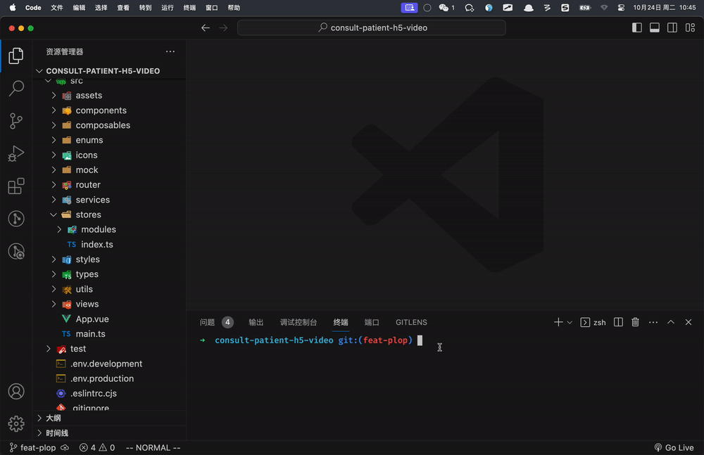
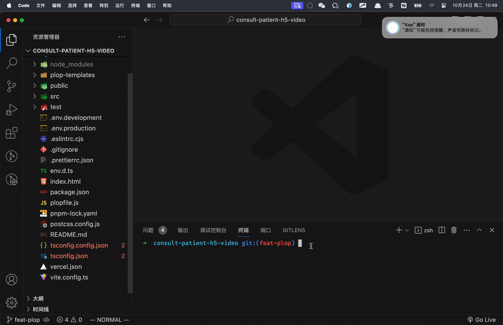

# 其他扩展

## 第三方登录-QQ登录流程


首先：
- 需要在 [QQ互联](https://connect.qq.com/index.html) 平台注册。
- 需要实名身份认证，审核通过。
- 然后创建我的web应用，需要有网站域名，需要域名备案号，设置登录成功回跳地址，审核通过。
- 得到 appid 和 回跳地址。

```bash
# 测试用 appid 
# 102015968
# 测试用 redirect_uri
# http://consult-patients.itheima.net/login/callback
```


步骤：

- 准备QQ登录按钮
- 准备回跳页面
  - 使用 openID 进行登录
  - 登录成功，跳转到来源页面
  - 登录失败，显示绑定手机界面
    - 绑定成功，跳转到来源页面


## 第三方登录-跳转QQ登录

步骤：
- 引入QQ登录SDK
- 生成QQ登录跳转链接
- 登录后回跳成功
- 本地host配置

代码：

1）引入QQ登录SDK

`index.html`
```vue
<script
  src="https://connect.qq.com/qc_jssdk.js"
  data-appid="102015968"
  data-redirecturi="http://consult-patients.itheima.net/login/callback"
></script>
```

2）生成QQ登录跳转连接，跳转至QQ登录

方式一：首先生成QQ登录按钮，再获取其跳转链接，然后配合 A 标签改成直接跳转

```ts
  onMounted(() => {
    // 组件渲染完毕，使用QC生成QQ登录按钮，目的得到跳转链接
    QC.Login({
      btnId: 'qq'
    })
  })
```
```html
<div class="icon" id="qq">
```
以上可以审查元素看到登录链接，复制后改成 A 标签改成 href 跳转即可
```html
  <a
    href="https://graph.qq.com/oauth2.0/authorize?client_id=102015968&response_type=token&scope=all&redirect_uri=http%3A%2F%2Fconsult-patients.itheima.net%2Flogin%2Fcallback"
  >
    
  </a>
```

方式二：直接获取跳转链接，然后配合 `window.location.href` 改成直接跳转

```ts
const qqLogin = () => {
  window.location.href = QC.Login.insertButton._getPopupUrl({
    appId: '102015968',
    redirectURI: 'http://consult-patients.itheima.net/login/callback'
  })
}
```

```html
<div class="icon" @click="qqLogin">
  
</div>
```

> 补充说明：若使用方式二，那么在第一步 “**1）引入QQ登录SDK**” 时，则无需在 script 标签上绑定 `appid` 和 `redirecturi` 了。


:::tip 注意

在手机访问会走QQ登录手机页面，点击按钮唤起QQ应用进行登录，课堂无法演示（限制域名）

开发中可以把谷歌手机模拟器关闭，关闭后可以可以使用手机QQ扫码进行登录，可走通流程。

:::


3）登录后回跳成功

链接如下，路由为 `/login/callback`
```
http://consult-patients.itheima.net/login/callback#access_token=B417C0C3EBF93A380A22A188A9C491A4&expires_in=7776000
```

4） 本地host配置
`windows`

```
1. 找到 C:\Windows\System32\drivers\etc 下hosts文件
2. 在文件中加入  127.0.0.1       consult-patients.itheima.net
3. 保存即可。
# 如果提示没有权限
1. 将hosts文件移到桌面，然后进行修改，确认保存。
2. 将桌面hosts文件替换c盘文件
```

`mac OS`

```
1. 打开命令行窗口
2. 输入：sudo vim /etc/hosts
3. 按下：i 键
4. 输入：127.0.0.1       consult-patients.itheima.net
5. 按下：esc
6. 按下：shift + :
7. 输入：wq 回车即可
# 如果未生效，可执行 sudo killall mDNSResponder
```

5） vite 配置
```ts
  server: {
    port: 80,
    host: true
  },
```

6）回跳地址白名单
```diff
router.beforeEach((to) => {
  NProgress.start()
  const store = useUserStore()
+  const whiteList = ['/login', '/login/callback']
  if (!store.user?.token && !whiteList.includes(to.path)) return '/login'
})
```
```ts
    {
      path: '/login/callback',
      component: () => import('@/views/Login/LoginCallback.vue'),
      meta: { title: 'QQ登录-绑定手机' }
    }
```
```vue
<script setup lang="ts"></script>

<template>
  <div class="login-callback-page">login-callback</div>
</template>

<style lang="scss" scoped></style>
```


## 第三方登录-进行登录

步骤：
- 编写QQ登录API函数
- 提供 `QC` 相关的类型，使用QQ的SDK提供 `QC` 相关API获取 `openId`
- 提交三方登录亲请求
  - 1 如果之前没绑定，失败：需要绑定手机
  - 2 如果之前绑定过，成功：和之前登录成功一样的逻辑
  - 刚注册用户，属于情况1

代码：

1）编写QQ登录API函数
```ts
export const loginByQQ = (openId: string) =>
  request<User>('/login/thirdparty', 'POST', { openId, source: 'qq' })
```

2）提供 `QC` 相关的类型，使用QQ的SDK提供 `QC` 相关API获取 `openId`
`global.d.ts`
```ts
type QCType = {
  Login: {
    check(): boolean
    getMe(cb: (openId: string) => void): void
  }
}

declare const QC: QCType
```

3）进行QQ登录
`/Login/LoginCallback.vue`  记录 openId 和 isBind
```vue
<script setup lang="ts">
/*global QC*/
import { onMounted, ref } from 'vue'

const openId = ref('')
const isNeedBind = ref(false)
onMounted(() => {
  if (QC.Login.check()) {
    QC.Login.getMe((id) => {
      openId.value = id
      // QQ，登录
      loginByQQ(id)
        .then((res) => {
          // 登录成功
        })
        .catch(() => {
          // 登录失败
          isNeedBind.value = true
        })
    })
  }
})
</script>

<template>
  <div class="login-callback-page">login-callback</div>
</template>

<style lang="scss" scoped></style>
```

```vue
<template>
  <div class="login-page" v-if="isNeedBind">
    <cp-nav-bar></cp-nav-bar>
    <div class="login-head">
      <h3>手机绑定</h3>
    </div>
    <van-form autocomplete="off" ref="form">
      <van-field name="mobile" placeholder="请输入手机号"></van-field>
      <van-field name="code" placeholder="请输入验证码">
        <template #button>
          <span class="btn-send">发送验证码</span>
        </template>
      </van-field>
      <div class="cp-cell">
        <van-button
          style="margin-top: 50px"
          block
          round
          type="primary"
          native-type="submit"
        >
          立即绑定
        </van-button>
      </div>
    </van-form>
  </div>
</template>

<style lang="scss" scoped>
@import '@/styles/login.scss';
</style>
```

小结：
- `isNeedBind` 是 `true` 需要显示绑定手机界面

## 第三方登录-验证码composable

1）分析 composable 需要传入参数，返回哪些数据
```
参数：
1. 手机号
2. 发短信类型

返回：
1. form 表单实例
2. time 倒计时数据
3. send 发送函数
```

2）提取函数
```ts
import { showToast, type FormInstance } from 'vant'
import { sendMobileCode } from '@/services/user'
import type { CodeType } from '@/types/user'
```
```ts
// 发送短信验证码吗逻辑
export const useSendMobileCode = (mobile: Ref<string>, type: CodeType = 'login') => {
  const form = ref<FormInstance>()
  const time = ref(0)
  let timeId: number
  const onSend = async () => {
    if (time.value > 0) return
    await form.value?.validate('mobile')
    await sendMobileCode(mobile.value, type)
    showToast('发送成功')
    time.value = 60
    // 倒计时
    clearInterval(timeId)
    timeId = setInterval(() => {
      time.value--
      if (time.value <= 0) clearInterval(timeId)
    }, 1000)
  }
  onUnmounted(() => {
    clearInterval(timeId)
  })
  return { form, time, onSend }
}
```

3）使用函数
```ts
const { form, time, onSend } = useSendMobileCode(mobile, 'login')
```

## 第三方登录-绑定手机

步骤：
- 表单校验
- 发送验证码使用composable
- 进行绑定
- 绑定成功即是登录成功，根据是否有回跳地址进行跳转

代码：

1）表单校验
```ts 
import { mobileRules, codeRules } from '@/utils/rules'


const mobile = ref('')
const code = ref('')
const bind = async () => {
  // 校验通过
}
```

```html 
<van-form autocomplete="off" @submit="bind" ref="form">
  <van-field
    v-model="mobile"
    name="mobile"
    :rules="mobileRules"
    placeholder="请输入手机号"
  ></van-field>
  <van-field v-model="code" name="code" :rules="codeRules" placeholder="请输入验证码">
    <template #button>
      <span class="btn-send">发送验证码</span>
    </template>
  </van-field>
  <div class="cp-cell">
    <van-button style="margin-top: 50px" block round type="primary" native-type="submit"> 立即绑定 </van-button>
  </div>
</van-form>
```

2）发送验证码
```ts
const { form, time, onSend } = useSendMobileCode(mobile, 'bindMobile')
```
```html 
  <template #button>
    <span class="btn-send" :class="{ active: time > 0 }" @click="onSend">
      {{ time > 0 ? `${time}s后再次发送` : '发送验证码' }}
    </span>
  </template>
```

3）进行绑定

```ts
export const bindMobile = (data: { mobile: string; code: string; openId: string }) =>
  request<User>('/login/binding', 'POST', data)
```

```ts
import type { User } from '@/types/user'


// 登录成功
const store = useUserStore()
const router = useRouter()
const loginSuccess = (res: { data: User }) => {
  store.setUser(res.data)
  router.replace('/user')
  showSuccessToast('登录成功')
}

const bind = async () => {
  const res = await bindMobile({
    mobile: mobile.value,
    code: code.value,
    openId: openId.value
  })
  loginSuccess(res)
}
```
```diff
      loginByQQ(id)
        .then((res) => {
+          loginSuccess(res)
        })
        .catch(() => {
          isBind.value = false
        })
```

4) 绑定成功即是登录成功，根据是否有回跳地址进行跳转

`stores/modules/user.ts`
```ts
   // 记录回跳地址
    const returnUrl = ref('')
    const setReturnUrl = (url: string) => (returnUrl.value = url)
    return { user, setUser, delUser, returnUrl, setReturnUrl }
```
`Login/index.vue`
```diff
        <a
+          @click="store.setReturnUrl($route.query.returnUrl as string)"
          href="https://graph.qq.com/oauth2.0/authorize?client_id=102015968&response_type=token&scope=all&redirect_uri=http%3A%2F%2Fconsult-patients.itheima.net%2Flogin%2Fcallback"
        >
          
        </a>
```
`Login/LoginCallback.vue`
```diff
// 登录成功
const loginSuccess = (res: { data: User }) => {
  store.setUser(res.data)
  // 如果有回跳地址就进行回跳，没有跳转到个人中心
+  router.replace(store.returnUrl || '/user')
  Toast.success('登录成功')
+  store.setReturnUrl('')
}
```


## 部署-开发生产环境


步骤：

- 知道使用 什么是开发环境和生成环境？
  - run dev 是本地开发环境，run build 是线上生产环境
- QQ回调地址：
  - 线上：https://cp.itheima.net/login/callback
  - 本地：http://consult-patients.itheima.net/login/callback
- 支付回调
  - 问诊支付
    - 线上：https://cp.itheima.net/room
    - 本地：http://consult-patients.itheima.net/room
  - 药品支付
    - 线上：https://cp.itheima.net/order/pay/result
    - 本地：http://consult-patients.itheima.net/order/pay/result
- 标题：生产环境（优医问诊），本地环境（本地-优医问诊）

代码：

`.env.development`
```
VITE_APP_CALLBACK=http://consult-patients.itheima.net
VITE_APP_TITLE=本地-优医问诊
```
`.env.production`
```
VITE_APP_CALLBACK=https://cp.itheima.net
VITE_APP_TITLE=优医问诊
```

**JS文件中**

1) 跳转QQ登录 `Login/index.vue`
```ts
const qqUrl = `https://graph.qq.com/oauth2.0/authorize?client_id=102015968&response_type=token&scope=all&redirect_uri=${encodeURIComponent(
  import.meta.env.VITE_APP_CALLBACK + '/login/callback'
)}`
```
```html 
  <a @click="store.setReturnUrl($route.query.returnUrl as string)" :href="qqUrl">
    
  </a>
```

2）CpPaySheet 加入动态域名

```diff
  const res = await getConsultOrderPayUrl({
    orderId: orderId,
    paymentMethod: paymentMethod.value,
+    payCallback: import.meta.env.VITE_APP_CALLBACK + payCallback
  })
```

3）配置问诊支付回调
`Consult/ConsultPay.vue` `User/ConsultDetail.vue`
```diff
      <cp-pay-sheet
        v-model:show="show"
        :order-id="orderId"
        :actualPayment="payInfo.actualPayment"
        :onClose="onClose"
+        pay-callback="/room"
      />
```

4）配置药品订单支付回调
`Order/OrderPay.vue`
```diff
    <cp-pay-sheet
      :orderId="orderId"
      :actualPayment="orderPre.actualPayment"
      v-model:show="show"
+      payCallback="/order/pay/result"
    />
```

**index.html中**

安装 html 模板插件
```bash
pnpm add vite-plugin-html -D
```

`vite.config.ts`
```ts
import { createHtmlPlugin } from 'vite-plugin-html'
```
```ts
plugins: [
  createHtmlPlugin()
]
```
`index.html`  `<%=环境变量名%>` 取出值
```html
  <head>
    <meta charset="UTF-8" />
    <link rel="icon" href="/favicon.ico" />
    <meta name="viewport" content="width=device-width, initial-scale=1.0" />
    <title><%=VITE_APP_TITLE%></title>
  </head>
  <body>
    <div id="app"></div>
    <script type="module" src="/src/main.ts"></script>
    <script
      src="https://connect.qq.com/qc_jssdk.js"
      data-appid="102015968"
      data-redirecturi="<%=VITE_APP_CALLBACK%>/login/callback"
    ></script>
```


## 部署-真机调试

- 在 Chrome 浏览器中使用什么进行调试？
  - 控制面板，开发者工具，F12
- 在 手机端 浏览器使用什么进行调试呢？
- Eruda 手机调试面板工具

使用方式：https://github.com/liriliri/eruda

`index.html`

```html
    <script src="https://cdnjs.cloudflare.com/ajax/libs/eruda/2.4.1/eruda.min.js"></script>
    <script>eruda.init()</script>
```

只在开发环境使用：
```html
    <% if(DEV){ %>
    <script src="https://cdnjs.cloudflare.com/ajax/libs/eruda/2.4.1/eruda.min.js"></script>
    <script>eruda.init()</script>
    <% } %>
```

小结：
- 使用 vite-plugin-html 解析模板，默认支持 ejs 模板引擎语法


## 部署-pm2托管（手动）

1）本地打包

```sh
pnpm build
```

得到 dist 资源包


2）上传服务器

服务器一般是 linux系统，使用 XFTP 进行文件的上传和下载（这个就不赘述了）


3）服务器使用pm2进行部署（本地演示） [托管静态资源](https://pm2.keymetrics.io/docs/usage/expose/)

全局安装：

```sh
npm i pm2 -g
```

进入dist：

```sh
# pm2 serve 目录 端口  --name 服务名称
pm2 serve ./ 8080 --name my-cp-server
```


4）history路由模式问题，如果有子路径，刷新页面 404 

原因：hostory 改变路由是前端切换，不会请求服务器，一旦刷新浏览器 `/consult/dep`按照这个地址请求服务器，是没有对应的资源的。

解决：遇见子路径且没有后缀名，服务器定位到 ‘index.html’ 页面返回给前端即可。

命令：

```sh
pm2 serve --spa ./ 8080 --name my-cp-server
```


pm2其他命令：

```sh
# 查看服务列表
pm2 list
# 删除服务
pm2 delete my-cp-server
```


## 部署-腾讯云部署


[腾讯云-Web应用托管](https://console.cloud.tencent.com/webify/index)

- 注册，实名认证，才可以使用 webify 服务

使用步骤演示：

1）创建应用


2）关联码云，需要码云授权


3）选择需要使用的仓库


4）构建配置


5）进行构建


6）尝试访问


自动部署流程：


## 部署-gitlab部署(演示)


1. 本地Vscode编写代码
2. gitlab是企业版，内部部署
3. Linux服务器
   1. 安装 gitlab-runner 用于拉取仓库代码
   2. 安装 Nodejs 用于打包项目
   3. 安装 pm2 用于启动静态资源托管，守护进程
4. 运维使用 Nginx 进行域名代理
5. 用户通过浏览器访问服务

依赖于gitlab-ci.yml配置文件

```text
stages:
  - build
cache:
  key: ${CI_BUILD_REF_NAME}
  paths:
    - node_modules/

build-140:
  stage: build
  only:
    - master
  script:
    - rm -rf node_modules/
    - pnpm i
    - pnpm build
    - rm -rf /home/patient-h5-preview
    - mkdir /home/patient-h5-preview
    - cp -r dist/* /home/patient-h5-preview
    - cd /home/patient-h5-preview
    - pm2 delete patient-h5-preview || echo no
    - pm2 serve --spa ./ 8083 --name patient-h5-preview
  tags: 
    - patient-h5-preview
```


## 扩展-mock接口数据

https://www.npmjs.com/package/vite-plugin-mock

1）安装 vite-plugin-mock mockjs
```bash
pnpm i vite-plugin-mock mockjs -D
```

2）使用插件扫描 `src/mock` 下文件
```ts
import { viteMockServe } from 'vite-plugin-mock'
```
```ts
plugins: [
    viteMockServe({
      mockPath: './src/mock',
      localEnabled: true
    })
]
```

3）mock文件 `src/mock/index.ts`
```ts
import Mock from 'mockjs'

const rules = [
  {
    url: '/patient/message/sys/list',
    method: 'get',
    timeout: 1000,
    response: () => {
      const data = []
      for (let i = 0; i < 10; i++) {
        data.push(
          Mock.mock({
            id: '@id',
            avatar: '@image("100x100")',
            title: '@ctitle(3,10)',
            content: '@ctitle(10,40)',
            createTime: '@datetime()',
            status: '@integer(0,1)',
            type: '@integer(1,3)',
          })
        )
      }
      return {
        code: 10000,
        message: '模拟数据成功',
        data
      }
    }
  }
]

export default rules
```
测试 

```ts
request(import.meta.env.VITE_APP_CALLBACK + '/patient/message/list').then((res) => {
  console.log(res)
})
```

使用注意：
- 这些mock接口是  vite 本地服务器提供的


## 扩展-vitest单元测试

- 测试作用：自动化测试能够预防无意引入的 bug
- 何时测试：越早越好，拖得越久，应用就会有越多的依赖和复杂性，想要开始添加测试也就越困难。
- 测试类型：单元测试、组件测试、端对端测试

> 单元测试：检查给定函数、类或组合式函数的输入是否产生预期的输出或副作用。

- 安装 vitest 

```bash
pnpm i vitest -D
```

- 配置命令 `package.json`

```ts
"scripts": {
    "test": "vitest"
}
```

- 测试代码 `utils/test/filter.test.ts`

```ts
import { IllnessTime } from '@/enums'
import { test, expect } from 'vitest'
import { getConsultFlagText, getIllnessTimeText } from '../filter'

// 测试 getIllnessTimeText 函数
test('测试 getIllnessTimeText 函数', () => {
  // 进行测试，函数：输入是否可以达到预期的输出
  const text = getIllnessTimeText(IllnessTime.Month)
  expect(text).toBe('一月内')
  const text2 = getIllnessTimeText(IllnessTime.Week)
  expect(text2).toBe('一周内')
})

// 测试 getConsultFlagText 函数
test('测试 getConsultFlagText 函数', () => {
  const text = getConsultFlagText(0)
  expect(text).toBe('没就诊过')
})
```


## 扩展-vitest组件测试

- 对于 视图 的测试：根据输入 prop 和插槽断言渲染输出是否正确。

- 对于 交互 的测试：断言渲染的更新是否正确或触发的事件是否正确地响应了用户输入事件。

- 组件测试通常涉及到单独挂载被测试的组件，触发模拟的用户输入事件，并对渲染的 DOM 输出进行断言。安装：happy-dom @testing-library/vue

具体步骤：

1）安装

```bash
pnpm i happy-dom @testing-library/vue -D
```

2）配置测试环境下的DOM生成器 `vite.config.ts`

```ts{1,8,9,10}
/// <reference types="vitest/config" />

export default defineConfig({
  server: {
    port: 80,
    host: true
  },
  test: {
    environment: 'happy-dom'
  },
```

3）测试代码 `components/test/components.test.ts`

```ts
import { test, expect } from 'vitest'
import { render } from '@testing-library/vue'
import CpRadioBtn from '../CpRadioBtn.vue'

test('CpRadioBtn', async () => {
  // 1.  单独挂着组件
  const wrapper = render(CpRadioBtn, {
    props: {
      options: [
        { label: '选项一', value: 1 },
        { label: '选项二', value: 2 }
      ],
      modelValue: 1
    }
  })

  // 2. 测试组件渲染
  wrapper.getByText('选项一')
  wrapper.getByText('选项二')

  // 3. 测试props
  expect(wrapper.queryByText('选项一')?.classList.contains('active')).toBe(true)

  // 4. 自定义事件（update:modelValue）
  wrapper.queryByText('选项二')?.click()
  expect(wrapper.emitted()['update:modelValue'][0]).toEqual([2])
  // 更新props
  await wrapper.rerender({
    modelValue: 2
  })
  expect(wrapper.queryByText('选项二')?.classList.contains('active')).toBe(true)
})
```

## 工程化-plop

思考：
1. 每次在`modules`中新建个`store`模块，`defineStore`组合式语法代码又是固定的写法，之后还要在`index`中统一导出，这是重复的工作
2. 每次在`views`中新建页面组件，写最基本结构，之后在配置路由规则，这又是重复的工作
3. 每次在`components`中新写组件，实现后最后都不能忘记在`components.d.ts`中写类型声明，这不又重复工作了吗


**有什么办法吗！可以使用[plop](https://plopjs.com/)**


### 演示效果


#### store



#### view



#### component


### 代码实现

1. 安装依赖
```bash
npm install --save-dev plop
```
2. 在根目录下创建`plopfile.js`
```js
// eslint-disable-next-line
module.exports = function (plop) {
  // plop generator code
  plop.setGenerator('store', {
    // 描述
    description: 'generate store',
    prompts: [
      {
        type: 'input', // 用户输入
        name: 'name', // 接收的变量名
        message: 'store name please' // 提示用户输入信息
      }
    ],
    actions: [
      {
        type: 'add', // 新建文件
        path: 'src/stores/modules/{{ name }}.ts', // 新建文件的路径
        templateFile: 'plop-templates/store/module.ts.hbs' // 模板路径
      },
      {
        type: 'modify', // 修改文件
        path: 'src/stores/index.ts', // 修改文件路径
        pattern: /(\/\/ -- append store here --)/gi, // 正则找到标识位置(在文件哪里修改)
        templateFile: 'plop-templates/store/index.ts.hbs' // 模板路径
      }
    ]
  })

  plop.setGenerator('view', {
    description: 'generate view',
    prompts: [
      {
        type: 'input',
        name: 'name',
        message: 'view name please'
      }
    ],
    actions: [
      {
        type: 'add',
        path: 'src/views/{{ properCase name }}/index.vue', // properCase大驼峰，详细请看文档
        templateFile: 'plop-templates/view/index.vue.hbs'
      },
      {
        type: 'modify',
        path: 'src/router/index.ts',
        pattern: /(\/\/ -- append route here --)/gi,
        templateFile: 'plop-templates/view/route.ts.hbs'
      }
    ]
  })
  plop.setGenerator('component', {
    description: 'generate component',
    prompts: [
      {
        type: 'input',
        name: 'name',
        message: 'component name please'
      }
    ],
    actions: [
      {
        type: 'add',
        path: 'src/components/Cp{{ name }}.vue',
        templateFile: 'plop-templates/component/index.vue.hbs'
      },
      {
        type: 'modify',
        path: 'src/types/components.d.ts',
        pattern: /(\/\/ -- append import here --)/gi,
        templateFile: 'plop-templates/component/import.ts.hbs'
      },
      {
        type: 'modify',
        path: 'src/types/components.d.ts',
        pattern: /(\/\/ -- append type here --)/gi,
        templateFile: 'plop-templates/component/type.ts.hbs'
      }
    ]
  })
}
```
3. 配置模板

- store
```ts
// index.ts.hbs
// -- append store here --
export * from './modules/{{ name }}'
```

```ts
// module.ts.hbs
import { defineStore } from 'pinia'
import { ref } from 'vue'

export const use{{ properCase name }}Store = defineStore(
  'cp-{{ name }}',
  () => {
    
    return {
      
    }
  },
  {
    persist: true
  }
)

```
- view
```vue
// index.vue.hbs
<script setup lang="ts"></script>

<template>
  <div class="{{ name }}-page">
    <h1>{{ name }}</h1>
  </div>
</template>

<style scoped lang="scss">
.{{ name }}-page {

}
</style>

```

```ts
// route.ts.hbs
// -- append route here --
{
    path: '/{{ name }}',
    component: () => import('@/views/{{ properCase name }}/index.vue'),
    meta: { title: '{{ name }}' }
},
```
- component

```ts
// import.ts.hbs
// -- append import here --
import Cp{{ properCase name }} from '@/components/Cp{{ properCase name }}.vue'
```

```vue
// index.vue.hbs
<script setup lang="ts"></script>

<template>
  <div class="cp-{{ dashCase name }}"></div>
</template>

<style scoped lang="scss">
.cp-{{ dashCase name }} {

}
</style>

```

```ts
// type.ts.hbs
// -- append type here --
Cp{{ properCase name }}: typeof Cp{{ properCase name }}
```

4. 修改文件在对应文件中加上标识

`store/index.ts`

```diff
// 1. 创建pinia实例
// 2. 使用pinia插件

import { createPinia } from 'pinia'
import presist from 'pinia-plugin-persistedstate'

const pinia = createPinia()
pinia.use(presist)

export default pinia

// import { useUserStore } from './modules/user'
// export { useUserStore }
export * from './modules/user'
export * from './modules/consult'

+// -- append store here --

```

`router/index.ts`

```diff
  routes: [
    ...
    {
      path: '/login/callback',
      component: () => import('@/views/Login/LoginCallback.vue'),
      meta: { title: '三方登录' }
    },
+    // -- append route here --
    {
      path: '/',
      redirect: '/home',
      component: () => import('@/views/Layout/index.vue'),
      children: [
        {
          path: '/home',
          component: () => import('@/views/Home/index.vue'),
          meta: { title: '首页' }
        },
        {
          path: '/article',
          component: () => import('@/views/Article/index.vue'),
          meta: { title: '健康百科' }
        },
        {
          path: '/notify',
          component: () => import('@/views/Notify/index.vue'),
          meta: { title: '消息通知' }
        },
        {
          path: '/user',
          component: () => import('@/views/User/index.vue'),
          meta: { title: '个人中心' }
        }
      ]
    }
  ]
```
`components.d.ts`

```diff
import CpNavBar from '@/components/CpNavBar.vue'
import CpIcon from '@/components/CpIcon.vue'
import CpRadioBtn from '@/components/CpRadioBtn.vue'
import CpPaySheet from '@/components/CpPaySheet.vue'

+// -- append import here --

declare module 'vue' {
  interface GlobalComponents {
    // 添加组件类型
    CpNavBar: typeof CpNavBar
    CpIcon: typeof CpIcon
    CpRadioBtn: typeof CpRadioBtn
    CpPaySheet: typeof CpPaySheet

+    // -- append type here --
  }
}

```

