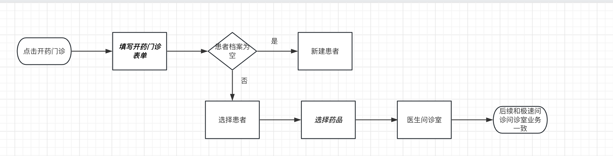

# 开药门诊模块

## 开药门诊-需求分析

> 理解开药门诊阶段流程分析



## 开药门诊-表单页面路由搭建

步骤

1. 准备基础结构代码
2. 路由配置
3. 首页跳转
4. cv静态结构

基础结构代码`views/Consult/ConsultMedicine.vue`

```vue
<script setup lang="ts"></script>

<template>
  <div class="consult-medicine-page">
    <h1>consult-medicine</h1>
  </div>
</template>

<style scoped lang="scss"></style>

```

路由配置`router/index.ts`

```ts
{
    path: '/consult/medicine',
    component: () => import('@/views/Consult/ConsultMedicine.vue'),
    meta: { title: '开药门诊' }
}
```

首页跳转`Home/index.vue`

```vue
<router-link
    to="/consult/medicine"
    class="nav"
    @click="store.setType(ConsultType.Medication)"
>
    <cp-icon name="home-prescribe"></cp-icon>
    <p class="title">开药门诊</p>
    <p class="desc">线上买药更方便</p>
</router-link>
```

静态结构`ConsultMedicine.vue`

```vue
<script setup lang="ts"></script>

<template>
  <div class="consult-medicine-page">
    <cp-nav-bar
      title="开药门诊"
      right-text="问诊记录"
      @click-right="$router.push('/user/consult')"
    ></cp-nav-bar>
    <van-notice-bar text="请如实填写资料以便医生了解您的病情和用药需求" />
    <div class="illness-form">
      <div class="adm-list-header">症状描述</div>
      <van-field
        type="textarea"
        rows="3"
        placeholder="请输入所患疾病名称"
      ></van-field>
      <div class="adm-list-header">用药人身体情况</div>
      <div class="item">
        <p>肝功能</p>
      </div>
      <div class="item">
        <p>肾功能</p>
      </div>
      <div class="item">
        <p>过敏史</p>
      </div>
      <div class="item">
        <p>生育状态及计划</p>
      </div>
      <div class="adm-list-header">补充病例信息</div>
      <!-- 上传组件 -->
      <div class="illness-img"></div>
      <!-- 下一步 -->
      <!-- <van-button type="primary" block round> 下一步 </van-button> -->
    </div>
  </div>
</template>

<style scoped lang="scss">
.consult-medicine-page {
  padding-top: 46px;
  .van-button {
    font-size: 16px;
    margin-bottom: 30px;
    &.disabled {
      opacity: 1;
      background: #fafafa;
      color: #d9dbde;
      border: #fafafa;
    }
  }
  .illness-form {
    padding: 0 15px 15px 15px;
    .adm-list-header {
      padding-bottom: 5px;
      font-size: 16px;
      font-weight: 500;
      color: #121826;
      border-bottom: none;
      margin-top: 30px;
    }
    .van-field {
      padding: 0;
      &::after {
        border-bottom: none;
      }
    }
    .item {
      > p {
        color: var(--cp-text3);
        padding: 15px 0;
      }
    }
  }
}
</style>

```

## 开药门诊-表单单选框处理

需求：

完成表单双向数据绑定

步骤：

1. 定义枚举
2. 定义选项options
3. 开药门诊页面中使用`cp-radio-btn`
4. 扩展`Consult`类型添加字段，`store`中添加方法保存字段
5. 双向数据绑定

定义枚举`enums/index.ts`

```ts
// 肝功能
export enum LiverFunction {
  /** 正常 */
  Normal,
  /** 异常 */
  Abnormal,
  /** 不清楚 */
  Unclear
}
// 肾功能
export enum RenalFunction {
  /** 正常 */
  Normal,
  /** 异常 */
  Abnormal,
  /** 不清楚 */
  Unclear
}
// 过敏史
export enum AllergicHistory {
  /** 正常 */
  Normal,
  /** 异常 */
  Abnormal,
  /** 不清楚 */
  Unclear
}
// 生育状态及计划
export enum FertilityStatus {
  /** 无 */
  No,
  /** 备孕中 */
  TryingToConceive,
  /** 已怀孕 */
  AlreadyPregnant,
  /** 哺乳期 */
  Breastfeeding
}
```

定义`options`选项`services/constant`

```ts
// 肝功能
export const liverFunctionOptions = [
  { label: '正常', value: LiverFunction.Normal },
  { label: '异常', value: LiverFunction.Abnormal },
  { label: '不清楚', value: LiverFunction.Unclear }
]
// 肾功能
export const renalFunctionOptions = [
  { label: '正常', value: RenalFunction.Normal },
  { label: '异常', value: RenalFunction.Abnormal },
  { label: '不清楚', value: RenalFunction.Unclear }
]
// 过敏史
export const allergicHistoryOptions = [
  { label: '正常', value: AllergicHistory.Normal },
  { label: '异常', value: AllergicHistory.Abnormal },
  { label: '不清楚', value: AllergicHistory.Unclear }
]
// 生育状态及计划
export const fertilityStatusOptions = [
  { label: '无', value: FertilityStatus.No },
  { label: '备孕中', value: FertilityStatus.TryingToConceive },
  { label: '已怀孕', value: FertilityStatus.AlreadyPregnant },
  { label: '哺乳期中', value: FertilityStatus.Breastfeeding }
]

```

使用`cp-radio-btn`在开药门诊页面中`ConsultMedicine.vue`

```ts
import {
  liverFunctionOptions,
  allergicHistoryOptions,
  fertilityStatusOptions,
  renalFunctionOptions
} from '@/services/constants'
```

```vue
      <div class="item">
        <p>肝功能</p>
        <cp-radio-btn :options="liverFunctionOptions"></cp-radio-btn>
      </div>
      <div class="item">
        <p>肾功能</p>
        <cp-radio-btn :options="renalFunctionOptions"></cp-radio-btn>
      </div>
      <div class="item">
        <p>过敏史</p>
        <cp-radio-btn :options="allergicHistoryOptions"></cp-radio-btn>
      </div>
      <div class="item">
        <p>生育状态及计划</p>
        <cp-radio-btn :options="fertilityStatusOptions"></cp-radio-btn>
      </div>
```

扩展`Consult`类型添加字段，`store`中添加方法保存字段

`consult.d.ts`

```ts
import type {
  ConsultType,
  IllnessTime,
  OrderType,
  LiverFunction,
  RenalFunction,
  AllergicHistory,
  FertilityStatus
} from '@/enums'

...

export type Consult = {
  ...
  /** 肝功能 */
  liverFunction: LiverFunction
  /** 肾功能 */
  renalFunction: RenalFunction
  /** 过敏史 */
  allergicHistory: AllergicHistory
  /** 生育状态及计划 */
  fertilityStatus: FertilityStatus
}

export type MedicineIllness = Pick<
  PartialConsult,
  | 'illnessDesc'
  | 'liverFunction'
  | 'renalFunction'
  | 'allergicHistory'
  | 'fertilityStatus'
  | 'pictures'
>    
```

`src/stores/modules/consult.ts`

```ts
import type { ConsultIllness, PartialConsult, MedicineIllness } from '@/types/consult'

...
// 记录问药门诊病情
const setMedicineIlness = (illness: MedicineIllness) => {
    consult.value.illnessDesc = illness.illnessDesc
    consult.value.liverFunction = illness.liverFunction
    consult.value.renalFunction = illness.renalFunction
    consult.value.allergicHistory = illness.allergicHistory
    consult.value.fertilityStatus = illness.fertilityStatus
    consult.value.pictures = illness.pictures
}

return {
    ...,
    setMedicineIlness
}
```

双向数据绑定`ConsultMedicine.vue`

```ts
import type { MedicineIllness } from '@/types/consult'
import { ref } from 'vue'
const form = ref<MedicineIllness>({
  illnessDesc: '',
  liverFunction: undefined,
  renalFunction: undefined,
  allergicHistory: undefined,
  fertilityStatus: undefined,
  pictures: []
})
```

```vue
<div class="illness-form">
      <div class="adm-list-header">症状描述</div>
      <van-field
        type="textarea"
        rows="3"
        placeholder="请输入所患疾病名称"
        v-model="form.illnessDesc"
      ></van-field>
      <div class="adm-list-header">用药人身体情况</div>
      <div class="item">
        <p>肝功能</p>
        <cp-radio-btn
          :options="liverFunctionOptions"
          v-model="form.liverFunction"
        ></cp-radio-btn>
      </div>
      <div class="item">
        <p>肾功能</p>
        <cp-radio-btn
          :options="renalFunctionOptions"
          v-model="form.renalFunction"
        ></cp-radio-btn>
      </div>
      <div class="item">
        <p>过敏史</p>
        <cp-radio-btn
          :options="allergicHistoryOptions"
          v-model="form.allergicHistory"
        ></cp-radio-btn>
      </div>
      <div class="item">
        <p>生育状态及计划</p>
        <cp-radio-btn
          :options="fertilityStatusOptions"
          v-model="form.fertilityStatus"
        ></cp-radio-btn>
      </div>
      <div class="adm-list-header">补充病例信息</div>
      <!-- 上传组件 -->
      <div class="illness-img"></div>
      <!-- 下一步 -->
      <!-- <van-button type="primary" block round> 下一步 </van-button> -->
    </div>
```

## 开药门诊-封装上传组件

极速问诊中图文问诊用到了上传图片功能，在开药门诊中我们也有上传图片功能，所以需要封装上传组件

步骤：

1. 封装组件`CpUpload`
2. 为`CpUpload`组件提供类型
3. `ConsultIllness`使用上传组件
4. `ConsultMedicine`使用上传组件

封装组件`components/CpUpload.vue`

```vue
<script setup lang="ts">
import { uploadImage } from '@/services/consult'
import type { UploaderFileListItem } from 'vant'
import type { UploaderAfterRead } from 'vant/lib/uploader/types'
import { ref } from 'vue'
import type { Image } from '@/types/consult'

const emit = defineEmits<{
  (e: 'uploadSuccess', img: Image): void
  (e: 'deleteSuccess', item: UploaderFileListItem): void
}>()

// 上传图片
const fileList = ref<Image[]>([])
// 图片上传
const onAfterRead: UploaderAfterRead = (item) => {
  if (Array.isArray(item)) return
  if (!item.file) return

  item.status = 'uploading'
  item.message = '上传中...'
  uploadImage(item.file)
    .then((res) => {
      item.status = 'done'
      item.message = undefined
      item.url = res.data.url
      emit('uploadSuccess', res.data)
    })
    .catch(() => {
      item.status = 'failed'
      item.message = '上传失败'
    })
}
const onDeleteImg = (item: UploaderFileListItem) => {
  emit('deleteSuccess', item)
}

const setFileList = (val: Image[]) => {
  fileList.value = val
}
defineExpose({
  setFileList
})
</script>

<template>
  <div class="illness-img">
    <van-uploader
      upload-icon="photo-o"
      upload-text="上传图片"
      max-count="9"
      :max-size="5 * 1024 * 1024"
      v-model="fileList"
      :after-read="onAfterRead"
      @delete="onDeleteImg"
    ></van-uploader>
    <p class="tip" v-if="!fileList.length">
      上传内容仅医生可见,最多9张图,最大5MB
    </p>
  </div>
</template>

<style scoped lang="scss">
.illness-img {
  padding-top: 16px;
  margin-bottom: 40px;
  display: flex;
  align-items: center;
  .tip {
    font-size: 12px;
    color: var(--cp-tip);
  }
  ::v-deep() {
    .van-uploader {
      &__preview {
        &-delete {
          left: -6px;
          top: -6px;
          border-radius: 50%;
          background-color: var(--cp-primary);
          width: 20px;
          height: 20px;
          &-icon {
            transform: scale(0.9) translate(-22%, 22%);
          }
        }
        &-image {
          border-radius: 8px;
          overflow: hidden;
        }
      }
      &__upload {
        border-radius: 8px;
      }
      &__upload-icon {
        color: var(--cp-text3);
      }
    }
  }
}
</style>
```

为`CpUpload`组件提供类型`src/types/components.d.ts`

```ts
...
import CpUpload from '@/components/CpUpload.vue'

declare module 'vue' {
  interface GlobalComponents {
    // 添加组件类型
    ...
    CpUpload: typeof CpUpload
  }
}

```

`ConsultIllness.vue`使用上传组件

```ts
// 数据的回显
onMounted(() => {
  if (store.consult.illnessDesc) {
    showConfirmDialog({
      title: '温馨提示',
      message: '是否恢复之前填写的病情信息？',
      closeOnPopstate: false
    }).then(() => {
      // 回显数据
      const { illnessDesc, illnessTime, consultFlag, pictures } = store.consult
      form.value = { illnessDesc, illnessTime, consultFlag, pictures }
      cpUploadRef.value.setFileList(pictures || [])
    })
  }
})
const cpUploadRef = ref()
const onUploadSuccess = (image: Image) => {
  form.value.pictures?.push(image)
}
const onDeleteSuccess = (item: UploaderFileListItem) => {
  form.value.pictures = form.value.pictures?.filter(
    (pic) => pic.url !== item.url
  )
}

```

```vue
<cp-upload
  ref="cpUploadRef"
  @upload-success="onUploadSuccess"
  @delete-success="onDeleteSuccess"
></cp-upload>
```

`ConsultMedicine.vue`使用上传组件

```ts
const cpUploadRef = ref()
const onUploadSuccess = (image: Image) => {
  form.value.pictures?.push(image)
}
const onDeleteSuccess = (item: UploaderFileListItem) => {
  form.value.pictures = form.value.pictures?.filter(
    (pic) => pic.url !== item.url
  )
}
```

```vue
<cp-upload
  ref="cpUploadRef"
  @upload-success="onUploadSuccess"
  @delete-success="onDeleteSuccess"
></cp-upload>
```

## 开药门诊-表单页面下一步功能

`ConsultMedicine`

步骤：

1. 控制按钮样式
2. 校验逻辑
3. 下一步跳转逻辑

控制按钮样式

```ts
const disabled = computed(
  () =>
    !form.value.illnessDesc ||
    form.value.liverFunction === undefined ||
    form.value.renalFunction === undefined ||
    form.value.allergicHistory === undefined ||
    form.value.fertilityStatus === undefined
)
```

```vue
<van-button
  :class="{ disabled }"
  type="primary"
  block
  round
  @click="next"
>
  下一步
</van-button>
```

校验逻辑

```ts
const next = () => {
  if (!form.value.illnessDesc) return showToast('请输入病情描述')
  if (form.value.liverFunction === undefined)
    return showToast('请选择肝功能情况')
  if (form.value.renalFunction === undefined)
    return showToast('请选择肾功能情况')
  if (form.value.allergicHistory === undefined)
    return showToast('请选择过敏史情况')
  if (form.value.fertilityStatus === undefined)
    return showToast('请选择生育状态及计划')
  
}
```

下一步跳转逻辑

```ts
const store = useConsultStore()
const router = useRouter()
const next = () => {
  ....
  //  记录病情
  store.setMedicineIlness(form.value)
  // 跳转，携带标识
  router.push('/user/patient?isChange=1&from=medicineConsult')
}
```

## 开药门诊-选择患者页面下一步功能

步骤：

1. 开药门诊选择患者下一步跳转选择药品，根据标识跳转
2. 新建页面结构
3. 路由规则配置

开药门诊选择患者下一步跳转选择药品，根据标识跳转`views/User/PatientPage.vue`

```ts
const fromMedicineConsultFlag = computed(
  () => route.query.from === 'medicineConsult'
)
const next = () => {
  if (!patientId.value) return showToast('请选择患者')
  store.setPatient(patientId.value)
  if (fromMedicineConsultFlag.value) {
    router.push('/consult/choose')
  } else {
    router.push('/consult/pay')
  }
}
```

新建页面结构`ConsultChoose.vue`

```vue
<script setup lang="ts"></script>

<template>
  <div class="consult-choose-page">
    <h1>consult-choose</h1>
  </div>
</template>

<style scoped lang="scss"></style>

```

路由规则配置`router/index.ts`

```ts
{
  path: '/consult/choose',
  component: () => import('@/views/Consult/ConsultChoose.vue'),
  meta: { title: '选择药品' }
}
```

## 选择药品-页面结构

步骤：

1. 静态结构
2. 步进器组件学习及样式处理

静态结构`ConsultChoose.vue`

```vue
<script setup lang="ts">
import { showToast } from 'vant'
import { ref } from 'vue'

const searchValue = ref('')
const onSearch = (val: string) => showToast(val)
const onCancel = () => showToast('取消')

const step = ref(1)
</script>

<template>
  <div class="consult-choose-page">
    <cp-nav-bar title="选择药品"></cp-nav-bar>
    <van-search
      v-model="searchValue"
      show-action
      placeholder="搜一搜: 药品名称"
      @search="onSearch"
      @cancel="onCancel"
    />
    <!-- 药品列表 -->
    <div class="medicine-list">
      <div class="item van-hairline--top" v-for="i in 20" :key="i">
        
        <div class="info">
          <p class="name">
            <span>优赛明 维生素E乳 {{ i }}</span>
            <span>
              <van-stepper v-model="step" />
            </span>
          </p>
          <p class="size">
            <van-tag>处方药</van-tag>
            <span>80ml</span>
          </p>
          <p class="price">￥25.00</p>
        </div>
      </div>
    </div>
    <van-action-bar>
      <van-action-bar-icon icon="cart-o" badge="0" />
      <div class="total-price">￥ 1000</div>
      <van-action-bar-button type="primary" text="申请开方" />
    </van-action-bar>
  </div>
</template>

<style scoped lang="scss">
.consult-choose-page {
  padding-top: 46px;
  .van-search {
    position: sticky;
    top: 46px;
    z-index: 10;
    background-color: #fff;
  }
  .van-action-bar {
    border-top: 1px solid rgba(237, 237, 237, 0.9);
    .total-price {
      width: 200px;
      font-size: 24px;
      line-height: 18px;
      font-weight: 700;
      color: #121826;
    }
  }
  .medicine-list {
    background-color: #fff;
    padding: 0 15px 45px;
    .item {
      display: flex;
      flex-wrap: wrap;
      padding: 15px 0;
      .img {
        width: 80px;
        height: 70px;
        border-radius: 2px;
        overflow: hidden;
      }
      .info {
        padding-left: 15px;
        width: 250px;
        .name {
          display: flex;
          font-size: 15px;
          margin-bottom: 5px;
          > span:first-child {
            // width: 200px;
            // width: 300px;
            width: 40vw;
          }
          > span:last-child {
            // width: 50px;
            text-align: right;
          }
        }
        .size {
          margin-bottom: 5px;
          .van-tag {
            background-color: var(--cp-primary);
            vertical-align: middle;
          }
          span:not(.van-tag) {
            margin-left: 10px;
            color: var(--cp-tag);
            vertical-align: middle;
          }
        }
        .price {
          font-size: 16px;
          color: #eb5757;
        }
      }
      .desc {
        width: 100%;
        background-color: var(--cp-bg);
        border-radius: 4px;
        margin-top: 10px;
        padding: 4px 10px;
        color: var(--cp-tip);
      }
    }
  }
}
</style>

```

步进器组件学习及样式处理

```ts
const step = ref(0)
```

```vue
<van-stepper
    v-model="step"
    min="0"
    :class="{ hide: step === 0 }"
/>
```

```scss
.van-stepper {
    position: absolute;
    right: 0;
    bottom: 15px;
    :deep() {
      .van-stepper__input {
        background: none;
      }
      .van-stepper__minus {
        background-color: #fff;
        border: 0.5px solid #16c2a3;
      }
      .van-stepper__plus {
        background-color: #eaf8f6;
      }
      .van-stepper__minus,
      .van-stepper__plus {
        width: 20px;
        height: 20px;
      }
    }
    &.hide {
      :deep() {
        .van-stepper__minus,
        .van-stepper__input {
          visibility: hidden;
        }
      }
    }
  }
```

## 选择药品-抽离列表卡片组件

步骤：

1. 抽离卡片组件
2. 抽离列表组件
3. 使用列表组件

抽离卡片组件`views/Consult/components/MedicineCard.vue`

```vue
<script setup lang="ts">
import { ref } from 'vue'

const step = ref(0)
</script>

<template>
  <div class="item van-hairline--top">
    
    <div class="info">
      <p class="name">
        <span>优赛明 维生素E乳</span>
        <span>
          <van-stepper v-model="step" min="0" :class="{ hide: step === 0 }" />
        </span>
      </p>
      <p class="size">
        <van-tag>处方药</van-tag>
        <span>80ml</span>
      </p>
      <p class="price">￥25.00</p>
    </div>
  </div>
</template>

<style scoped lang="scss">
.item {
  display: flex;
  padding: 15px 0;
  .img {
    width: 80px;
    height: 70px;
    border-radius: 2px;
    overflow: hidden;
  }
  .info {
    padding-left: 15px;
    width: 250px;
    .name {
      display: flex;
      font-size: 15px;
      margin-bottom: 5px;
      > span:first-child {
        // width: 200px;
        // width: 300px;
        width: 40vw;
      }
      > span:last-child {
        // width: 50px;
        text-align: right;
      }
    }
    .size {
      margin-bottom: 5px;
      .van-tag {
        background-color: var(--cp-primary);
        vertical-align: middle;
      }
      span:not(.van-tag) {
        margin-left: 10px;
        color: var(--cp-tag);
        vertical-align: middle;
      }
    }
    .price {
      font-size: 16px;
      color: #eb5757;
    }
  }
  .desc {
    width: 100%;
    background-color: var(--cp-bg);
    border-radius: 4px;
    margin-top: 10px;
    padding: 4px 10px;
    color: var(--cp-tip);
  }
}

.van-stepper {
  position: absolute;
  right: 0;
  bottom: 15px;
  :deep() {
    .van-stepper__input {
      background: none;
    }
    .van-stepper__minus {
      background-color: #fff;
      border: 0.5px solid #16c2a3;
    }
    .van-stepper__plus {
      background-color: #eaf8f6;
    }
    .van-stepper__minus,
    .van-stepper__plus {
      width: 20px;
      height: 20px;
    }
  }
  &.hide {
    :deep() {
      .van-stepper__minus,
      .van-stepper__input {
        visibility: hidden;
      }
    }
  }
}
</style>

```

抽离列表组件`src/views/Consult/components/MedicineList.vue`

```vue
<script setup lang="ts">
import MedicineCard from './MedicineCard.vue'
</script>

<template>
  <div class="medicine-list">
    <medicine-card v-for="i in 100" :key="i"></medicine-card>
  </div>
</template>

<style scoped lang="scss">
.medicine-list {
  background-color: #fff;
  padding: 0 15px 45px;
}
</style>

```

使用列表组件`ConsultChoose.vue`

```vue
import MedicineList from './components/MedicineList.vue'
...
<!-- 药品列表 -->
<medicine-list></medicine-list>
...
```

## 选择药品-list组件渲染药品列表

步骤：

1. van-list初步使用
2. 封装并调用请求
3. 渲染药品卡片

van-list初步使用`MedicineList.vue`

```vue

<script setup lang="ts">
import { ref } from 'vue'
import MedicineCard from './MedicineCard.vue'
const list = ref<number[]>([])
const loading = ref(false)
const finished = ref(false)

const onLoad = () => {
  // 异步更新数据
  // setTimeout 仅做示例，真实场景中一般为 ajax 请求
  setTimeout(() => {
    for (let i = 0; i < 10; i++) {
      list.value.push(list.value.length + 1)
    }

    // 加载状态结束
    loading.value = false

    // 数据全部加载完成
    if (list.value.length >= 40) {
      finished.value = true
    }
  }, 1000)
}
</script>

<template>
  <div class="medicine-list">
    <van-list
      v-model:loading="loading"
      :finished="finished"
      finished-text="没有更多了"
      @load="onLoad"
    >
      <medicine-card v-for="i in list" :key="i"></medicine-card>
    </van-list>
  </div>
</template>

<style scoped lang="scss">
.medicine-list {
  background-color: #fff;
  padding: 0 15px 45px;
}
</style>

```

封装并调用请求

`consult.d.ts`编写类型，提取`BasePage`泛型别名

```ts
import type { Medical } from './room'

// 药品列表查询参数
export type MedicineParams = PageParams & {
  keyword: string
}


export type BasePage<T = any> = {
  pageTotal: number
  total: number
  rows: T
}

// 医生列表
export type DoctorList = Doctor[]

// 医生分页
export type DoctorPage = BasePage<DoctorList>

// 文章列表
export type KnowledgeList = Knowledge[]

// 文章列表带分页
export type KnowledgePage = BasePage<KnowledgeList>

// 药品列表
export type MedicineList = Medical[]
// 药品列表带分页
export type MedicinePage = BasePage<MedicineList>

```

封装接口`service/consult.ts`

```ts
export const getMedicinePage = (params: MedicineParams) => {
  return request<MedicinePage>('patient/medicine', 'GET', params)
}
```

调用接口`MedicineList.vue`

```vue
<script setup lang="ts">
import { ref } from 'vue'
import MedicineCard from './MedicineCard.vue'
import type { MedicineList, MedicineParams } from '@/types/consult'
import { getMedicinePage } from '@/services/consult'
const list = ref<MedicineList>([])
const loading = ref(false)
const finished = ref(false)

const params = ref<MedicineParams>({
  keyword: '',
  pageSize: 10,
  current: 1
})

const onLoad = async () => {
  const { data } = await getMedicinePage(params.value)
  list.value.push(...data.rows)
  loading.value = false
  if (params.value.current >= data.pageTotal) {
    finished.value = true
  } else {
    finished.value = false
    params.value.current++
  }
}
</script>

<template>
  <div class="medicine-list">
    <van-list
      v-model:loading="loading"
      :finished="finished"
      finished-text="没有更多了"
      @load="onLoad"
    >
      <medicine-card v-for="item in list" :key="item.id"></medicine-card>
    </van-list>
  </div>
</template>

<style scoped lang="scss">
.medicine-list {
  background-color: #fff;
  padding: 0 15px 45px;
}
</style>

```

渲染药品卡片

父传子`MedicineList.vue`

```vue
<medicine-card
        v-for="item in list"
        :key="item.id"
        :item="item"
></medicine-card>
```

子组件接收数据并渲染`MedicineCard`

```vue
<script setup lang="ts">
import type { Medical } from '@/types/room'
import { ref } from 'vue'

defineProps<{
  item: Medical
}>()

const step = ref(0)
</script>

<template>
  <div class="item van-hairline--top">
    
    <div class="info">
      <p class="name">
        <span>{{ item.name }}</span>
        <span>
          <van-stepper v-model="step" min="0" :class="{ hide: step === 0 }" />
        </span>
      </p>
      <p class="size">
        <van-tag v-if="item.prescriptionFlag === 1">处方药</van-tag>
        <span>{{ item.specs }}</span>
      </p>
      <p class="price">￥{{ item.amount }}</p>
    </div>
  </div>
</template>

```

## 选择药品-搜索功能

步骤：

1. 搜索框双向数据绑定字段`searchValue`，`keyword`查询参数字段，回车后赋值该字段
2. 父传子
3. 监听字段，渲染页面

`ConsultChoose`搜索框双向数据绑定字段`searchValue`,`keyword`查询参数字段，回车后赋值该字段

```ts
const searchValue = ref('')
const keyword = ref('')
const onSearch = () => {
  keyword.value = searchValue.value
}
const onCancel = () => {
  keyword.value = ''
}
```

父传子`ConsultChoose`

```vue
<!-- 药品列表 -->
<medicine-list :keyword="keyword"></medicine-list>
```

监听字段，重新渲染页面`ConsultList`

```vue
const props = defineProps<{
  keyword: string
}>()

const params = ref<MedicineParams>({
  keyword: props.keyword || '',
  pageSize: 10,
  current: 1
})

watch(
  () => props.keyword,
  (val) => {
    list.value = []
    params.value.keyword = val
    params.value.current = 1
    onLoad()
  }
)
```

## 选择药品-购物车底部操作栏

步骤：

1. `Consult`类型新增`medicines`字段
2. `store`新增方法，存`medicines`字段
3. 处理药品增加数量减少数量逻辑
4. 计算属性处理数量和总金额

`Consult`类型新增`medicines`字段

`consult.d.ts`

```ts
export type Consult = {
  ...
  /** 药品 */
  medicines: Medical[]
}
```

`store`新增方法，存`medicines`字段

```ts
const setMedicines = (val: Medical[]) => (consult.value.medicines = val)
return {
    ...
    setMedicines
    ...
}
```

处理药品增加数量减少数量逻辑
`MedicineCard`

```vue
<script setup lang="ts">
import { useConsultStore } from '@/stores'
import type { Medical } from '@/types/room'
import { ref, watch } from 'vue'
    
const props = defineProps<{
  item: Medical
}>()

const step = ref(0)

const consultStore = useConsultStore()
const onChange = (value: string, detail: { name: string }) => {
  // 不要忘记在组件上name属性绑定id值
  const medicines = consultStore.consult.medicines || []
  const medicine = medicines?.find((item) => item.id === detail.name)
  if (medicine) {
    medicine.quantity = value
  } else {
    medicines.push({
      ...props.item,
      quantity: value
    })
  }
  consultStore.setMedicines(medicines.filter((item) => +item.quantity > 0))
}

watch(
  () =>
    consultStore.consult.medicines?.find((item) => item.id === props.item.id),
  (val) => {
    if (val) {
      step.value = +val.quantity
    } else {
      step.value = 0
    }
  },
  { deep: true, immediate: true }
)
</script>

<template>
  <div class="item van-hairline--top">
    
    <div class="info">
      <p class="name">
        <span>{{ item.name }}</span>
        <span>
          <van-stepper
            :name="item.id"
            v-model="step"
            min="0"
            :class="{ hide: step === 0 }"
            @change="onChange"
          />
        </span>
      </p>
      <p class="size">
        <van-tag v-if="item.prescriptionFlag === 1">处方药</van-tag>
        <span>{{ item.specs }}</span>
      </p>
      <p class="price">￥{{ item.amount }}</p>
    </div>
  </div>
</template>
```

计算属性处理数量和总金额
`ConsultChoose`

```vue
<script setup lang="ts">
....

const consultStore = useConsultStore()
const totalPrice = computed(() => {
  return consultStore.consult.medicines
    ?.reduce((sum, item) => {
      return (sum += +item.amount * +item.quantity)
    }, 0)
    .toFixed(2)
})
const cartLength = computed(
  () =>
    consultStore.consult.medicines?.length || 0
)
</script>

<template>
  <div class="consult-choose-page">
    <cp-nav-bar title="选择药品"></cp-nav-bar>
    <van-search
      v-model="searchValue"
      show-action
      placeholder="搜一搜: 药品名称"
      @search="onSearch"
      @cancel="onCancel"
    />
    <!-- 药品列表 -->
    <medicine-list :keyword="keyword"></medicine-list>
    <van-action-bar>
      <van-action-bar-icon
        icon="cart-o"
        :color="cartLength > 0 ? '#323233' : '#eee'"
        :badge="cartLength === 0 ? '' : cartLength"
      />
      <div class="total-price">￥ {{ totalPrice }}</div>
      <van-action-bar-button type="primary" text="申请开方" />
    </van-action-bar>
  </div>
</template>
```

## 选择药品-购物车抽屉

步骤：

1. 抽屉结构样式
2. 打开抽屉，清空药品方法定义
3. 药品列表渲染
4. 实现增加减少清空药品功能

抽屉结构样式`ConsultChoose.vue`

```vue
<van-action-sheet v-model:show="show">
  <div class="content">
    <div class="content-header">
      <div class="content-header-left">
        <span>药品清单</span><span>共{{ cartLength }}件商品</span>
      </div>
      <div class="content-header-right" @click="clear">
        <van-icon name="delete-o" />
        <span>清空</span>
      </div>
    </div>
  </div>
  <van-action-bar>
    <van-action-bar-icon
      icon="cart-o"
      :color="cartLength > 0 ? '#323233' : '#eee'"
      :badge="cartLength === 0 ? '' : cartLength"
    />
    <div class="total-price">￥ {{ totalPrice }}</div>
    <van-action-bar-button type="primary" text="申请开方" />
  </van-action-bar>
</van-action-sheet>
```

```scss
  .content {
  --content-height: 400px;
  --content-header-height: 25px;
  padding: 16px;
  height: var(--content-height);
  .content-header {
    position: sticky;
    top: 0px;
    z-index: 10;
    background-color: #fff;
    display: flex;
    justify-content: space-between;
    align-items: center;
    height: var(--content-header-height);
    padding-bottom: 10px;
    &-left {
      span {
        font-size: 16px;
        color: #000000;
        margin-right: 10px;
      }
      span + span {
        font-size: 13px;
        color: var(--cp-primary);
      }
    }
    &-right {
      span {
        margin-left: 5px;
      }
    }
  }
  .medicine-list {
    padding-bottom: 45px;
  }
}
```

打开抽屉，清空药品方法定义

```ts
const show = ref(false)
// 底部操作栏注册事件，注意不是抽屉内容的底部操作栏
const openCart = () => {
  if (cartLength.value === 0) return showToast('请选择药品')
  show.value = true
}

const clear = () => {
  // console.log('clear')
  show.value = false
}
```

药品列表渲染

```vue
import MedicineCard from './components/MedicineCard.vue'

<!-- 列表 -->
<div class="medicine-list">
  <medicine-card
    v-for="item in consultStore.consult.medicines"
    :key="item.id"
    :item="item"
  ></medicine-card>
</div>
```

实现增加减少清空药品功能

增加减少药品功能 `MedicineCard.vue`

```vue
watch(
  () => consultStore.consult.medicines?.find((item) => item.id === props.item.id),
  (val) => {
    if (val) {
      step.value = +val.quantity
    } else {
      step.value = 0
    }
  },
  { deep: true, immediate: true }
)
```

清空购物车`ConsultChoose`

```ts
const clear = () => {
  // console.log('clear')
  consultStore.setMedicines([])
  show.value = false
}
```

## 药品详情-跳转详情页

步骤：

1. 基本结构，路由配置
2. 跳转方法调用
3. 静态结构

基本结构`ConsultMedicineDetail`

```vue
<script setup lang="ts"></script>

<template>
  <div class="medicine-detail-page">
    <h1>medicine-detail</h1>
  </div>
</template>

<style scoped lang="scss"></style>

```

路由配置`router/index.ts`

```ts
{
  path: '/medicineDetail/:id',
  component: () => import('@/views/Consult/ConsultMedicineDetail.vue'),
  meta: { title: '药品详情' }
},
```

跳转方法调用`MedicineCard.vue`

```vue
<div class="item van-hairline--top" @click="$router.push(`/medicineDetail/${item.id}`)">
  
  <div class="info">
    <p class="name">
      <span>{{ item.name }}</span>
      <span>
        <van-stepper
          :name="item.id"
          v-model="step"
          min="0"
          :class="{ hide: step === 0 }"
          @change="onChange"
          @click.stop
        />
      </span>
    </p>
    <p class="size">
      <van-tag v-if="item.prescriptionFlag === 1">处方药</van-tag>
      <span>{{ item.specs }}</span>
    </p>
    <p class="price">￥{{ item.amount }}</p>
  </div>
</div>
```

静态结构`ConsultMedicineDetail.vue`

```vue
<script setup lang="ts"></script>

<template>
  <div class="medicine-detail-page">
    <cp-nav-bar title="双蚁祛湿通络胶囊(双蚁)"></cp-nav-bar>
    <!-- 主图片 -->
    <van-swipe indicator-color="#fff">
      <van-swipe-item>
        
      </van-swipe-item>
    </van-swipe>

    <div class="detail-top">
      <div class="info">
        <p class="name">
          <span>双蚁祛湿通络胶囊(双蚁)</span>
        </p>
        <p class="size">
          <van-tag>处方药</van-tag>
          <span>每粒装0.4克</span>
        </p>
        <p class="price">￥186.00</p>
      </div>
    </div>

    <div class="pay-space"></div>

    <div class="detail-bottom">
      <div class="info-item">
        <div class="info-title">药品名称</div>
        <div class="info-desc">双蚁祛湿通络胶囊(双蚁)</div>
      </div>
      <div class="info-item">
        <div class="info-title">品牌</div>
        <div class="info-desc">无</div>
      </div>
      <div class="info-item">
        <div class="info-title">功能主治</div>
        <div class="info-desc">
          补肝肾、益气血、活血通络、祛风除湿的功能，临床用于改善肝肾两亏、气血不足引起的腰膝冷痛、肢气肿胀、麻木不仁、酸软乏力、屈伸不利等痹证症状。
        </div>
      </div>
      <div class="info-item">
        <div class="info-title">不良反应</div>
        <div class="info-desc">尚不明确。</div>
      </div>
      <div class="info-item">
        <div class="info-title">禁忌</div>
        <div class="info-desc">尚不明确。</div>
      </div>
      <div class="info-item">
        <div class="info-title">注意事项</div>
        <div class="info-desc">1.忌与茶、牛奶同服。2.本品含有制川乌，应严格按照规定用量服用。</div>
      </div>
      <div class="info-item">
        <div class="info-title">有效期</div>
        <div class="info-desc">24 月</div>
      </div>
      <div class="info-item">
        <div class="info-title">执行标准</div>
        <div class="info-desc">国药准字J20030056</div>
      </div>
      <div class="info-item">
        <div class="info-title">批准文号</div>
        <div class="info-desc">国药准字B20021059</div>
      </div>
      <div class="info-item">
        <div class="info-title">生产企业</div>
        <div class="info-desc">企业名称：广西双蚁药业有限公司企业简称：双蚁药业</div>
      </div>
    </div>

    <medicine-action></medicine-action>
  </div>
</template>

<style scoped lang="scss">
.medicine-detail-page {
  padding: 46px 0px 45px;

  .van-swipe {
    img {
      width: 100%;
    }
  }

  .detail-top {
    padding: 15px;
    .info {
      padding-left: 15px;
      width: 250px;
      .name {
        display: flex;
        font-size: 15px;
        margin-bottom: 5px;
        > span:first-child {
          width: auto;
        }
        > span:last-child {
          text-align: right;
        }
      }
      .size {
        margin-bottom: 5px;
        .van-tag {
          background-color: var(--cp-primary);
          vertical-align: middle;
        }
        span:not(.van-tag) {
          margin-left: 10px;
          color: var(--cp-tag);
          vertical-align: middle;
        }
      }
      .price {
        font-size: 16px;
        color: #eb5757;
      }
    }
  }
  .detail-bottom {
    padding: 15px;
    .info-item {
      margin-bottom: 30px;
      .info-title {
        font-size: 18px;
        font-family: PingFang SC, PingFang SC-Medium;
        font-weight: 500;
        color: #000000;
      }
      .info-desc {
        margin-top: 10px;
        font-size: 14px;
        font-family: PingFang SC, PingFang SC-Regular;
        font-weight: 400;
        color: #3c3e42;
      }
    }
  }
  .pay-space {
    height: 12px;
    background-color: var(--cp-bg);
  }
}
</style>

```

## 药品详情-渲染页面

步骤：

1. 定义类型
2. 封装接口
3. 调用请求渲染

定义类型`consult.d.ts`

```ts
export type MedicineDetail = Medical & {
  /** 品牌 */
  brand: string
  brandId?: any
  /** 生产企业 */
  manufacturer: string
  /** 批准文号 */
  approvalNo: string
  /** 有效期 */
  expiration: string
  classify: string
  classifyId: string
  /** 功能主治 */
  indicationsFunction: string
  /** 禁忌 */
  contraindication: string
  /** 不良反应 */
  untowardReaction: string
  /** 注意事项 */
  preparation: string
  /** 执行标准 */
  standard: string
  /** 药品图片 */
  mainPictures: string[]

  creator: string
  updator: string
  createTime: string
  updateTime: string
  deleteState: number
}
```

封装接口`services/consult.ts`

```ts
export const getMedicineDetail = (id: string) => {
  return request<MedicineDetail>(`patient/medicine/${id}`)
}
```

调用请求渲染`ConsultMedicineDetail.vue`

```vue
<script setup lang="ts">
import { getMedicineDetail } from '@/services/consult'
import type { MedicineDetail } from '@/types/consult'
import { ref } from 'vue'
import { onMounted } from 'vue'
import { computed } from 'vue'
import { useRoute } from 'vue-router'

const route = useRoute()
const id = computed(() => route.params.id)
const detail = ref<MedicineDetail>()
onMounted(() => {
  loadDetail()
})
const loadDetail = async () => {
  const { data } = await getMedicineDetail(id.value as string)
  detail.value = data
}
</script>

<template>
  <div class="medicine-detail-page" v-if="detail">
    <cp-nav-bar :title="detail.name"></cp-nav-bar>
    <!-- 主图片 -->
    <van-swipe indicator-color="#fff">
      <van-swipe-item v-for="(item, index) in detail.mainPictures" :key="index">
        
      </van-swipe-item>
    </van-swipe>

    <div class="detail-top">
      <div class="info">
        <p class="name">
          <span>{{ detail.name }}</span>
        </p>
        <p class="size">
          <van-tag v-if="detail.prescriptionFlag === 1">处方药</van-tag>
          <span>{{ detail.specs }}</span>
        </p>
        <p class="price">￥{{ detail.amount }}</p>
      </div>
    </div>

    <div class="pay-space"></div>

    <div class="detail-bottom">
      <div class="info-item">
        <div class="info-title">药品名称</div>
        <div class="info-desc">{{ detail.name }}</div>
      </div>
      <div class="info-item">
        <div class="info-title">品牌</div>
        <div class="info-desc">{{ detail.brand }}</div>
      </div>
      <div class="info-item">
        <div class="info-title">功能主治</div>
        <div class="info-desc">{{ detail.indicationsFunction }}</div>
      </div>
      <div class="info-item">
        <div class="info-title">不良反应</div>
        <div class="info-desc">{{ detail.untowardReaction }}</div>
      </div>
      <div class="info-item">
        <div class="info-title">禁忌</div>
        <div class="info-desc">{{ detail.contraindication }}</div>
      </div>
      <div class="info-item">
        <div class="info-title">注意事项</div>
        <div class="info-desc">{{ detail.preparation }}</div>
      </div>
      <div class="info-item">
        <div class="info-title">有效期</div>
        <div class="info-desc">{{ detail.expiration }}</div>
      </div>
      <div class="info-item">
        <div class="info-title">执行标准</div>
        <div class="info-desc">{{ detail.standard }}</div>
      </div>
      <div class="info-item">
        <div class="info-title">批准文号</div>
        <div class="info-desc">{{ detail.approvalNo }}</div>
      </div>
      <div class="info-item">
        <div class="info-title">生产企业</div>
        <div class="info-desc">{{ detail.manufacturer }}</div>
      </div>
    </div>
  </div>
</template>
```

## 药品详情-底部操作栏功能

列表页和详情页都有底部操作栏，所以我们可以抽离组件

步骤：

1. 封装底部操作栏组件
2. 区分加入药箱逻辑
3. 加入药箱逻辑实现
4. 申请开单跳转问诊室

封装底部操作栏组件`MedicineAction.vue`

```vue
<script setup lang="ts">
import { useConsultStore } from '@/stores'
import { computed, ref } from 'vue'
import MedicineCard from './MedicineCard.vue'

const consultStore = useConsultStore()
const totalPrice = computed(() => {
  return consultStore.consult.medicines
    ?.reduce((sum, item) => {
      return (sum += +item.amount * +item.quantity)
    }, 0)
    .toFixed(2)
})
const cartLength = computed(() => consultStore.consult.medicines?.length || 0)
const show = ref(false)
const openCart = () => {
  if (cartLength.value === 0) return
  show.value = true
}

const clear = () => {
  // console.log('clear')
  consultStore.setMedicines([])
  show.value = false
}
</script>

<template>
  <van-action-bar>
    <van-action-bar-icon
      icon="cart-o"
      :badge="cartLength === 0 ? '' : cartLength"
      :color="cartLength > 0 ? '#323233' : '#eee'"
      @click="openCart"
    />
    <div class="total-price">￥ {{ totalPrice }}</div>
    <van-action-bar-button type="primary" text="申请开方" />
  </van-action-bar>

  <van-action-sheet v-model:show="show">
    <div class="content">
      <div class="content-header">
        <div class="content-header-left">
          <span>药品清单</span><span>共{{ cartLength }}件商品</span>
        </div>
        <div class="content-header-right" @click="clear">
          <van-icon name="delete-o" />
          <span>清空</span>
        </div>
      </div>
      <!-- 列表 -->
      <div class="medicine-list">
        <medicine-card
          v-for="item in consultStore.consult.medicines"
          :key="item.id"
          :item="item"
        ></medicine-card>
      </div>
    </div>
    <van-action-bar>
      <van-action-bar-icon
        icon="cart-o"
        :color="cartLength > 0 ? '#323233' : '#eee'"
        :badge="cartLength === 0 ? '' : cartLength"
      />
      <div class="total-price">￥ {{ totalPrice }}</div>
      <van-action-bar-button type="primary" text="申请开方" />
    </van-action-bar>
  </van-action-sheet>
</template>

<style scoped lang="scss">
.van-action-bar {
  border-top: 1px solid rgba(237, 237, 237, 0.9);
  .total-price {
    width: 200px;
    font-size: 24px;
    line-height: 18px;
    font-weight: 700;
    color: #121826;
  }
}

.content {
  --content-height: 400px;
  --content-header-height: 25px;
  padding: 16px;
  height: var(--content-height);
  .content-header {
    position: sticky;
    top: 0px;
    z-index: 10;
    background-color: #fff;
    display: flex;
    justify-content: space-between;
    align-items: center;
    height: var(--content-header-height);
    padding-bottom: 10px;
    &-left {
      span {
        font-size: 16px;
        color: #000000;
        margin-right: 10px;
      }
      span + span {
        font-size: 13px;
        color: var(--cp-primary);
      }
    }
    &-right {
      span {
        margin-left: 5px;
      }
    }
  }
  .medicine-list {
    padding-bottom: 45px;
  }
}
</style>

```

`ConsultMedicineDetail`使用底部操作栏

```vue
<medicine-action></medicine-action>
```

区分加入药箱逻辑`MedicineAction`

```ts
<script setup lang="ts">
...

withDefaults(
  defineProps<{
    from?: 'list' | 'detail'
  }>(),
  {
    from: 'list'
  }
)

const onAskDocotor = () => {
  console.log('申请开方')
}

const onAddToCart = () => {
  console.log('加入药箱')
}
</script>

```

底部操作栏按钮区分，注意抽屉内容都是申请开方

```vue
<van-action-bar-button
  v-if="from === 'list'"
  type="primary"
  text="申请开方"
  @click="onAskDocotor"
/>
<van-action-bar-button
  v-else
  type="primary"
  text="加入药箱"
  @click="onAddToCart"
></van-action-bar-button>
```

加入药箱逻辑实现，子传父通知父组件处理数据

`MedicineAction`

```ts
const emits = defineEmits<{
  (e: 'addToCart'): void
}>()

const onAddToCart = () => {
  emits('addToCart')
}
```

`ConsultMedicineDetail`

```ts
// ConsultMedicineDetail
const consultStore = useConsultStore()
const onAddToCart = () => {
  const medicines = consultStore.consult.medicines || []
  const medicine = medicines?.find((item) => item.id === detail.value?.id)
  if (medicine) {
    medicine.quantity += 1
  } else {
    medicines.push({
      amount: detail.value?.amount!,
      avatar: detail.value?.avatar!,
      id: detail.value?.id!,
      name: detail.value?.name!,
      prescriptionFlag: detail.value?.prescriptionFlag!,
      specs: detail.value?.specs!,
      usageDosag: detail.value?.usageDosag!,
      quantity: '1'
    })
  }
  consultStore.setMedicines(medicines)
}
```

申请开单跳转问诊室，需要先生成订单id，订单id的参数，我们都存在pinia中，由于不同主线需要的参数不同，所以，我们要区分下

`utils/createOrderParams`

```ts
// utils/createOrderParams
import { ConsultType } from '@/enums'
import type { PartialConsult } from '@/types/consult'

type Key = keyof PartialConsult

// 三条线都有的字段
export const commonKeys: Key[] = [
  'type', // 问医生，极速问诊，开药门诊
  'illnessDesc', // 病情描述
  'patientId', // 患者Id
  'pictures' // 图片
]

// 极速问诊字段
export const fastKeys: Key[] = [
  ...commonKeys,
  'depId', // 科室
  'illnessTime', // 患病时长
  'consultFlag' // 是否就诊过
]

// 问医生字段，比极速问诊多一个docId 医生Id
// export const doctorKeys: Key[] = [...fastKeys, 'docId']

// 开药门诊字段
export const medicineKeys: Key[] = [
  ...commonKeys,
  'allergicHistory', // 过敏史
  'fertilityStatus', // 生育状态及计划
  'liverFunction', // 肝功能
  'renalFunction', // 肾功能
  'medicines' // 药品
]

export const getCreateOrderParams = (
  consult: PartialConsult,
  type: ConsultType = ConsultType.Fast
) => {
  const params: Record<string, unknown> = {}
  switch (type) {
    case ConsultType.Doctor:
      //   for (const key of doctorKeys) {
      //     params[key] = consult[key]
      //   }
      break
    case ConsultType.Fast:
      for (const key of fastKeys) {
        params[key] = consult[key]
      }
      break
    case ConsultType.Medication:
      for (const key of medicineKeys) {
        params[key] = consult[key]
      }
      break
  }
  return params
}

```

此时再处理申请开单逻辑 `MedicineAction`

```ts
// MedicineAction
const onAskDocotor = async () => {
  const medicines = consultStore.consult.medicines || []
  if (medicines?.length === 0) return showToast('请先选药')
  const params = getCreateOrderParams(
    consultStore.consult,
    ConsultType.Medication
  )
  // console.log(params)
  try {
    const { data } = await createConsultOrder(params)
    router.push(`/room?orderId=${data.id}&from=medicine`)
  } catch (e) {
    return showDialog({
      title: '温馨提示',
      message: '问诊信息不完整请重新填写',
      closeOnPopstate: false
    }).then(() => {
      router.push('/')
    })
  } finally {
    consultStore.clear()
  }
}
```

## 问诊室-开药门诊信息渲染

步骤：

1. 渲染开药门诊信息
2. 数据转中文

渲染开药门诊信息 `RoomMessage`

```ts
// RoomMessage
const route = useRoute()
const fromPage = computed(() => route.query.from)
```

```vue
<span v-if="fromPage === 'medicine'">
  肝功能 {{ item.msg.consultRecord.liverFunction }} | 肾功能
  {{ item.msg.consultRecord.renalFunction }} | 过敏史
  {{ item.msg.consultRecord.allergicHistory }} | 生育状态
  {{ item.msg.consultRecord.fertilityStatus }}
</span>
<span v-else>
  {{ getIllnessTimeText(item.msg.consultRecord?.illnessTime) }} |
  {{ getConsultFlagText(item.msg.consultRecord?.consultFlag) }}
</span>
```

```vue
<van-col span="6" v-if="fromPage === 'medicine'">用药需求</van-col>
<van-col span="18" v-if="fromPage === 'medicine'">
  {{
    item.msg.consultRecord?.medicines
      .map(
        (item) => `${item.name}
  ${item.specs} X${item.quantity}`
      )
      .join(',')
  }}
</van-col>
```

数据转中文

`filter.ts`

```ts
// filter.ts

...

export const getLiverFunctionText = (val: LiverFunction) => {
  return liverFunctionOptions.find((item) => item.value === val)?.label
}

export const getAllergicHistoryText = (val: AllergicHistory) => {
  return allergicHistoryOptions.find((item) => item.value === val)?.label
}

export const getFertilityStatusText = (val: FertilityStatus) => {
  return fertilityStatusOptions.find((item) => item.value === val)?.label
}

export const getRenalFunctionText = (val: RenalFunction) => {
  return renalFunctionOptions.find((item) => item.value === val)?.label
}

```

```vue
<span v-if="fromPage === 'medicine'">
  肝功能
  {{ getLiverFunctionText(item.msg.consultRecord.liverFunction) }} |
  肾功能
  {{ getRenalFunctionText(item.msg.consultRecord.renalFunction) }} |
  过敏史
  {{ getAllergicHistoryText(item.msg.consultRecord.allergicHistory) }} |
  生育状态
  {{ getFertilityStatusText(item.msg.consultRecord.fertilityStatus) }}
</span>
```
