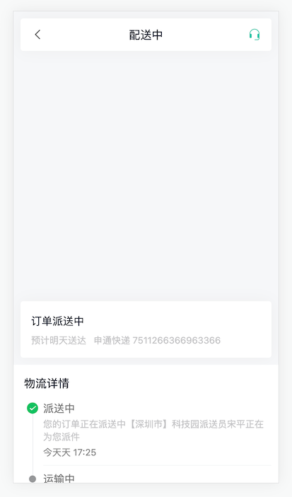

# 药品订单


## 药品订单-支付页面


```ts
    {
      path: '/order/pay',
      component: () => import('@/views/Order/OrderPay.vue'),
      meta: { title: '药品支付' }
    },
```
```vue
<script setup lang="ts"></script>

<template>
  <div class="order-pay-page">
    <cp-nav-bar title="药品支付" />
    <div class="order-address">
      <p class="area">
        <van-icon name="location" />
        <span>北京市昌平区</span>
      </p>
      <p class="detail">建材城西路金燕龙办公楼999号</p>
      <p>李富贵 13211112222</p>
    </div>
    <div class="order-medical">
      <div class="head">
        <h3>优医药房</h3>
        <small>优医质保 假一赔十</small>
      </div>
      <div class="item van-hairline--top" v-for="i in 2" :key="i">
        
        <div class="info">
          <p class="name">
            <span>优赛明 维生素E乳</span>
            <span>x1</span>
          </p>
          <p class="size">
            <van-tag>处方药</van-tag>
            <span>80ml</span>
          </p>
          <p class="price">￥25.00</p>
        </div>
        <div class="desc">用法用量：口服，每次1袋，每天3次，用药3天</div>
      </div>
    </div>
    <div class="order-detail">
      <van-cell-group>
        <van-cell title="药品金额" value="￥50" />
        <van-cell title="运费" value="￥4" />
        <van-cell title="优惠券" value="-￥0" />
        <van-cell title="实付款" value="￥54" class="price" />
      </van-cell-group>
    </div>
    <div class="order-tip">
      <p class="tip">
        由于药品的特殊性，如非错发、漏发药品的情况，药品一经发出
        不得退换，请核对药品信息无误后下单。
      </p>
      <van-checkbox>我已同意<a href="javascript:;">支付协议</a></van-checkbox>
    </div>
    <van-submit-bar
      :price="50 * 100"
      button-text="立即支付"
      button-type="primary"
      text-align="left"
    ></van-submit-bar>
  </div>
</template>

<style lang="scss" scoped>
:deep(.van-nav-bar) {
  background-color: var(--cp-primary);
  .van-nav-bar__arrow,
  .van-nav-bar__title {
    color: #fff;
  }
}
:deep(.van-cell) {
  .van-cell__title {
    font-size: 16px;
  }
  .van-cell__value {
    font-size: 16px;
  }
  &.price {
    .van-cell__value {
      font-size: 18px;
      color: var(--cp-price);
    }
  }
}
:deep(.van-submit-bar) {
  box-shadow: 0 0 2px rgba(0, 0, 0, 0.1);
  .van-button {
    width: 200px;
  }
}
.order-pay-page {
  padding: 46px 0 65px;
}
.order-address {
  padding: 15px 15px 0 15px;
  background-color: #fff;
  font-size: 13px;
  .area {
    color: var(--cp-tag);
    margin-bottom: 5px;
    .van-icon-location {
      color: #ff7702;
      font-size: 14px;
    }
  }
  .detail {
    font-size: 17px;
    margin-bottom: 5px;
  }
  &::after {
    content: '';
    display: block;
    height: 12px;
    background-color: var(--cp-bg);
    margin: 0 -15px;
    margin-top: 15px;
  }
}

.order-medical {
  background-color: #fff;
  padding: 0 15px;
  .head {
    display: flex;
    height: 54px;
    align-items: center;
    > h3 {
      font-size: 16px;
      font-weight: normal;
    }
    > small {
      font-size: 13px;
      color: var(--cp-tag);
      margin-left: 10px;
    }
  }
  .item {
    display: flex;
    flex-wrap: wrap;
    padding: 15px 0;
    .img {
      width: 80px;
      height: 70px;
      border-radius: 2px;
      overflow: hidden;
    }
    .info {
      padding-left: 15px;
      width: 250px;
      .name {
        display: flex;
        font-size: 15px;
        margin-bottom: 5px;
        > span:first-child {
          width: 200px;
        }
        > span:last-child {
          width: 50px;
          text-align: right;
        }
      }
      .size {
        margin-bottom: 5px;
        .van-tag {
          background-color: var(--cp-primary);
          vertical-align: middle;
        }
        span:not(.van-tag) {
          margin-left: 10px;
          color: var(--cp-tag);
          vertical-align: middle;
        }
      }
      .price {
        font-size: 16px;
        color: #eb5757;
      }
    }
    .desc {
      width: 100%;
      background-color: var(--cp-bg);
      border-radius: 4px;
      margin-top: 10px;
      padding: 4px 10px;
      color: var(--cp-tip);
    }
  }
}
.order-tip {
  padding: 0 15px;
  display: flex;
  flex-wrap: wrap;
  justify-content: center;
  margin-top: 10px;
  .tip {
    font-size: 12px;
    color: var(--cp-tag);
    width: 100%;
    &::before {
      content: '*';
      color: var(--cp-price);
      font-size: 14px;
    }
    margin-bottom: 30px;
  }
  .van-checkbox {
    a {
      color: var(--cp-primary);
    }
  }
}
</style>
```


## 药品订单-支付链接

## 药品订单-支付结果


```ts
    {
      path: '/order/pay/result',
      component: () => import('@/views/Order/OrderPayResult.vue'),
      meta: { title: '药品支付结果' }
    }
```
```vue
<script setup lang="ts"></script>

<template>
  <div class="order-pay-result-page">
    <cp-nav-bar title="药品支付结果" />
    <div class="result">
      <van-icon name="checked" />
      <p class="price">￥ 35.00</p>
      <p class="status">支付成功</p>
      <p class="tip">订单支付成功，已通知药房尽快发出， 请耐心等待~</p>
      <div class="btn">
        <van-button type="primary">查看订单</van-button>
        <van-button>返回诊室</van-button>
      </div>
    </div>
  </div>
</template>

<style lang="scss" scoped>
.order-pay-result-page {
  padding-top: 46px;
}
.result {
  display: flex;
  flex-direction: column;
  align-items: center;
  .van-icon {
    font-size: 75px;
    color: var(--cp-primary);
    margin-top: 60px;
  }
  .price {
    font-size: 22px;
    margin-top: 10px;
  }
  .status {
    color: var(--cp-text3);
  }
  .tip {
    color: var(--cp-tip);
    width: 240px;
    text-align: center;
    margin-top: 20px;
  }
  .btn {
    margin-top: 60px;
    .van-button--primary {
      margin-right: 20px;
    }
  }
  &.error {
    .van-icon {
      color: var(--cp-price);
    }
  }
}
</style>
```

## 药品订单-订单详情


```ts
    {
      path: '/order/:id',
      component: () => import('@/views/Order/OrderDetail.vue'),
      meta: { title: '药品订单详情' }
    }
```
```vue
<script setup lang="ts"></script>

<template>
  <div class="order-detail-page">
    <cp-nav-bar title="药品订单详情" />
    <div class="order-head">
      <div class="card">
        <div class="logistics">
          <p>【东莞市】您的包裹已由物流公司揽收</p>
          <p>2019-07-14 17:42:12</p>
        </div>
        <van-icon name="arrow" />
      </div>
    </div>
    <div class="order-medical">
      <div class="head">
        <h3>优医药房</h3>
        <small>优医质保 假一赔十</small>
      </div>
      <div class="item van-hairline--top" v-for="i in 2" :key="i">
        
        <div class="info">
          <p class="name">
            <span>优赛明 维生素E乳</span>
            <span>x1</span>
          </p>
          <p class="size">
            <van-tag>处方药</van-tag>
            <span>80ml</span>
          </p>
          <p class="price">￥25.00</p>
        </div>
        <div class="desc">用法用量：口服，每次1袋，每天3次，用药3天</div>
      </div>
    </div>
    <div class="order-detail">
      <van-cell-group>
        <van-cell title="药品金额" value="￥50" />
        <van-cell title="运费" value="￥4" />
        <van-cell title="优惠券" value="-￥0" />
        <van-cell title="实付款" value="￥54" class="price" />
        <van-cell title="订单编号" value="202201127465" />
        <van-cell title="创建时间" value="2022-01-23 09:23:46" />
        <van-cell title="支付时间" value="2022-01-23 09:23:46" />
        <van-cell title="支付方式" value="支付宝支付" />
      </van-cell-group>
    </div>
    <!-- 已取消 -->
    <!-- <van-action-bar>
      <van-action-bar-icon icon="delete-o" text="删除" />
      <van-action-bar-button type="primary" text="沟通记录" />
    </van-action-bar> -->
    <!-- 待收货 -->
    <van-action-bar>
      <van-action-bar-button type="primary" text="确认收货" />
    </van-action-bar>
    <!-- 待发货 -->
    <!-- <van-action-bar>
      <van-action-bar-button type="primary" text="提醒发货" />
    </van-action-bar> -->
    <!-- 待支付 -->
    <!-- <van-action-bar>
      <p class="price">需要支付：<span>￥60</span></p>
      <van-action-bar-button color="#bbb" text="取消问诊" />
      <van-action-bar-button type="primary" text="继续支付" />
    </van-action-bar> -->
    <!-- 已完成 -->
    <!-- <van-action-bar>
      <van-action-bar-icon icon="delete-o" text="删除" />
      <van-action-bar-button type="primary" text="再次购买" />
    </van-action-bar> -->
  </div>
</template>

<style lang="scss" scoped>
.order-detail-page {
  padding-top: 46px;
  padding-bottom: 65px;
}
.order-head {
  position: relative;
  padding: 15px;
  &::before {
    content: '';
    position: absolute;
    left: 0;
    top: 0;
    width: 100%;
    height: 80px;
    background: linear-gradient(180deg, rgba(44, 181, 165, 0), rgba(44, 181, 165, 0.2));
    border-bottom-left-radius: 150px 20px;
    border-bottom-right-radius: 150px 20px;
  }
  .card {
    height: 74px;
    background-color: #fff;
    border-radius: 8px;
    position: relative;
    display: flex;
    align-items: center;
    padding: 0 15px;
    box-shadow: 0px 0px 22px 0px rgba(229, 229, 229, 0.5);
    .logistics {
      flex: 1;
      p {
        &:first-child {
          color: var(--cp-primary);
        }
        &:last-child {
          color: var(--cp-tag);
          font-size: 13px;
          margin-top: 5px;
        }
      }
    }
    .van-icon {
      color: var(--cp-tip);
    }
  }
}
:deep(.van-cell) {
  .van-cell__title {
    font-size: 16px;
  }
  .van-cell__value {
    font-size: 16px;
  }
  &.price {
    .van-cell__value {
      font-size: 18px;
      color: var(--cp-price);
    }
  }
}
.order-medical {
  background-color: #fff;
  padding: 0 15px;
  .head {
    display: flex;
    height: 54px;
    align-items: center;
    > h3 {
      font-size: 16px;
      font-weight: normal;
    }
    > small {
      font-size: 13px;
      color: var(--cp-tag);
      margin-left: 10px;
    }
  }
  .item {
    display: flex;
    flex-wrap: wrap;
    padding: 15px 0;
    .img {
      width: 80px;
      height: 70px;
      border-radius: 2px;
      overflow: hidden;
    }
    .info {
      padding-left: 15px;
      width: 250px;
      .name {
        display: flex;
        font-size: 15px;
        margin-bottom: 5px;
        > span:first-child {
          width: 200px;
        }
        > span:last-child {
          width: 50px;
          text-align: right;
        }
      }
      .size {
        margin-bottom: 5px;
        .van-tag {
          background-color: var(--cp-primary);
          vertical-align: middle;
        }
        span:not(.van-tag) {
          margin-left: 10px;
          color: var(--cp-tag);
          vertical-align: middle;
        }
      }
      .price {
        font-size: 16px;
        color: #eb5757;
      }
    }
    .desc {
      width: 100%;
      background-color: var(--cp-bg);
      border-radius: 4px;
      margin-top: 10px;
      padding: 4px 10px;
      color: var(--cp-tip);
    }
  }
}
.van-action-bar {
  padding: 0 10px;
  box-shadow: 0 0 2px rgba(0, 0, 0, 0.1);
  .price {
    padding: 0 10px;
    > span {
      font-size: 18px;
      color: var(--cp-price);
    }
  }
}
</style>
```

## 药品订单-物流详情



```ts
    {
      path: '/order/logistics/:id',
      component: () => import('@/views/Order/OrderLogistics.vue'),
      meta: { title: '物流详情' }
    }
```
```vue
<script setup lang="ts"></script>

<template>
  <div class="order-logistics-page">
    <div id="map">
      <div class="title">
        <van-icon name="arrow-left" @click="$router.back()" />
        <span>配送中</span>
        <van-icon name="service" />
      </div>
      <div class="current">
        <p class="status">订单派送中</p>
        <p class="predict">
          <span>预计明天送达</span>
          <span>申通快递 7511266366963366</span>
        </p>
      </div>
    </div>
    <div class="logistics">
      <p class="title">物流详情</p>
      <van-steps direction="vertical" :active="0">
        <van-step>
          <p class="status">派送中</p>
          <p class="content">您的订单正在派送中【深圳市】科技园派送员宋平正在为您派件</p>
          <p class="time">今天天 17:25</p>
        </van-step>
        <van-step v-for="i in 5" :key="i">
          <p class="status">运输中</p>
          <p class="content">在广东深圳公司进行发出扫描</p>
          <p class="time">昨天 10:25</p>
        </van-step>
        <van-step>
          <p class="status">已发货</p>
          <p class="content">卖家已发货</p>
          <p class="time">2022-08-20 10:25</p>
        </van-step>
      </van-steps>
    </div>
  </div>
</template>

<style lang="scss" scoped>
.order-logistics-page {
  --van-step-icon-size: 18px;
  --van-step-circle-size: 10px;
}
#map {
  height: 450px;
  background-color: var(--cp-bg);
  overflow: hidden;
  position: relative;
  .title {
    background-color: #fff;
    height: 46px;
    width: 355px;
    border-radius: 4px;
    display: flex;
    align-items: center;
    padding: 0 15px;
    font-size: 16px;
    position: absolute;
    left: 10px;
    top: 10px;
    box-sizing: border-box;
    box-shadow: 0px 0px 22px 0px rgba(229, 229, 229, 0.5);
    z-index: 999;
    > span {
      flex: 1;
      text-align: center;
    }
    .van-icon {
      font-size: 18px;
      color: #666;
      &:last-child {
        color: var(--cp-primary);
      }
    }
  }
  .current {
    height: 80px;
    border-radius: 4px;
    background-color: #fff;
    height: 80px;
    width: 355px;
    box-sizing: border-box;
    padding: 15px;
    position: absolute;
    left: 10px;
    bottom: 10px;
    box-shadow: 0px 0px 22px 0px rgba(229, 229, 229, 0.5);
    z-index: 999;
    .status {
      font-size: 15px;
      line-height: 26px;
    }
    .predict {
      color: var(--cp-tip);
      font-size: 13px;
      margin-top: 5px;
      > span {
        padding-right: 10px;
      }
    }
  }
}
.logistics {
  padding: 0 10px 20px;
  .title {
    font-size: 16px;
    padding: 15px 5px 5px;
  }
  .van-steps {
    :deep(.van-step) {
      &::after {
        display: none;
      }
    }
    .status {
      font-size: 15px;
      color: var(--cp-text3);
      margin-bottom: 4px;
    }
    .content {
      font-size: 13px;
      color: var(--cp-tip);
      margin-bottom: 4px;
    }
    .time {
      font-size: 13px;
      color: var(--cp-tag);
    }
  }
}
</style>
```


## 药品订单-高德地图