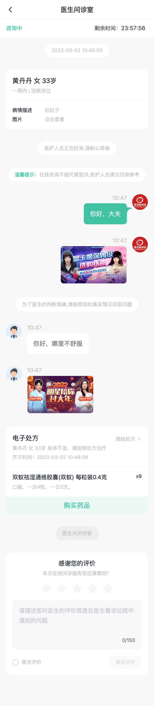

# 问诊室模块



## 问诊室-组件拆分{#room-components}

1）状态栏组件

- 等待接诊，咨询中，已结束

```vue
<script setup lang="ts"></script>

<template>
  <div class="room-status">
    <div class="wait">已通知医生尽快接诊，24小时内医生未回复将自动退款</div>
    <!-- <div class="chat">
      <span>咨询中</span>
      <span>剩余时间：23:10:34</span>
    </div> -->
    <!-- <div class="end"><van-icon name="passed" /> 已结束</div> -->
  </div>
</template>

<style lang="scss" scoped>
.room-status {
  position: fixed;
  left: 0;
  top: 46px;
  height: 44px;
  width: 100%;
  background-color: #fff;
  font-size: 13px;
  z-index: 1;
  .wait {
    padding: 0 15px;
    background-color: var(--cp-plain);
    height: 100%;
    line-height: 44px;
    text-align: center;
    color: var(--cp-primary);
  }
  .chat {
    height: 100%;
    display: flex;
    align-items: center;
    justify-content: space-between;
    padding: 0 15px;
    span {
      &:first-child {
        color: var(--cp-primary);
      }
      &:last-child {
        color: var(--cp-text2);
        width: 130px;
        .van-count-down {
          display: inline;
        }
      }
    }
  }
  .end {
    display: flex;
    align-items: center;
    height: 44px;
    padding: 0 15px;
    font-weight: 500;
    .van-icon {
      font-size: 14px;
      margin-right: 4px;
      position: relative;
      top: 1px;
    }
  }
}
</style>
```
```vue
<script setup lang="ts">
import RoomStatus from './components/RoomStatus.vue'
</script>

<template>
  <div class="room-page">
    <cp-nav-bar title="医生问诊室" />
    <room-status />
  </div>
</template>
```

2）操作栏组件

- 需要禁用，接诊后开启

```vue
<script setup lang="ts"></script>

<template>
  <div class="room-action">
    <van-field
      type="text"
      class="input"
      :border="false"
      placeholder="问医生"
      autocomplete="off"
      :disabled="true"
    ></van-field>
    <van-uploader :preview-image="false" :disabled="true">
      <cp-icon name="consult-img" />
    </van-uploader>
  </div>
</template>

<style lang="scss" scoped>
.room-action {
  position: fixed;
  left: 0;
  bottom: 0;
  width: 100%;
  height: 60px;
  background-color: #fff;
  display: flex;
  align-items: center;
  padding: 0 16px;
  z-index: 1;
  box-sizing: border-box;
  .input {
    background-color: var(--cp-bg);
    border: none;
    border-radius: 25px;
    margin-right: 10px;
    padding: 8px 15px;
  }
  .cp-icon {
    width: 24px;
    height: 24px;
  }
}
</style>
```

3）消息卡片组件

- 根据消息类型判断显示不同消息卡片

`Room/components/RoomMessage.vue` 

```vue
<script setup lang="ts"></script>

<template>
  <!-- 患者卡片 -->
  <div class="msg msg-illness">
    <div class="patient van-hairline--bottom">
      <p>李富贵 男 31岁</p>
      <p>一周内 | 未去医院就诊</p>
    </div>
    <van-row>
      <van-col span="6">病情描述</van-col>
      <van-col span="18">头痛、头晕、恶心</van-col>
      <van-col span="6">图片</van-col>
      <van-col span="18">点击查看</van-col>
    </van-row>
  </div>
  <!-- 通知-通用 -->
  <div class="msg msg-tip">
    <div class="content">
      <span>医护人员正在赶来，请耐心等候</span>
    </div>
  </div>
  <!-- 通知-温馨提示 -->
  <div class="msg msg-tip">
    <div class="content">
      <span class="green">温馨提示：</span>
      <span>在线咨询不能代替面诊，医护人员建议仅供参考</span>
    </div>
  </div>
  <!-- 通知-结束 -->
  <div class="msg msg-tip msg-tip-cancel">
    <div class="content">
      <span>订单取消</span>
    </div>
  </div>
  <!-- 发送文字 -->
    <div class="msg msg-to">
    <div class="content">
      <div class="time">20:12</div>
      <div class="pao">大夫你好？</div>
    </div>
    <van-image src="https://yjy-oss-files.oss-cn-zhangjiakou.aliyuncs.com/tuxian/popular_3.jpg" />
  </div>
  <!-- 发送图片 -->
  <div class="msg msg-to">
    <div class="content">
      <div class="time">20:12</div>
      <van-image 
        fit="contain" 
        src="https://yjy-oss-files.oss-cn-zhangjiakou.aliyuncs.com/tuxian/popular_3.jpg"
      />
    </div>
    <van-image src="https://yjy-oss-files.oss-cn-zhangjiakou.aliyuncs.com/tuxian/popular_3.jpg" />
  </div>
  <!-- 接收文字 -->
  <div class="msg msg-from">
    <van-image src="https://yjy-oss-files.oss-cn-zhangjiakou.aliyuncs.com/tuxian/popular_3.jpg" />
    <div class="content">
      <div class="time">20:12</div>
      <div class="pao">哪里不舒服</div>
    </div>
  </div>
  <!-- 接收图片 -->
  <div class="msg msg-from">
    <van-image src="https://yjy-oss-files.oss-cn-zhangjiakou.aliyuncs.com/tuxian/popular_3.jpg" />
    <div class="content">
      <div class="time">20:12</div>
      <van-image 
        fit="contain" 
        src="https://yjy-oss-files.oss-cn-zhangjiakou.aliyuncs.com/tuxian/popular_3.jpg"
      />
    </div>
  </div>
  <!-- 处方卡片 -->
  <div class="msg msg-recipe">
    <div class="content">
      <div class="head van-hairline--bottom">
        <div class="head-tit">
          <h3>电子处方</h3>
          <p>原始处方 <van-icon name="arrow"></van-icon></p>
        </div>
        <p>李富贵 男 31岁 血管性头痛</p>
        <p>开方时间：2022-01-15 14:21:42</p>
      </div>
      <div class="body">
        <div class="body-item" v-for="i in 2" :key="i">
          <div class="durg">
            <p>优赛明 维生素E乳</p>
            <p>口服，每次1袋，每天3次，用药3天</p>
          </div>
          <div class="num">x1</div>
        </div>
      </div>
      <div class="foot"><span>购买药品</span></div>
    </div>
  </div>
  <!-- 评价卡片，后期实现 -->
</template>

<style lang="scss" scoped>
@import '@/styles/room.scss';
</style>
```

`/styles/room.scss`

```scss
.msg {
  display: flex;
  padding: 15px;
  // 医生消息+图片
  &-from {
    .content {
      max-width: 240px;
      min-width: 52px;
      .time {
        color: var(--cp-tip);
        margin-bottom: 5px;
      }
      .pao {
        padding: 15px;
        background-color: #fff;
        color: var(--cp-text3);
        font-size: 15px;
        border-radius: 8px;
        position: relative;
        &::before {
          content: '';
          position: absolute;
          left: -13px;
          top: 10px;
          width: 13px;
          height: 16px;
          background: #fff;
          border-top-left-radius: 13px 3px;
        }
        &::after {
          content: '';
          position: absolute;
          left: -13px;
          top: 13px;
          width: 13px;
          height: 13px;
          background: var(--cp-bg);
          border-top-right-radius: 13px 13px;
        }
      }
      .van-image {
        max-height: 160px;
        max-width: 160px;
        border-radius: 8px;
        overflow: hidden;
        border: 1px solid var(--cp-line);
      }
    }
    > .van-image {
      width: 38px;
      height: 38px;
      border-radius: 50%;
      overflow: hidden;
      margin-right: 13px;
    }
  }
  // 患者消息+图片
  &-to {
    justify-content: flex-end;
    .content {
      max-width: 240px;
      min-width: 52px;
      .time {
        color: var(--cp-tip);
        margin-bottom: 5px;
        text-align: right;
      }
      .pao {
        padding: 15px;
        background-color: var(--cp-primary);
        color: #fff;
        font-size: 15px;
        border-radius: 8px;
        position: relative;
        &::before {
          content: '';
          position: absolute;
          right: -13px;
          top: 10px;
          width: 13px;
          height: 16px;
          background: var(--cp-primary);
          border-top-right-radius: 13px 3px;
        }
        &::after {
          content: '';
          position: absolute;
          right: -13px;
          top: 13px;
          width: 13px;
          height: 13px;
          background: var(--cp-bg);
          border-top-left-radius: 13px 13px;
        }
      }
      .van-image {
        max-height: 160px;
        max-width: 160px;
        border-radius: 8px;
        overflow: hidden;
        border: 1px solid var(--cp-line);
      }
    }
    > .van-image {
      width: 38px;
      height: 38px;
      border-radius: 50%;
      overflow: hidden;
      margin-left: 13px;
    }
  }
  &-tip {
    justify-content: center;
    font-size: 12px;
    .content {
      height: 34px;
      line-height: 34px;
      background-color: #fff;
      color: var(--cp-tip);
      font-size: 12px;
      border-radius: 17px;
      padding: 0 16px;
      max-width: 100%;
      .green {
        color: var(--cp-primary);
      }
    }
    &-cancel {
      .content {
        background-color: #ededed;
      }
    }
  }
  &-illness {
    display: block;
    background-color: #fff;
    margin: 15px;
    border-radius: 8px;
    font-size: 12px;
    .patient {
      padding-bottom: 15px;
      margin-bottom: 15px;
      > p {
        &:first-child {
          font-size: 16px;
        }
        &:last-child {
          margin-top: 5px;
          color: var(--cp-tip);
        }
      }
    }
    .van-col {
      &:nth-child(-n + 2) {
        margin-bottom: 5px;
      }
      &:nth-child(2n) {
        color: var(--cp-tip);
      }
    }
  }
  &-recipe {
    padding: 15px;
    .content {
      background-color: #fff;
      border-radius: 8px;
      color: var(--cp-tip);
      font-size: 12px;
      flex: 1;
      .head {
        padding: 15px;
        .head-tit {
          display: flex;
          justify-content: space-between;
          > h3 {
            font-weight: normal;
            font-size: 16px;
            color: var(--cp-text1);
          }
        }
        p {
          margin-top: 5px;
        }
      }
      .body {
        padding: 15px 15px 0 15px;
        &-item {
          display: flex;
          margin-bottom: 15px;
          .durg {
            flex: 1;
            > p {
              &:first-child {
                font-size: 14px;
                color: var(--cp-text1);
                margin-bottom: 5px;
              }
            }
          }
          .num {
            color: var(--cp-text1);
          }
        }
      }
      .foot {
        background-color: var(--cp-plain);
        color: var(--cp-primary);
        font-size: 16px;
        text-align: center;
        height: 42px;
        line-height: 42px;
      }
    }
  }
}
```


4）问诊室页面

`Room/index.vue` 
```vue
<script setup lang="ts">
import RoomStatus from './components/RoomStatus.vue'
import RoomAction from './components/RoomAction.vue'
import RoomMessage from './components/RoomMessage.vue'
</script>

<template>
  <div class="room-page">
    <cp-nav-bar title="问诊室" />
    <room-status></room-status>
    <room-message></room-message>
    <room-action></room-action>
  </div>
</template>

<style lang="scss" scoped>
.room-page {
  padding-top: 90px;
  padding-bottom: 60px;
  min-height: 100vh;
  box-sizing: border-box;
  background-color: var(--cp-bg);
  .van-pull-refresh {
    width: 100%;
    min-height: calc(100vh - 150px);
  }
}
</style>
```

## 问诊室-websocket介绍

> 目的：认识websocket 

什么是 websocket ? https://websocket.org/

- 是一种网络通信协议，和 HTTP 协议 一样。


为什么需要websocket ?

- 因为 HTTP 协议有一个缺陷：通信只能由客户端发起。


理解 websokect 通讯过程


了解 websocket api含义

```js
var ws = new WebSocket("wss://javascript.info/article/websocket/demo/hello");

ws.onopen = function(evt) { 
  console.log("Connection open ...");
  ws.send("Hello WebSockets!");
};
ws.onmessage = function(evt) {
  console.log( "Received Message: " + evt.data);
  ws.close();
};
ws.onclose = function(evt) {
  console.log("Connection closed.");
};      
```
`ws://121.40.165.18:8800` 备用 ws 服务，有广告。

我们项目中使用 socket.io-client 来实现客户端代码，它是基于 websocket 的库。


## 问诊室-socket.io使用

> 目的：掌握 socket.io 的基本使用

1. socket.io 什么？
   - socket.io 是一个基于 WebSocket 的 CS（客户端-服务端）的实时通信库
   - 使用它可以在后端提供一个即时通讯服务
   - 它也提供一个 js 库，在前端可以去链接后端的 socket.io 创建的服务
   - 总结：它是一套基于 websocket 前后端即时通讯解决方案

2. socket.io 如何使用？
   -  大家可以体验下这个 [官方Demo](https://socket.io/get-started/chat#getting-this-example)

3. 我们需要掌握的客户端几个 api 的基本使用

如何使用客户端js库?
```bash
pnpm add socket.io-client
```

如何建立连接？
```ts
import io from 'socket.io-client'
// 参数1：不传默认是当前服务域名，开发中传入服务器地址
// 参数2：配置参数，根据需要再来介绍
const socket = io()
```

如何确定连接成功？
```ts
socket.on('connect', () => {
  // 建立连接成功
})
```

如何发送消息？
```ts
// chat message 发送消息事件，由后台约定，可变
socket.emit('chat message', '消息内容')
```

如何接收消息？

```ts
// chat message 接收消息事件，由后台约定，可变
socket.on('chat message', (ev) => {
  // ev 是服务器发送的消息
})
```

如何关闭连接？
```ts
// 离开组件需要使用
socket.close()
```

小结：
- sockt.io 在前端使用的js库需要知道哪些内容？
  - 如何建立链接 `io('地址')`
  - 连接成功的事件 `connect`
  - 如何发消息 `emit` + 事件
  - 如何收消息 `on` + 事件
  - 如果关闭连接 `close()`


## 问诊室-通讯规则

> 知道前后以及定义数据的类型

- 通讯的一些事件


`chatMsgList` **接收**聊天记录

`sendChatMsg` 发送消息

`receiveChatMsg` **接收**消息

`updateMsgStatus` 消息已读

`getChatMsgList` 获取聊天记录

`statusChange` **接收**订单状态改变


- 消息数据的类型

`enums/index.ts`
```ts
// 消息类型
export enum MsgType {
  /** 文字聊天 */
  MsgText = 1,
  /** 消息聊天 */
  MsgImage = 4,
  /** 患者信息 */
  CardPat = 21,
  /** 处方信息 */
  CardPre = 22,
  /** 未评价信息 */
  CardEvaForm = 23,
  /** 已评价信息 */
  CardEva = 24,
  /** 通用通知 */
  Notify = 31,
  /** 温馨提示 */
  NotifyTip = 32,
  /** 取消提示 */
  NotifyCancel = 33
}

// 处方状态
export enum PrescriptionStatus {
  /** 未付款 */
  NotPayment = 1,
  /** 已付款 */
  Payment = 2,
  /** 已失效 */
  Invalid = 3
}
```

`types/room.d.ts`
```ts
import { MsgType, PrescriptionStatus } from '@/enums'
import type { Consult, Image } from './consult'
import type { Patient } from './user'

export type Medical = {
  /** 药品ID */
  id: string
  /** 药品名称 */
  name: string
  /** 金额 */
  amount: string
  /** 药品图片 */
  avatar: string
  /** 规格信息 */
  specs: string
  /** 用法用量 */
  usageDosag: string
  /** 数量 */
  quantity: string
  /** 是否处方，0 不是 1 是 */
  prescriptionFlag: 0 | 1
}

export type Prescription = {
  /** 处方ID */
  id: string
  /** 药品订单ID */
  orderId: string
  /** 创建时间 */
  createTime: string
  /** 患者名称 */
  name: string
  /** 问诊记录ID */
  recordId: string
  /** 性别 0 女 1 男 */
  gender: 0 | 1
  /** 性别文字 */
  genderValue: ''
  /** 年龄 */
  age: number
  /** 诊断信息 */
  diagnosis: string
  /** 处方状态 */
  status: PrescriptionStatus
  /** 药品清单 */
  medicines: Medical[]
}

export type EvaluateDoc = {
  /** 评价ID */
  id?: string
  /** 评分 */
  score?: number
  /** 内容 */
  content?: string
  /** 创建时间 */
  createTime?: string
  /** 创建人 */
  creator?: string
}

export type Message = {
  /** 消息ID */
  id: string
  /** 消息类型 */
  msgType: MsgType
  /** 发信人 */
  from?: string
  /** 发信人ID */
  fromAvatar?: string
  /** 收信人 */
  to?: string
  /** 收信人头像 */
  toAvatar?: string
  /** 创建时间 */
  createTime: string
  /** 消息主体 */
  msg: {
    /** 文本内容 */
    content?: string
    /** 图片对象 */
    picture?: Image
    /** 问诊记录，患者信息 */
    consultRecord?: Consult & {
      patientInfo: Patient
    }
    /** 处方信息 */
    prescription?: Prescription
    /** 评价信息 */
    evaluateDoc?: EvaluateDoc
  }
}

// 消息分组列表
export type TimeMessages = {
  /** 分组消息最早时间 */
  createTime: string
  /** 消息数组 */
  items: Message[]
  /** 订单ID */
  orderId: string
  /** 会话ID */
  sid: string
}
```
以上是类型


## 问诊室-建立连接


步骤：
- 安装 sokect.io-client 包
- 在组件挂载完毕，进行socket连接
- 监听连接成功，监听错误消息，监听关闭连接
- 组件卸载关闭连接

代码：

- 安装 sokect.io-client 包
```bash
pnpm add socket.io-client
```

```ts
import type { Socket } from 'socket.io-client'
import { io } from 'socket.io-client'
import { onMounted, onUnmounted } from 'vue'
import { baseURL } from '@/utils/request'
import { useUserStore } from '@/stores'
import { useRoute } from 'vue-router'

const store = useUserStore()
const route = useRoute()

let socket: Socket
onUnmounted(() => {
  socket.close()
})
onMounted(async () => {
  // 建立链接，创建 socket.io 实例
  socket = io(baseURL, {
    auth: {
      token: `Bearer ${store.user?.token}`
    },
    query: {
      orderId: route.query.orderId
    }
  })

  socket.on('connect', () => {
    // 建立连接成功
    console.log('connect')
  })

  socket.on('error', (event) => {
    // 错误异常消息
    console.log('error')
  })

  socket.on('disconnect', ()=> {
    // 已经断开连接
    console.log('disconnect')
  })
})
```


## 问诊室-默认消息

步骤：
- 监听默认聊天记录，并且处理处理成消息列表
- 提取常量数据
- 进行渲染
- 预览病情图片

代码：

1）监听默认聊天记录，并且处理处理成消息列表 `Room/index.vue`
```ts
import { MsgType } from '@/enums'
import type { Message, TimeMessages } from '@/types/room'

const list = ref<Message[]>([])
```

```ts
  // 聊天记录
  socket.on('chatMsgList', ({ data }: { data: TimeMessages[] }) => {
    // 准备转换常规消息列表
    const arr: Message[] = []
    data.forEach((item, i) => {
      arr.push({
        msgType: MsgType.Notify,
        msg: { content: item.createTime },
        createTime: item.createTime,
        id: item.createTime
      })
      arr.push(...item.items)
    })
    // 追加到聊天消息列表
    list.value.unshift(...arr)
  })
```

2) 抽取常量数据 `services/constants.ts`

```ts
import { IllnessTime } from '@/enums'

export const timeOptions = [
  { label: '一周内', value: IllnessTime.Week },
  { label: '一月内', value: IllnessTime.Month },
  { label: '半年内', value: IllnessTime.HalfYear },
  { label: '大于半年', value: IllnessTime.More }
]
export const flagOptions = [
  { label: '就诊过', value: 0 },
  { label: '没就诊过', value: 1 }
]
```


3）进行渲染 `Room/components/RoomMessage.vue`

```html
<room-message :list="list" />
```

```ts
import { IllnessTime } from '@/enums'
import { flagOptions, timeOptions } from '@/services/constants'


defineProps<{ list: Message[] }>()

const getIllnessTimeText = (time: IllnessTime) =>
  timeOptions.find((item) => item.value === time)?.label

const getConsultFlagText = (flag: 0 | 1) =>
  flagOptions.find((item) => item.value === flag)?.label

```

```html
  <template v-for="{ msgType, msg, createTime, from } in list" :key="msg.id">
    <!-- 病情描述 -->
    <div class="msg msg-illness" v-if="msgType === MsgType.CardPat">
      <div class="patient van-hairline--bottom" v-if="msg.consultRecord">
        <p>
          {{ msg.consultRecord.patientInfo.name }}
          {{ msg.consultRecord.patientInfo.genderValue }}
          {{ msg.consultRecord.patientInfo.age }}岁
        </p>
        <p>
          {{ getIllnessTimeText(msg.consultRecord.illnessTime) }} |
          {{ getConsultFlagText(msg.consultRecord.consultFlag) }}
        </p>
      </div>
      <van-row>
        <van-col span="6">病情描述</van-col>
        <van-col span="18">{{ msg.consultRecord?.illnessDesc }}</van-col>
        <van-col span="6">图片</van-col>
        <van-col span="18" @click="previewImg(msg.consultRecord?.pictures)"> 点击查看 </van-col>
      </van-row>
    </div>
    <!-- 温馨提示 -->
    <div class="msg msg-tip" v-if="msgType === MsgType.NotifyTip">
      <div class="content">
        <span class="green">温馨提示：</span>
        <span>{{ msg.content }}</span>
      </div>
    </div>
    <!-- 通用通知 -->
    <div class="msg msg-tip" v-if="msgType === 31">
      <div class="content">
        <span>{{ msg.content }}</span>
      </div>
    </div>
  </template>    
```

4）预览病情图片 `Room/components/RoomMessage.vue`
```ts
import { ImagePreview } from 'vant'

const previewImg = (pictures?: Image[]) => {
  if (pictures && pictures.length) ImagePreview(pictures.map((item) => item.url))
}
```

## 问诊室-接诊状态


步骤：
- 初始化需要订单信息，订单状态发送变化，需要更新订单信息
- 状态组件，根据状态展示对应信息
  - 待接诊，绿色文字提示
  - 问诊中，倒计时显示
  - 已结束or已取消，显示问诊结束
- 底部操作组件，禁用和启用

代码：

1) 订单状态发送变化，需要更新组件  `Room/index.vue`

`enums/index.ts`
```ts
export enum OrderType {
  // 问诊订单
  /** 待支付 */
  ConsultPay = 1,
  /** 待接诊 */
  ConsultWait = 2,
  /** 问诊中 */
  ConsultChat = 3,
  /** 问诊完成 */
  ConsultComplete = 4,
  /** 取消问诊 */
  ConsultCancel = 5,
  // 药品订单
  /** 待支付 */
  MedicinePay = 10,
  /** 待发货 */
  MedicineSend = 11,
  /** 待收货 */
  MedicineTake = 12,
  /** 已完成 */
  MedicineComplete = 13,
  /** 取消订单 */
  MedicineCancel = 14
}
```
`types/consult.d.ts`
```ts
// 问诊订单单项信息
export type ConsultOrderItem = Consult & {
  /** 创建时间 */
  createTime: string
  /** 医生信息 */
  docInfo?: Doctor
  /** 患者信息 */
  patientInfo: Patient
  /** 订单编号 */
  orderNo: string
  /** 订单状态 */
  status: OrderType
  /** 状态文字 */
  statusValue: string
  /** 类型问诊文字 */
  typeValue: string
  /** 倒计时时间 */
  countdown: number
  /** 处方ID */
  prescriptionId?: string
  /** 评价ID */
  evaluateId: number
  /** 应付款 */
  payment: number
  /** 优惠券抵扣 */
  couponDeduction: number
  /** 积分抵扣 */
  pointDeduction: number
  /** 实付款 */
  actualPayment: number
}
```

`services/consult.ts`
```ts
export const getConsultOrderDetail = (orderId: string) =>
  request<ConsultOrderItem>('/patient/consult/order/detail', 'GET', { orderId })
```
```ts
import type { ConsultOrderItem } from '@/types/consult'
import { getConsultOrderDetail } from '@/services/consult'

const consult = ref<ConsultOrderItem>()

onMounted(async () => {
  const res = await getConsultOrderDetail(route.query.orderId as string)
  consult.value = res.data
})  
```
```ts
  // 订单状态 在onMounted注册
  socket.on('statusChange', async () => {
    const res = await getConsultOrderDetail(route.query.orderId as string)
    consult.value = res.data
  })
```

2）传入 订单状态 倒计时时间  给状态组件
`Room/index.vue`
```html
<room-status :status="consult?.status" :countdown="consult?.countdown" />
```
`Room/components/RoomStatus.vue`
```ts
import { OrderType } from '@/enums'

const { status, countdown = 0 } = defineProps<{
  status?: OrderType
  countdown?: number
}>()
```
:::warning 开启解构Props响应式转换功能，vite.config.ts
    vue({
      reactivityTransform: true
    }),
:::

3）根据状态展示对应信息 `Room/components/RoomStatus.vue`
```html
  <div class="room-status">
    <div class="wait" v-if="status === OrderType.ConsultWait">
      已通知医生尽快接诊，24小时内医生未回复将自动退款
    </div>
    <div class="chat" v-if="status === OrderType.ConsultChat">
      <span>咨询中</span>
      <span class="time">剩余时间：<van-count-down :time="countdown * 1000" /></span>
    </div>
    <div
      class="end"
      v-if="status === OrderType.ConsultComplete || status === OrderType.ConsultCancel"
    >
      <van-icon name="passed" /> 已结束
    </div>
  </div>
```

4) 根据状态禁用状态栏 `Room/components/RoomAction.vue`

```html
<room-action :disabled="consult?.status !== OrderType.ConsultChat"></room-action>
```

```ts
defineProps<{
  disabled: boolean
}>()
```
```diff
    <van-field
+     :disabled="disabled"
      type="text"
      class="input"
      :border="false"
      placeholder="问医生"
      autocomplete="off"
    ></van-field>
    <!-- 不预览，使用小图标作为上传按钮 -->
+    <van-uploader :preview-image="false" :disabled="disabled">
      <cp-icon name="consult-img" />
    </van-uploader>
```


## 问诊室-文字聊天
> 可以发送文字消息，可以接收文字消息

步骤：
- 底部操作组件，可以输入文字，触发 `send-text` 事件传出文字
- 问诊室组件，监听 `send-text` 事件接收文字
- 获取订单详情，需要使用医生ID，作为收信息人的标识
- 通过 `socket.emit` 的 `sendChatMsg` 发送文字给服务器
- 通过 `socket.on` 的 `receiveChatMsg` 接收发送成功或者医生发来的消息
- 展示消息

代码：

1）底部操作组件，可以输入文字，触发 `send-text` 事件传出文字
`Room/components/RoomAction.vue`
```ts
import { ref } from 'vue'

const emit = defineEmits<{
  (e: 'send-text', text: string): void
}>()

const text = ref('')

const sendText = () => {
  emit('send-text', text.value)
  text.value = ''
}
```
```html
    <van-field
      :disabled="disabled"
      v-model="text"
      type="text"
      class="input"
      :border="false"
      placeholder="问医生"
      autocomplete="off"
      @keyup.enter="sendText"
    ></van-field>
```

2）问诊室组件，监听 `send-text` 事件接收文字 
`Room/index.vue`
```html
<room-action @send-text="sendText" />
```
```ts
const sendText = (text: string) => {
  // 发送消息
}
```

3）通过 `socket.emit` 的 `sendChatMsg` 发送文字给服务器

```ts

const sendText = (text: string) => {
  // 发送信息需要  发送人  收消息人  消息类型  消息内容
  socket.emit('sendChatMsg', {
    from: store.user?.id,
    to: consult.value?.docInfo?.id,
    msgType: MsgType.MsgText,
    msg: { content: text }
  })
}
```

5）通过 `socket.on` 的 `receiveChatMsg` 接收发送成功或者医生发来的消息
```ts
 // 接收消息 在onMounted注册
  socket.on('receiveChatMsg', async (event) => {
    list.value.push(event)
    await nextTick()
    window.scrollTo(0, document.body.scrollHeight)
  })
```

6) 展示消息  `Room/components/RoomMessage.vue`

```ts
import dayjs from 'dayjs'

const formatTime = (time: string) => dayjs(time).format('HH:mm')
```
```html
    <!-- 我发的消息 -->
    <div class="msg msg-to" v-if="msgType === MsgType.MsgText && store.user?.id === from">
      <div class="content">
        <div class="time">{{ formatTime(createTime) }}</div>
        <div class="pao">{{ msg.content }}</div>
      </div>
      <van-image :src="store.user?.avatar" />
    </div>

    <!-- 医生发的消息 -->
    <div class="msg msg-from" v-if="msgType === MsgType.MsgText && store.user?.id !== from">
      <van-image :src="avatar" />
      <div class="content">
        <div class="time">{{ formatTime(createTime) }}</div>
        <div class="pao">{{ msg.content }}</div>
      </div>
    </div>
```


## 问诊室-图片聊天

步骤：
- 底部操作组件，可以上传图片，触发 `send-image` 事件传出图片对象
- 问诊室组件，监听 `send-image` 事件接收图片对象
- 通过 `socket.emit` 的 `sendChatMsg` 发送图片给服务器
- 展示消息


代码：

1）底部操作组件，可以上传图片，触发 `send-image` 事件传出图片对象
```ts
import { uploadImage } from '@/services/consult'
import type { Image } from '@/types/consult'
import { Toast } from 'vant'
import type { UploaderAfterRead } from 'vant/lib/uploader/types'
```
```diff
const emit = defineEmits<{
  (e: 'send-text', text: string): void
+  (e: 'send-image', img: Image): void
}>()
```
```ts
const sendImage: UploaderAfterRead = async (data) => {
  if (Array.isArray(data)) return
  if (!data.file) return
  const t = Toast.loading('正在上传')
  const res = await uploadImage(data.file)
  t.clear()
  emit('send-image', res.data)
}
```
```html
 <van-uploader :preview-image="false" :disabled="disabled" :after-read="sendImage">
      <cp-icon name="consult-img" />
    </van-uploader>
```

2）问诊室组件，监听 `send-image` 事件接收图片对象，通过 `socket.emit` 的 `sendChatMsg` 发送图片给服务器
```html
<room-action @send-text="sendText" @send-image="sendImage" />
```
```ts
import type { Image } from '@/types/consult'

const sendImage = (img: Image) => {
  socket.emit('sendChatMsg', {
    from: store.user?.id,
    to: consult.value?.docInfo?.id,
    msgType: MsgType.MsgImage,
    msg: { picture: img }
  })
}
```

3）展示消息

```html
    <div class="msg msg-to" v-if="msgType === MsgType.MsgImage && store.user?.id === from">
      <div class="content">
        <div class="time">{{ formatTime(createTime) }}</div>
        <van-image fit="contain" :src="msg.picture?.url" />
      </div>
      <van-image :src="store.user?.avatar" />
    </div>
    <div class="msg msg-from" v-if="msgType === MsgType.MsgImage && store.user?.id !== from">
      <van-image :src="avatar" />
      <div class="content">
        <div class="time">{{ formatTime(createTime) }}</div>
        <van-image fit="contain" :src="msg.picture?.url" />
      </div>
    </div>
```

## 问诊室-聊天记录

步骤：
- 实现下拉刷新效果
- 记录每段消息的开始时间，作为下一次请求的开始时间
- 触发刷新，发送获取聊天记录消息
- 在接收聊天记录事件中
  - 关闭刷新中效果
  - 判断是否有数据？没有提示 `没有聊天记录了`
  - 如果是初始化获取的聊天，需要滚动到最底部
  - 如果是第二，三...次获取消息,不需要滚动到底部
- 如果断开连接后再次连接，需要清空聊天记录

代码：
- 实现下拉刷新效果

```html
    <van-pull-refresh v-model="loading" @refresh="onRefresh">
      <room-message :list="list" />
    </van-pull-refresh>
```
```ts
const loading = ref(false)
const onRefresh = () => {
  // 触发下拉
}
```

- 记录每段消息的开始时间，作为下一次请求的开始时间

```ts
const time = ref(dayjs().format('YYYY-MM-DD HH:mm:ss'))
```
```diff
    const arr: Message[] = []
    data.forEach((item, i) => {
+      if (i === 0) time.value = item.createTime
      arr.push({
        msgType: MsgType.Notify,
        msg: { content: item.createTime },
        createTime: item.createTime,
        id: item.createTime
      })
      arr.push(...item.items)
    })
```

- 触发刷新，发送获取聊天记录消息

```ts
const onRefresh = () => {
  socket.emit('getChatMsgList', 20, time.value, route.query.orderId)
}
```

- 在接收聊天记录事件中
  - 关闭刷新中效果
  - 判断是否有数据？没有提示 `没有聊天记录了`
  - 如果是初始化获取的聊天，需要滚动到最底部
```ts
const initialMsg = ref(true)
```
```diff
socket.on('chatMsgList', ({ data }: { data: TimeMessages[] }) => {
    const arr: Message[] = []
    data.forEach((item, i) => {
      if (i === 0) time.value = item.createTime
      arr.push({
        msgType: MsgType.Notify,
        msg: { content: item.createTime },
        createTime: item.createTime,
        id: item.createTime
      })
      arr.push(...item.items)
    })
    list.value.unshift(...arr)
+    loading.value = false
+    if (!data.length) {
+      return Toast('没有聊天记录了')
+    }
+    nextTick(() => {
+      if (initialMsg.value) {
+        window.scrollTo(0, document.body.scrollHeight)
+        initialMsg.value = false
+      }
+    })
  })
```

- 如果断开连接后再次连接，需要清空聊天记录
```ts
  // 建立连接成功
  socket.on('connect', () => {
    list.value = []
  })
```


## 问诊室-消息已读

步骤：
- 接收到消息的时候，需要把消息设置为已读
- 默认加载的消息，需要用最后一条消息设置已读，之前所有消息即是已读

代码：

```diff
  socket.on('receiveChatMsg', async (event) => {
    list.value.push(event)
    await nextTick()
+    socket.emit('updateMsgStatus', event.id)
    window.scrollTo(0, document.body.scrollHeight)
  })
```

```diff
    nextTick(() => {
      if (initialMsg.value) {
+        socket.emit('updateMsgStatus', arr[arr.length - 1].id)
        window.scrollTo(0, document.body.scrollHeight)
        initialMsg.value = false
      }
    })
```

小结：
- 这个功能是给 消息通知  默认准备的，那里有未读消息的条数。


## 问诊室-查看处方

步骤：
- 定义参考处方API
- 点击查看处方预览处方图片

:::tip
  需要去辅助-超级医生开处方
:::

代码：

1) 渲染处方消息

```html
<!-- 处方 -->
    <div class="msg msg-recipe" v-if="msgType === MsgType.CardPre">
      <div class="content" v-if="msg.prescription">
        <div class="head van-hairline--bottom">
          <div class="head-tit">
            <h3>电子处方</h3>
            <p @click="showPrescription(msg.prescription?.id)">
              原始处方 <van-icon name="arrow"></van-icon>
            </p>
          </div>
          <p>
            {{ msg.prescription.name }}
            {{ msg.prescription.genderValue }}
            {{ msg.prescription.age }}岁
            {{ msg.prescription.diagnosis }}
          </p>
          <p>开方时间：{{ msg.prescription.createTime }}</p>
        </div>
        <div class="body">
          <div class="body-item" v-for="med in msg.prescription.medicines" :key="med.id">
            <div class="durg">
              <p>{{ med.name }} {{ med.specs }}</p>
              <p>{{ med.usageDosag }}</p>
            </div>
            <div class="num">x{{ med.quantity }}</div>
          </div>
        </div>
        <div class="foot">
          <span @click="buy(msg.prescription)">购买药品</span>
        </div>
      </div>
    </div>
```

2）定义参考处方API

```ts
// 查看处方
export const getPrescriptionPic = (id: string) =>
  request<{ url: string }>(`/patient/consult/prescription/${id}`)
```

3）点击查看处方预览处方图片

```diff
          <div class="head-tit">
            <h3>电子处方</h3>
+            <p @click="showPrescription(msg.prescription?.id)">
              原始处方 <van-icon name="arrow"></van-icon>
            </p>
          </div>
```

```ts
  import { getPrescriptionPic } from '@/services/consult'
  import { ImagePreview } from 'vant'

  const showPrescription = async (id?: string) => {
    if (id) {
      const res = await getPrescriptionPic(id)
      ImagePreview([res.data.url])
    }
  }
```

## 问诊室-评价医生

步骤：
- 准备评价组件
- 展示评价组件
  - 传入 评价信息对象 条件展示
- 评价表单数据绑定和校验
- 提交评价
- 修改消息


代码：

1）准备评价组件 `Room/components/EvaluateCard.vue`

```vue
<script setup lang="ts"></script>

<template>
  <div class="evaluate-card">
    <p class="title">医生服务评价</p>
    <p class="desc">我们会更加努力提升服务质量</p>
    <van-rate
      :modelValue="3"
      size="7vw"
      gutter="3vw"
      color="#FADB14"
      void-icon="star"
      void-color="rgba(0,0,0,0.04)"
    />
  </div>
  <div class="evaluate-card">
    <p class="title">感谢您的评价</p>
    <p class="desc">本次在线问诊服务您还满意吗？</p>
    <van-rate
      size="7vw"
      gutter="3vw"
      color="#FADB14"
      void-icon="star"
      void-color="rgba(0,0,0,0.04)"
    />
    <van-field
      type="textarea"
      maxlength="150"
      show-word-limit
      rows="3"
      placeholder="请描述您对医生的评价或是在医生看诊过程中遇到的问题"
    ></van-field>
    <div class="footer">
      <van-checkbox>匿名评价</van-checkbox>
      <van-button type="primary" size="small" round> 提交评价 </van-button>
    </div>
  </div>
</template>

<style lang="scss" scoped>
.evaluate-card {
  width: 100%;
  background-color: #fff;
  border-radius: 8px;
  overflow: hidden;
  text-align: center;
  padding: 15px;
  .title {
    font-size: 15px;
    margin-bottom: 5px;
  }
  .desc {
    font-size: 12px;
    margin-bottom: 15px;
    color: var(--cp-tip);
  }
  .van-field {
    background-color: var(--cp-bg);
    margin: 15px 0;
    border-radius: 8px;
  }
  .footer {
    display: flex;
    justify-content: space-between;
    align-items: center;
    box-sizing: border-box;
    :deep() {
      .van-checkbox {
        .van-icon {
          font-size: 12px;
        }
        &__label {
          font-size: 12px;
          color: var(--cp-tip);
        }
        height: 16px;
      }
      .van-button {
        padding: 0 16px;
        &.disabled {
          opacity: 1;
          background: #fafafa;
          color: #d9dbde;
          border: #fafafa;
        }
      }
    }
  }
}
</style>
```

2）展示评价组件

`Room/components/RoomMessage.vue`
```ts
import EvaluateCard from './EvaluateCard.vue'
```
```html
    <div
      class="msg msg-comment"
      v-if="msgType === MsgType.CardEva || msgType === MsgType.CardEvaForm"
    >
      <evaluate-card :evaluateDoc="msg.evaluateDoc" />
    </div>
```

`Room/components/evaluateCard.vue`
```ts
import type { EvaluateDoc } from '@/types/room'

defineProps<{
  evaluateDoc?: EvaluateDoc
}>()
```
```diff
+  <div class="evaluate-card" v-if="evaluateDoc">
    <p class="title">医生服务评价</p>
    <p class="desc">我们会更加努力提升服务质量</p>
    <van-rate
+      :modelValue="evaluateDoc.score"
      size="7vw"
      gutter="3vw"
      color="#FADB14"
      void-icon="star"
      void-color="rgba(0,0,0,0.04)"
    />
  </div>
+  <div class="evaluate-card" v-else>
```

3）评价表单数据绑定和校验

```ts
import { showToast } from 'vant'
import { computed, inject, ref } from 'vue'

const score = ref(0)
const anonymousFlag = ref(false)
const content = ref('')
const disabled = computed(() => !score.value || !content.value)

const onSubmit = async () => {
  if (!score.value) return showToast('请选择评分')
  if (!content.value) return showToast('请输入评价')
  
}
```
```html
    <van-rate
      v-model="score"
      size="7vw"
      gutter="3vw"
      color="#FADB14"
      void-icon="star"
      void-color="rgba(0,0,0,0.04)"
    />
    <van-field
      v-model="content"
      type="textarea"
      maxlength="150"
      show-word-limit
      rows="3"
      placeholder="请描述您对医生的评价或是在医生看诊过程中遇到的问题"
    ></van-field>
    <div class="footer">
      <van-checkbox v-model="anonymousFlag">匿名评价</van-checkbox>
      <van-button @click="onSubmit" type="primary" size="small" :class="{ disabled }" round>
        提交评价
      </van-button>
    </div>
```

4）提交评价

api函数
```ts
// 评价问诊
export const evaluateConsultOrder = (data: {
  docId: string
  orderId: string
  score: number
  content: string
  anonymousFlag: 0 | 1
}) => request<{ id: string }>('/patient/order/evaluate', 'POST', data)
```

注入订单信息：提供医生ID和订单ID
`Room/index.vue`
```ts
import { provide } from 'vue'
// ...
provide('consult', consult)
```
`Room/components/EvaluateCard.vue`
```ts
import { inject, type Ref } from 'vue'
import type { ConsultOrderItem } from '@/types/consult'

const consult = inject<Ref<ConsultOrderItem>>('consult')
```

提交评价
```diff
const onSubmit = async () => {
  if (!score.value) return showToast('请选择评分')
  if (!content.value) return showToast('请输入评价')
+  if (!consult?.value) return showToast('未找到订单')
+  if (consult.value.docInfo?.id) {
+    await evaluateConsultOrder({
+      docId: consult.value?.docInfo?.id,
+      orderId: consult.value?.id,
+      score: score.value,
+      content: content.value,
+      anonymousFlag: anonymousFlag.value ? 1 : 0
+    })
+  }
  // 修改消息
}
```

5）成功后修改消息
`Room/index.vue`
```ts
const completeEva = (score: number) => {
  const item = list.value.find((item) => item.msgType === MsgType.CardEvaForm)
  if (item) {
    item.msg.evaluateDoc = { score }
    item.msgType = MsgType.CardEva
  }
}
provide('completeEva', completeEva)
```
`Room/components/EvaluateCard.vue`
```diff
+const completeEva = inject<(score: number) => void>('completeEva')


const onSubmit = async () => {
  if (!score.value) return showToast('请选择评分')
  if (!content.value) return showToast('请输入评价')
  if (!consult?.value) return showToast('未找到订单')
  if (consult.value.docInfo?.id) {
    await evaluateConsultOrder({
      docId: consult.value.docInfo?.id,
      orderId: consult.value?.id,
      score: score.value,
      content: content.value,
      anonymousFlag: anonymousFlag.value ? 1 : 0
    })
  }
+  completeEva && completeEva(score.value)
}
```

结束问诊消息：
```html
    <div class="msg msg-tip msg-tip-cancel" v-if="msgType === MsgType.NotifyCancel">
      <div class="content">
        <span>{{ msg.content }}</span>
      </div>
    </div>
```
