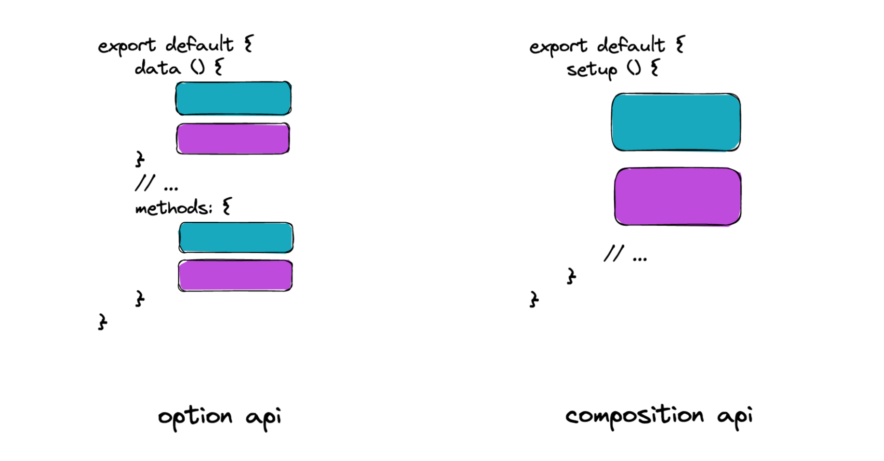

# CompositionAPI

## 组合式API介绍{#composition-api}
> 介绍：什么是组合式API，组合式API的特点

Vue3提供两种组织代码逻辑的写法：

- 通过data、methods、watch 等配置选项组织代码逻辑是`选项式API`写法
- 所有逻辑在setup函数中，使用 ref、watch 等函数组织代码是`组合式API`写法


准备了两份代码实现同一些功能，做对比：


`option api`

```vue
<template>
  <button @click="toggle">显示隐藏图片</button>
  
  <hr />
  计数器：{{ count }} <button @click="increment">累加</button>
</template>
<script>
export default {
  data() {
    return {
      show: true,
      count: 0,
    };
  },
  methods: {
    toggle() {
      this.show = !this.show;
    },
    increment() {
      this.count++;
    },
  },
};
</script>
```

`composition api`

```vue
<template>
  <button @click="toggle">显示隐藏图片</button>
  
  <hr />
  计数器：{{ count }} <button @click="increment">累加</button>
</template>
<script>
// ref 就是一个组合式API  
import { ref } from 'vue';
export default {
  setup () {
    // 显示隐藏
    const show = ref(true)
    const toggle = () => {
      show.value = !show.value
    }
    // 计数器
    const count = ref(0)
    const increment = () => {
      count.value ++
    }

    return { show, toggle, count, increment }
  }
};
</script>
```




::: tip 总结

- 在setup中通过vue提供的函数组织代码实现功能，就是组合式API写法。
- 组合式API有什么好处？可复用，可维护
- ref 是不是一个组合式API？是

:::


## setup函数{#setup}
> setup函数是组合式API的入口函数

- `setup` 函数是 `Vue3` 特有的选项，作为组合式API的起点
- 从组件生命周期看，它在 `beforeCreate` 之前执行
- 函数中 `this` 不是组件实例，是 `undefined`
- 如果数据或者函数在模板中使用，需要在 `setup` 返回

```vue
<template>
  <div class="container">
    <h1 @click="say()">{{msg}}</h1>
  </div>
</template>

<script>
export default {
  setup () {
    console.log('setup执行了')
    console.log(this)
    // 定义数据和函数
    const msg = 'hi vue3'
    const say = () => {
      console.log(msg)
    }
    // 返回给模板使用
    return { msg , say}
  },
  beforeCreate() {
    console.log('beforeCreate执行了')
    console.log(this)
  }
}
</script>
```

总结： 
- 今后在vue3的项目中几乎用不到 `this` , 所有的东西通过函数获取。


## reactive函数{#reactive}
> 通常使用它定义 对象类型 响应式数据


疑问：以前在 data 函数中返回对象数据就是响应式的，现在 setup 中返回对象数据是响应式的吗？

- 不是，需要使用 `reactive` 转成响应式


使用步骤：

- 从 `vue` 中导出 `reactive` 函数
- 在 `setup` 函数中，使用 `reactive` 函数，传入一个普通对象，返回一个响应式数据对象
- 最后 `setup` 函数返回一个对象，包含该响应式对象即可，模板中可使用

```vue
<template>
  <div>
    <p>姓名：{{state.name}}</p>
    <p>年龄：{{state.age}} <button @click="state.age++">一年又一年</button></p>
  </div>
</template>

<script>
// 1. 导入函数
import { reactive } from "vue"; 
export default {
  setup() {
    // 2. 创建响应式数据对象
    const state = reactive({ name: 'tom', age: 18 })
    // 3. 返回数据
    return { state }
  }
};
</script>
```


总结：

- `reactive` 函数通常定义：复杂类型的响应式数据

- 可以转换简单数据吗？不能


## ref函数{#ref-fn}

> 通常使用它定义响应式数据，不限类型

使用步骤：

- 从 `vue` 中导出 `ref` 函数
- 在 `setup` 函数中，使用 `ref` 函数，传入普通数据（简单or复杂），返回一个响应式数据
- 最后 `setup` 函数返回一个对象，包含该响应式数据即可
- 注意：使用 `ref` 创建的数据，`js` 中需要 `.value` ，`template` 中可省略

落地代码：

```vue
<template>
  <div>
    <p>
      计数器：{{ count }}
      <button @click="count++">累加1</button>
      <!-- template中使用可省略.value -->
      <button @click="increment">累加10</button>
    </p>
  </div>
</template>

<script>
// 1. 导入函数
import { ref } from "vue";
export default {
  setup() {
    // 2. 创建响应式数据对象
    const count = ref(0);
    const increment = () => {
      // js中使用需要.value
      count.value += 10;
    };
    // 3. 返回数据
    return { count, increment };
  },
};
</script>
```

**总结：**

- `ref `可以把简单数据或者复杂数据转换成响应式数据，注意使用加上 `.value`，不过模板可省略。
- 疑问：定义响应式数据使用 `ref` 还是 `reactive` 呢？


## reactive 与 ref 的选择{#reactive-and-ref}

> 知道：在定义响应式数据的时候如何选择reactive和ref

开始分析：

- `reactive` 可以转换对象成为响应式数据对象，但是不支持简单数据类型。
- `ref` 可以转换简单数据类型为响应式数据对象，也支持复杂数据类型，但是操作的时候需要 `.value` 。
- 它们各有特点，现在也没有最佳实践，没有明显的界限，所有大家可以自由选择。

**推荐用法：**

- 如果能确定数据是对象且字段名称也确定，可使用 `reactive` 转成响应式数据，其他一概使用 `ref` 。这样就没有 心智负担 。

参考代码：

```js
    // 1. 明确表单对象有两个字段
    const form = reactive({
      username: '',
      password: ''
    })

    // 2. 后台返回的数据对象
    const data = ref(null)
    const res = await axios.get('/user/100')
    data.value = res.data
```

**总结：**

- 在定义响应式数据的函数选择上，遵循：尽量使用 `ref` 函数支持所有场景，确定字段的对象使用 `reactive` 可以省去`.value`。


## setup语法糖{#setup-sugar}

> 简化 setup 固定套路代码 ，让代码更简洁

发现：

- 使用 setup 有几件事必须做：默认导出配置选项，setup函数声明，返回模板需要数据与函数。

```vue
<script>
export default {
  setup() {
    const say = () => console.log('hi')
    return { say }
  }
}
</script>
```


解法：

- 使用 setup 语法糖

```vue
<script setup>
  const say = () => console.log('hi')
</script>
```


案例：体验一下

```vue
<script setup>
  // 显示隐藏
  const show = ref(true)
  const toggle = () => {
    show.value = !show.value
  }
  // 计数器
  const count = ref(0)
  const increment = () => {
    count.value ++
  }
</script>

<template>
  <button @click="toggle">显示隐藏图片</button>
  
  <hr />
  计数器：{{ count }} <button @click="increment">累加</button>
</template>
```


小结：

- 在 `script setup` 中的顶层变量都可以在模板使用，数据，函数，组件。


## computed函数{#computed}

> 掌握：使用 computed 函数定义计算属性

大致步骤：

- 从 `vue` 中导出 `computed` 函数
- 在 `setup` 函数中，使用 `computed` 函数，传入一个函数，函数返回计算好的数据
- 最后 `setup` 函数返回一个对象，包含该计算属性数据即可，然后模板内使用


落地代码：

```vue
<script setup>
  import { ref, computed } from "vue";

  const scoreList = ref([80, 100, 90, 70, 60]);
  // 计算属性
  const betterList = computed(() => scoreList.value.filter((item) => item >= 90));
  // 改变数据，计算属性改变
  setTimeout(() => {
    scoreList.value.push(92, 66);
  }, 3000);

</script>

<template>
  <div>
    <p>分数：{{ scoreList }}</p>
    <p>优秀：{{ betterList }}</p>
  </div>
</template>
```

**总结：**

- 使用 `computed` 定义计算属性，场景：当需要依赖一个数据得到新的数据使用计算属性


## watch函数{#watch}

> 掌握：使用watch函数监听数据的变化

大致内容：

- 使用 `watch` 监听一个响应式数据
- 使用 `watch` 监听多个响应式数据
- 使用 `watch` 监听响应式对象数据中的一个属性(简单)
- 使用 `watch` 监听响应式对象数据中的一个属性(复杂)，配置深度监听
- 使用 `watch` 监听，配置默认执行

落地代码：

- 使用 `watch` 监听一个响应式数据

```vue
<script setup>
  import { ref, watch } from "vue";
  const count = ref(0);
  // 1. 监听一个响应式数据
  // watch(数据, 改变后回调函数)
  watch(count, () => {
    console.log("count改变了");
  });
  // 2s改变数据
  setTimeout(() => {
    count.value++;
  }, 2000);
</script>

<template>
  <p>计数器：{{ count }}</p>
</template>
```

- 使用 `watch` 监听多个响应式数据

```vue
<script setup>
  import { reactive, ref, watch } from "vue";
  const count = ref(0);
  const user = reactive({
    name: "tom",
    info: {
      gender: "男",
      age: 18,
    },
  });
  
  // 2. 监听多个响应式数据
  // watch([数据1, 数据2, ...], 改变后回调函数)
  watch([count, user], () => {
    console.log("数据改变了");
  });
  
  // 2s改变数据
  setTimeout(() => {
    count.value++;
  }, 2000);
  
  // 4s改变数据
  setTimeout(() => {
    user.info.age++;
  }, 4000);
</script>

<template>
  <p>计数器：{{ count }}</p>
  <p>
    姓名：{{ user.name }} 性别：{{ user.info.gender }} 年龄：{{ user.info.age }}
  </p>
</template>
```

- 使用 `watch` 监听响应式对象数据中的一个属性(简单)

```vue
<script setup>
  import { reactive, watch } from "vue";
  const user = reactive({
    name: "tom",
    info: {
      gender: "男",
      age: 18,
    },
  });
  // 3. 监听响应式对象数据的一个数据，简单类型
  // watch(()=>数据, 改变后回调函数)
  watch(()=>user.name, () => {
    console.log("数据改变了");
  });
  // 2s改变数据
  setTimeout(() => {
    user.name = 'jack';
  }, 2000);
  // 4s改变数据
  setTimeout(() => {
    user.info.age = 60;
  }, 4000);
</script>

<template>
  <p>
    姓名：{{ user.name }} 性别：{{ user.info.gender }} 年龄：{{ user.info.age }}
  </p>
</template>
```

- 使用 `watch` 监听响应式对象数据中的一个属性(复杂)，配置深度监听

```vue
<script setup>
  import { reactive, watch } from "vue";
  const user = reactive({
    name: "tom",
    info: {
      gender: "男",
      age: 18,
    },
  });
  // 4. 监听响应式对象数据的一个数据，复杂类型
  // watch(()=>数据, 改变后回调函数, {deep: true})
  watch(
    () => user.info,
    () => {
      console.log("数据改变了");
    },
    {
      // 开启深度监听
      deep: true,
    }
  );
  // 2s改变数据
  setTimeout(() => {
    user.info.age = 60;
  }, 2000);
</script>

<template>
  <p>
    姓名：{{ user.name }} 性别：{{ user.info.gender }} 年龄：{{ user.info.age }}
  </p>
</template>
```

- 使用 `watch` 监听，配置默认执行

```diff
      {
        // 开启深度监听
        deep: true,
+        // 默认执行一次
+        immediate: true
      }
```


总结：

- `watch(需要监听的数据,数据改变执行函数,配置对象)` 来进行数据的侦听
- 数据：单个数据，多个数据，函数返回对象属性，属性复杂需要开启深度监听
- 配置对象：`deep` 深度监听 `immediate` 默认执行


## 生命周期函数{#cycle}


> 掌握：vue3的常用生命周期函数

使用步骤：

1. 先从vue中导入以`on打头`的生命周期钩子函数
2. 在setup函数中调用生命周期函数并传入回调函数
3. 生命周期钩子函数可以调用多次

具体内容：

- Vue3和vue2的生命周期对比

| 选项式API下的生命周期函数使用 | 组合式API下的生命周期函数使用 |
| ----------------------------- | ----------------------------- |
| beforeCreate                  | 不需要（直接写到setup函数中） |
| created                       | 不需要（直接写到setup函数中） |
| beforeMount                   | `onBeforeMount`               |
| mounted                       | `onMounted`                   |
| beforeUpdate                  | `onBeforeUpdate`              |
| updated                       | `onUpdated`                   |
| beforeDestroyed               | `onBeforeUnmount`             |
| destroyed                     | `onUnmounted`                 |
| activated                     | `onActivated`                 |
| deactivated                   | `onDeactivated`               |

- 参考代码

```vue
<script setup>
  import { onMounted } from "vue";
  // 生命周期函数：组件渲染完毕
  onMounted(()=>{
    console.log('onMounted触发了')
  })

  onMounted(()=>{
    console.log('onMounted也触发了')
  })
</script>

<template>
  <div>生命周期函数</div>
</template>
```

**总结：**

- 常用的 `onMounted` 组件渲染完毕：发请求，操作dom，初始化图表...


## ref获取DOM元素{#ref-dom}

> 元素上使用 ref属性关联响应式数据，获取DOM元素

步骤：

1. 创建 ref =>  `const hRef = ref(null)`

2. 模板中建立关联  =>  `<h1 ref="hRef">我是标题</h1>`

3. 使用 => `hRef.value`


代码：

```vue
<script setup>
import { ref } from 'vue'

const hRef = ref(null)  
const clickFn = () => {
  hRef.value.innerText = '我不是标题'
}
</script>

<template>
  <div>
    <h1 ref="hRef">我是标题</h1>
    <button @click="clickFn">操作DOM</button>
  </div>
</template>
```


注意：默认值是`null`，需要在渲染完毕后访问DOM属性。


## ref操作组件-defineExpose{#define-expose}

> 组件上使用 ref属性关联响应式数据，获取组件实例


步骤：

- 使用 `<script setup>` 的组件是**默认关闭**的，组件实例使用不到顶层的数据和函数。
- 需要配合 `defineExpose` 暴露给组件实例使用，暴露的响应式数据会自动解除响应式。


代码：

```vue
<script setup>
import { ref } from 'vue'

const count = ref(0)
const validate = () => {
  console.log('表单校验方法')
}

// 暴露属性给外部组件使用
defineExpose({count, validate})
</script>

<template>
  <h3>我是Form组件</h3>
</template>

```

ref操作组件

```vue
<script setup>
import { ref } from 'vue'
import Form from './components/Form.vue'

// 1. 提供一个ref
const formRef = ref(null)
// 2. 使用组件组件和方法
const fn = () => {
  console.log(formRef.value.count)
  formRef.value.validate()
}
</script>

<template>
  <Form ref="formRef"></Form>
</template>
```


总结：

- 配合 `defineExpose` 暴露数据和方法，ref获取的组件实例才可以使用


## 父传子-defineProps函数{#define-props}

> 目标：能够实现组件通讯中的父传子组件通讯

步骤： 

1. 父组件提供数据
2. 父组件将数据传递给子组件
3. 子组件通过 `defineProps` 进行接收
4. 子组件渲染父组件传递的数据


代码：

`ParentCom.vue`

```vue
<script setup>
import { ref } from 'vue'
import ChildCom from './components/ChildCom.vue'

const money = ref(100)
const car = ref('玛莎拉蒂')
</script>

<template>
  <div>
    <h1>我是父组件</h1>
    <div>金钱：{{ money }}</div>
    <div>车辆：{{ car }}</div>
    <hr />
    <ChildCom :money="money" :car="car"></ChildCom>
  </div>
</template>
```

`ChildCom.vue`

```vue
<script setup>
import { computed } from 'vue'

// defineProps: 接收父组件传递的数据
const props = defineProps({
  money: Number,
  car: String,
})
// 使用props
console.log(props.money)
</script>

<template>
  <div>
    <h3>我是子组件</h3>
    <div>{{ money }} --- {{ car }}</div>
  </div>
</template>
```

注意：

- 如果使用 `defineProps` 接收数据，这个数据只能在模板中渲染
- 如果想要在 `script` 中也操作 `props` 属性，应该接收返回值


## 子传父-defineEmits函数{#define-emits}

> 目标：能够实现组件通讯中的子传父组件通讯

步骤：

1. 子组件通过 `defineEmits`获取 `emit` 函数（因为没有this)
2. 子组件通过 `emit` 触发事件，并且传递数据
3. 父组件提供方法
4. 父组件通过自定义事件的方式给子组件注册事件


代码：

`ChildCom.vue`

```vue
<script setup>
defineProps({
  money: Number,
  car: String,
})

// 得到emit函数，显性声明事件名称
const emit = defineEmits(['changeMoney'])
const change = () => {
  emit('changeMoney', 10)
}
</script>
```

`PrarentCom.vue`

```vue
<script setup>
import { ref } from 'vue'
import ChildCom from './components/ChildCom.vue'

const money = ref(100)
const car = ref('玛莎拉蒂')
const changeMoney = (num) => {
  money.value = money.value - num
}
</script>
```

```html
<ChildCom :money="money" :car="car" @changeMoney="changeMoney"></ChildCom>
```


总结：

- `defineEmits` 获取 `emit` 函数，且组件需要触发的事件需要显性声明出来


## 跨级组件通讯provide与inject函数{#provide-inject}


通过provide和inject函数可以**简便的**实现跨级组件通讯


接下来我们通过一个小案例，运用一下provide和inject函数


落地代码：

- 祖先组件：`App.vue`

```vue
<script setup>
import { provide, ref } from 'vue';
import ParentCom from './ParentCom.vue';

// 1. app组件数据传递给child
const count = ref(0);
provide('count', count);

// 2. app组件函数传递给child，调用的时候可以回传数据
const updateCount = (num) => {
  count.value += num;
};
provide('updateCount', updateCount);
</script>

<template>
  <div
    class="app-page"
    style="border: 10px solid #ccc; padding: 50px; width: 600px"
  >
    app 组件 {{ count }} updateCount
    <ParentCom />
  </div>
</template>
```

- 父级组件：`ParentCom.vue`

```vue
<script setup>
import ChildCom from './ChildCom.vue';
</script>

<template>
  <div class="parent-page" style="padding: 50px">
    parent 组件
    <hr />
    <ChildCom />
  </div>
</template>
```

- 子级组件：`ChildCom.vue`

```vue
<script setup>
const count = inject('count');
const updateCount = inject('updateCount');
</script>

<template>
  <div class="child-page" style="padding: 50px; border: 10px solid #ccc">
    child 组件 {{ count }} <button @click="updateCount(100)">修改count</button>
  </div>
</template>
```


总结：

- provide和inject是解决跨级组件通讯的方案
  - provide 提供后代组件需要依赖的数据或函数
  - inject 注入（获取）provide提供的数据或函数

- 官方术语：依赖注入
  - App是后代组件`依赖`的数据和函数的`提供者`，Child是`注入`（获取）了App提供的依赖


## 保持响应式-toRefs函数{#to-refs}

> 掌握：在使用reactive创建的响应式数据被展开或解构的时候使用toRefs保持响应式

大致步骤：

- 解构响应式数据，踩坑
- 使用 `toRefs` 处理响应式数据，爬坑
- `toRefs` 函数的作用，与使用场景

落地代码：

- 基础案例

```vue
<script setup>
import { reactive } from "vue";
const user = reactive({ name: "tom", age: 18 });
</script>

<template>
  <div>
    <p>姓名：{{ user.name }}</p>
    <p>年龄：{{ user.age }} <button @click="user.age++">一年又一年</button></p>
  </div>
</template>
```

- 使用响应式数据，踩坑

```vue
<script setup>
import { reactive } from "vue";
const { name, age } = reactive({ name: "tom", age: 18 });
</script>

<template>
  <div>
    <p>姓名：{{ name }}</p>
    <!-- 响应式丢失 -->
    <p>年龄：{{ age }} <button @click="age++">一年又一年</button></p>
  </div>
</template>
```

- 使用 `toRefs` 处理响应式数据，爬坑

```js
import { reactive, toRefs } from "vue";
const user = reactive({ name: "tom", age: 18 });
const { name, age } = toRefs(user)
```

 

`toRefs` 函数的作用，与使用场景

- 作用：把对象中的每一个属性做一次包装成为响应式数据
- 响应式数据展开的时候使用，解构响应式数据的时候使用

**总结：**

- 当去解构和展开响应式数据对象使用 `toRefs` 保持响应式