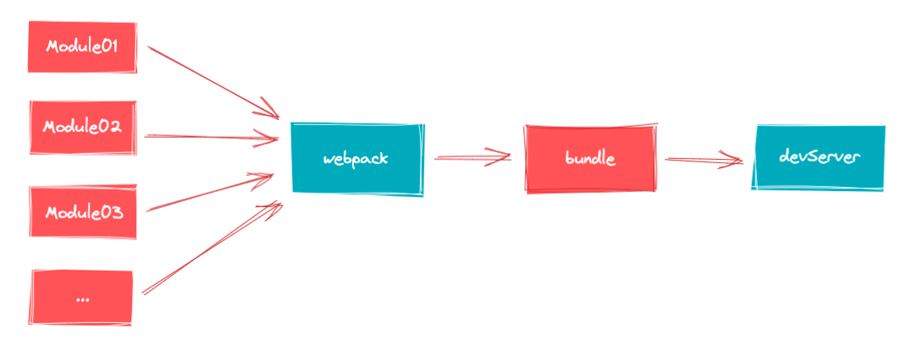

# 快速开始

## vue3 现状介绍

> 了解：vue3 的现状以及它特点

1. Vue3 的现状

2020 年 9 月 18 日发布，许多开发者还在观望。2022 年 2 月 7 日称为默认版本，意味着 vue3 是现在也是未来。

| 库名称  | 简介 |
| :----| :----|
| [ant-design-vue](https://antdv.com/docs/vue/introduce-cn/) | ant-design-vue 是 Ant Design 的 Vue 实现，组件的风格与 Ant Design 保持同步    |
| [element-plus](https://antdv.com/docs/vue/introduce-cn/)   | Element Plus，一套为开发者、设计师和产品经理准备的基于 Vue 3.0 的桌面端组件库 |
| [vant](https://vant-contrib.gitee.io/vant/v3/#/zh-CN)      | 有赞前端团队开源的移动端组件库，于 2016 年开源，已持续维护 4 年时间           |
| [Naive UI](https://vant-contrib.gitee.io/vant/v3/#/zh-CN)  | 一个 Vue 3 组件库比较完整，主题可调，使用 TypeScript，不算太慢，有点意思      |
| [VueUse](https://vueuse.org/)                              | 基于 composition 组合 api 的常用函数集合                                      |

2. 相关文档

   1. Vue3 中文文档 https://vue3js.cn/docs/zh/
   2. Vue3 设计理念 https://vue3js.cn/vue-composition/

3. 了解框架优点特点
   1. 首次渲染更快
   2. diff 算法更快
   3. 内存占用更少
   4. 打包体积更小
   5. 更好的 Typescript 支持
   6. `Composition API` 组合 API

**总结：**

- 前端学习 vue3 是加薪不是事，学习 vue3 主要学习 `组合API` 的使用。

## vite 构建工具

> 了解：vite工具作用和特点

vite（法语意为 "快速的"，发音 `/vit/`，发音同 "veet") 是一种新型前端构建工具，能够显著提升前端开发体验。

对比webpack：
- 需要查找依赖，打包所有的模块，然后才能提供服务，更新速度会随着代码体积增加越来越慢

vite的原理：
- 使用原生ESModule通过script标签动态导入，访问页面的时候加载到对应模块编译并响应

注明：项目打包的时候最终还是需要打包成静态资源的，打包工具 Rollup

问题：

- 基于 `webpack` 构建项目，基于 `vite` 构建项目，谁更快体验更好？vite
- 基于 `webpack` 的 `vue-cli` 可以创建vue项目吗？可以，慢一点而已

## vite 创建项目

> 掌握：使用create-vue脚手架创建项目

<a-button type="primary">Primary Button</a-button>

## 模板代码解析
